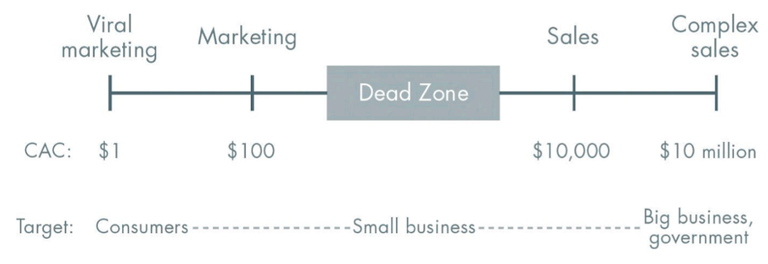

Humans are distinguished from other species by our ability to work miracles. We call these miracles technology. Technology is miraculous because it allows us to do more with less, ratcheting up our fundamental capabilities to a higher level. Other animals are instinctively driven to build things like dams or honeycombs, but we are the only ones that can invent new things and better ways of making them. Humans don’t decide what to do by making choices from some cosmic catalog of options given in advance; instead, by creating new technologies, we rewrite the plan of the world.

When we think about the future, we hope for a future of progress. That progress can take one of two forms—horizontal or vertical. Horizontal (extensive) progress means copying things that work—going from 1 to n. Horizontal progress is easy to imagine because we already know what it looks like. Vertical (intensive) progress means doing new things—going from 0 to 1. Vertical progress his harder to imagine because it requires doing something nobody else has ever done. If you take one typewriter and build 100, you have made horizontal progress. If you have a typewriter and build a word processor, you have made vertical progress.

At the macro level, the single word for horizontal progress is globalization—taking things that work somewhere and making them work everywhere. China is the paradigmatic example of globalization; its 20-year plan is to become like the United States today. The Chinese have been straightforwardly copying everything that has worked in the developed world: 19th-century railroads, 20th-century air conditioning, and even entire cities. They might skip a few steps along the way—going straight to wireless without installing landlines, for instance—but they’re copying all the same.
The single word for vertical, 0 to 1 progress is technology. The rapid progress of information technology in recent decades has made Silicon Valley the capital of “technology” in general. But there is no reason why technology should be limited to computers. Properly understood, any new and better way of doing things is technology.

Because globalization and technology are different modes of progress, it’s possible to have both, either, or neither at the same time. Most people think the future world will be defined by globalization, but the truth is that technology matters more. Without technological change, if China doubles its energy production over the next two decades, it will also double its air pollution. If every one of India’s hundreds of millions of households were to live the way Americans already do—using only today’s tools—the result would be environmentally catastrophic. Spreading old ways to create wealth around the world will result in devastation, not riches. In a world of scarce resources, globalization without new technology is unsustainable.
New technology has never been an automatic feature of history. Our ancestors lived in static, zero-sum societies where success meant seizing things from others. They created new sources of wealth only rarely, and in the long run they could never create enough to save the average person from an extremely hard life. Then, after 10,000 years of fitful advance from primitive agriculture to medieval windmills and 16th-century astrolabes, the modern world suddenly experienced relentless technological progress from the advent of the steam engine in the 1760s all the way up to about 1970. As a result, we have inherited a richer society than any previous generation would have been able to imagine. Today our challenge is to both imagine and create the new technologies that can make the 21st century more peaceful and prosperous than the 20th.

New technology tends to come from new ventures—startups. From the Founding Fathers in politics to the Royal Society in science to Fairchild Semiconductor’s “traitorous eight” in business, small groups of people bound together by a sense of mission have changed the world for the better. The easiest explanation for this is negative: it’s hard to develop new things in big organizations, and it’s even harder to do it by yourself. Bureaucratic hierarchies move slowly, and entrenched interests shy away from risk. In the most dysfunctional organizations, signaling that work is being done becomes a better strategy for career advancement than actually doing work (if this describes your company, you should quit now). At the other extreme, a lone genius might create a classic work of art or literature, but he could never create an entire industry. Startups operate on the principle that you need to work with other people to get stuff done, but you also need to stay small enough so that you actually can. Positively defined, a startup is the largest group of people you can convince of a plan to build a different future. It takes courage to create something new. Brilliant thinking is rare, but courage is in even shorter supply than genius.

A new company’s most important strength is new thinking: even more important than nimbleness, small size affords space to think. A startup has to question received ideas and rethink business from scratch. The first step to thinking clearly is to question what we think we know about the past. Hence, we must ask ourselves a contrarian question: What important truth do very few people agree with you on? This is a difficult question to answer directly. It may be easier to start with a preliminary: what does everybody agree on? “Madness is rare in individuals—but in groups, parties, nations, and ages it is the rule,” Nietzsche wrote (before he went mad). If you can identify a delusional popular belief, you can find what lies hidden behind it: the contrarian truth. You can’t escape the madness of crowds by dogmatically rejecting them. Instead ask yourself: how much of what you know about business is shaped by mistaken reactions to past mistakes? The most contrarian thing of all is not to oppose the crowd but to think for yourself.

## Perfect Competition vs. Monopoly

The business version of our contrarian question is: what valuable company is nobody building? This question is harder than it looks, because your company could create a lot of value without becoming very valuable itself. Creating value is not enough—you also need to capture some of the value you create.

This means that even very big businesses can be bad businesses. For example, U.S. airline companies serve millions of passengers and create hundreds of billions of dollars of value each year. But in 2012, when the average airfare each way was $178, the airlines made only 37 cents per passenger trip.  Compare them to Google, which creates less value but captures far more.  Google brought in $50 billion in 2012 (versus \$160 billion for the airlines), but it kept 21% of those revenues as profits—more than 100 times the airline industry’s profit margin that year. Google makes so much money it’s now worth three times more than every U.S. airline combined. The airlines compete with each other, but Google stands alone. Economists use two simplified models to explain the difference: perfect competition and monopoly.

“Perfect competition” is considered both the ideal and the default state in Economics 101. So-called perfectly competitive markets achieve equilibrium when producer supply meets consumer demand. Every firm in a competitive market is undifferentiated and sells the same homogeneous products. Since no firm has any market power, they must all sell at whatever price the market determines. If there is money to be made, new firms will enter the market, increase supply, drive prices down, and thereby eliminate the profits that attracted them in the first place. If too many firms enter the market, they’ll suffer losses, some will fold, and prices will rise back to sustainable levels. Under perfect competition, in the long run no company makes an economic profit.

The opposite of perfect competition is monopoly. Whereas a competitive firm must sell at the market price, a monopoly owns its market, so it can set its own prices. Since it has no competition, it produces at the quantity and price combination that maximizes its profits. TO an economist, every monopoly looks the same, whether it deviously eliminates rivals, secures a license from the state, or innovates its way to the top. Here, we’re not interested in illegal bullies or government favorites: by “monopoly,” we mean the kind of company that’s so good at what it does that no other firm can offer a close substitute. Google is a good example of a company that went from 0 to 1: it hasn’t competed in search since the early 2000s, when it definitively distanced itself from Microsoft and Yahoo!

Americans mythologize competition and credit it with saving us from socialist bread lines. Actually, capitalism and competition are opposites. Capitalism is premised on the accumulation of capital, but under perfect competition all profits get competed away. The lesson for entrepreneurs is clear: if you want to create and capture lasting value, don’t build an undifferentiated commodity business.

There’s an enormous difference between perfect competition and monopoly, and most businesses are much closer to one extreme than we commonly realize. The confusion comes from a universal bias for describing market conditions in self-serving ways: both monopolists and competitors are incentivized to bend the truth. Monopolists lie to protect themselves. They know that bragging about their great monopoly invites being audited, scrutinized, and attacked. Since they very much want their monopoly profits to continue unmolested, they tend to do whatever they can to conceal their monopoly—usually by exaggerating the power of their (nonexistent) competition. Non-monopolists tell the opposite lie: “we’re in a league of our own.” Entrepreneurs are always biased to understate the scale of competition, but that is the biggest mistake a startup can make. The fatal temptation is to describe your market extremely narrowly so that you can dominate it by definition.

Non-monopolists exaggerate their distinction by defining their market as the intersection of various smaller markets (i.e. British food  restaurant  Palo Alto). Monopolists, by contrast, disguise their monopoly by framing their market as the union of several large markets (i.e. search engine  mobile phones  wearable computers  self-driving cars).

The problem with a competitive business goes beyond lack of profits. Imagine you’re running a restaurant in Mountain View. You’re not that different from dozens of your competitors, so you’ve got to fight hard to survive. If you offer affordable food with low margins, you can probably pay employees only minimum wage. And you’ll need to squeeze out every efficiency: that’s why small restaurants put Grandma to work at the register and make the kids wash dishes in the back. Restaurants aren’t much better even at the highest rungs, where reviews and ratings like Michelin’s star system enforce a culture of intense competition that can drive chefs crazy. The competitive ecosystem pushes people toward ruthlessness or death.

A monopoly like Google is different. Since it doesn’t have a worry about competing with anyone, it has wider latitude to care about its workers, its products, and its impact on the wider world. Google’s motto—“Don’t be evil”—is in part a branding ploy, but it’s also characteristic of a kind of business that’s successful enough to take ethics seriously without jeopardizing its own existence. In business, money is either an important thing or it is everything. Monopolists can afford to think about things other than making money; non-monopolists can’t. In perfect competition, a business is so focused on today’s margins that it can’t possibly plan for a long-term future. Only one thing can allow a business to transcend the daily brute struggle for survival: monopoly profits.

So, a monopoly is good for everyone on the inside, but what about everyone on the outside? Do outsized profits come at the expense of the rest of society? Actually, yes: profits come out of customers’ wallets, and monopolies deserve their bad reputation—but only in a world where nothing changes. In a static world, a monopolist is just a rent collector. If you corner the market for something, you can jack up the price; others will have no choice but to buy from you. But the world we live in is dynamic: it’s possible to invent new and better things. Creative monopolists give customers more choices by adding entirely new categories of abundance to the world. Creative monopolies aren’t just good for the rest of society; they’re powerful engines for making it better.

The dynamism of new monopolies itself explains why old monopolies don’t strangle innovation. With Apple’s iOS at the forefront, the rize of mobile computing has dramatically reduced Microsoft’s decades-long operating system dominance. Before that, IBM’s hardware monopoly of the ‘60s and ‘70s was overtaken by Microsoft’s software monopoly. AT&T had a monopoly on telephone service for most of the 20th century, but now anyone can get a cheap cell phone plan from any number of providers. If the tendency of monopoly businesses were to hold back progress, they would be dangerous and we’d be right to oppose them. But the history of progress is a history of better monopoly businesses replacing incumbents.

Monopolies drive progress because the promise of years or even decades of monopoly profits provides a powerful incentive to innovate. Then monopolies can keep innovating because profits enable them to make the long-term plans and to finance the ambitious research projects that firms locked in competition can’t dream of.

So why are economists obsessed with competition as an ideal state? It’s a relic of history. Economists copied their mathematics from the work of 19th-century physicists: they see individuals and businesses as interchangeable atoms, not as unique creators. Their theories describe an equilibrium state of perfect competition because that’s what’s easy to model, not because it represents the best of business. But it’s worth recalling that the long-run equilibrium predicted by 19th-century physics was a state in which all energy is evenly distributed and everything comes to rest—also known as the heat death of the universe. Whatever your views on thermodynamics, it’s a powerful metaphor: in business, equilibrium means stasis, and stasis means death. If your industry is in a competitive equilibrium, the death of your business won’t matter to the world; some other undifferentiated competitor will always be ready to take your place.

Perfect equilibrium may describe the void that is most of the universe. It may even characterize many businesses. But every new creation takes place far from equilibrium. In the real world outside economic theory, every business is successful exactly to the extent that it does something others cannot. Monopoly is therefore not a pathology or an exception. Monopoly is the condition of every successful business. Tolstoy opens Anna Karenina by observing: “All happy families are alike; each unhappy family is unhappy in its own way.” Business is the opposite. All happy companies are different: each one earns a monopoly by solving a unique problem. All failed companies are the same: they failed to escape competition.

## The Ideology of Competition

Creative monopoly means new products that benefit everybody and sustainable profits for the creator. Competition means no profits for anybody, no meaningful differentiation, and a struggle for survival. So why do people believe that competition is healthy? The answer is that competition is not just an economic concept or a simple inconvenience that individuals and companies must deal with in the marketplace. More than anything else, competition is an ideology—the ideology—that. Pervades our society and distorts our thinking. We preach competition, internalize its necessity, and enact its commandments; and as a result, we trap ourselves within it—even though the more we compete, the less we gain.

This is a simple truth, but we’ve all been trained to ignore it. Our educational system both drives and reflects our obsession with competition. Grades themselves allow precise measurement of each student’s competitiveness; pupils with the highest marks receive status and credentials. We teach every young person the same subjects in mostly the same ways, irrespective of individual talents and preferences. Students who don’t learn best by sitting still at a desk are made to feel somehow inferior, while children who excel on conventional measures like tests and assignments end up defining. Their identities in terms of this weirdly contrived academic parallel reality. And it gets worse as students ascend to higher levels of the tournament. Elite students climb confidently until they reach a level of competition sufficiently intense to beat their dreams out of them. All Rhodes Scholars had a great future in their past. Higher education is the place where people who had big plans in high school get stuck in fierce rivalries with equally smart peers over conventional careers like management consulting and investment banking. For the privilege of being turned into conformists, students (or their families) pay hundreds of thousands of dollars in skyrocketing tuition that continues to outpace inflation. Why are we doing this to ourselves?

Professors downplay the cutthroat culture of academia, but managers never tire of comparing business to war. MBA students carry around copies of Clausewitz and Sun Tzu. War metaphors invade our everyday business language: we use headhunters to build up a sales force that will enable us to take a captive market and make a killing. But really, it’s competition, not business, that is like war: allegedly necessary, supposedly valiant, but ultimately destructive.

Why do people compete with each other? Marx and Shakespeare provide two models for understanding almost every kind of conflict. According to Marx, people fight because they are different. The proletariat fights the bourgeoisie because they have completely different ideas and goals (generated, for Marx, by their very different material circumstances). The greater the differences, the greater the conflict. To Shakespeare, by contrast, all combatants look more or less alike. It’s not at all clear why they should be fighting since they have nothing to fight about. Consider the opening line from Romeo and Juliet: “Two households, both alike in dignity.” The two houses are alike, yet they hate each other. They grow even more similar as the feud escalates. Eventually, they lose sight of why they started fighting in the first place.

In the world of business, at least, Shakespeare proves the superior guide. Inside a firm, people become obsessed with their competitors for career advancement. Then the firms themselves become obsessed with their competitors in the marketplace. Amid all the human drama, people lose sight of what matters and focus on their rivals instead. Rivalry causes us to overemphasize old opportunities and slavishly copy what has worked in the past.
The hazards of imitative competition may partially explain why individuals with an Asperger’s-like social ineptitude seem to be at an advantage in Silicon Valley today. If you’re less sensitive to social cues, you’re less likely to do the same thing as everyone else around you. If you’re interested in making things or programming computers, you’ll be less afraid to pursue those activities single-mindedly and thereby become incredibly good at them. Then when you apply your skills, you’re a little less likely than others to give up your own convictions: this can save you from getting caught up in crowds competing for obvious prizes.

Competition can make people hallucinate opportunities where none exist. The crazy ‘90s version of this was the fierce battle for the online pet store market. Winning is better than losing but everybody loses when the war isn’t one worth fighting. Other times, rivalry is just weird and distracting.
Sometimes you do have to fight. Where that’s true, you should fight and win. There is no middle ground: either don’t throw any punches, or strike hard and end it quickly. This advice can be hard to follow because pride and honor can get in the way. Hence Hamlet. For Hamlet, greatness means willingness to fight. For reasons as thin as an eggshell: anyone would fight for things that matter; true heroes take their personal honor so seriously they will fight for things that don’t matter. This twisted logic is part of human nature, but it’s disastrous in business. If you can recognize competition as a destructive force instead of a sign of value, you’re already more sane than most.

## Last Mover Advantage

Escaping competition will give you a monopoly, but even a monopoly is only a great business if it can endure in the future. When it went public, Twitter’s market capitalization dwarfed that of the New York Times Company. What explains the huge premium for Twitter? The answer is cash flow. This sounds bizarre at first, since the Times was profitable while Twitter wasn’t. But a great business is defined y its ability to generate cash flows, in the future. Investors expect Twitter will be able to capture monopoly profits over the next decade, while newspapers’ monopoly days are over.

Simply stated, the value of a business today is the present value of all the money it will make in the future. Comparing discounted cash flows shows the difference between low-growth businesses and high-growth startups at its starkest. Most of the value of low-growth businesses is in the near term. An Old Economy business (like a newspaper) might hold its value if it can maintain its current cash flows for five or six years. However, any firm with close substitutes will see its profits competed away. Nightclubs or restaurants are extreme examples: successful ones might collect healthy amounts today, but their cash flows will probably dwindle over the next few years when customers move on to newer and trendier alternatives.
Technology companies follow the opposite trajectory. They often lose money for the first few years: it takes time to build valuable things, and that means delayed revenue. Most of a tech company’s value will come at least 10 to 15 years in the future. For a company to be valuable it must grow and endure, but many entrepreneurs focus only on short-term growth. They have an excuse: growth is easy to measure, but durability isn’t. Those who succumb to measurement mania obsess about weekly active user statistics, monthly revenue targets, and quarterly earnings reports. However, you can hit those numbers and still overlook deeper, harder-to-measure problems that threaten the durability of your business. If you focus on near-term growth above all else, you miss the most important question you should be asking: will this business still be around a decade from now? Numbers alone won’t tell you the answer; instead you must think critically about the qualitative characteristics of your business.

What does a company with large cash flows far into the future look like? Every monopoly is unique, but they usually share some combination of the following characteristics: proprietary technology, network effects, economies of scale, and branding. This isn’t a list of boxes to check as you build your business—there’s no shortcut to monopoly. However, analyzing your business according to these characteristics can help you think about how to make it durable.

### Proprietary Technology

Proprietary technology is the most substantive advantage a company can have because it makes your product difficult or impossible to replicate. Google’s search algorithms, for example, return results better than anyone else’s. Proprietary technologies for extremely short page load times and highly accurate query autocompletion add to the core search product’s robustness and defensibility.

As a good rule of thumb, proprietary technology must be at least 10 times better than its closest substitute in some important dimension to lead to a real monopolistic advantage. Anything less than an order of magnitude better will probably be perceived as a marginal improvement and will be hard to sell, especially in a crowded market.

The clearest way to make a 10x improvement is to invent something completely new. If you build something valuable where there was nothing before, the increase in value is theoretically infinite. A drug to safely eliminate the need for sleep, or a cure for baldness, for example, would certainly support a monopoly business. Or you can radically improve an existing solution: once you’re 10x better, you escape the competition. PayPal, for instance, made buying and selling on eBay at least 10 times better. Instead of mailing a check that would take 7 to 10 days to arrive, PayPal let buyers pay as soon as an auction ended. Sellers received their proceeds right away, and unlike with a check, they knew the funds were good. Amazon made its first 10x improvement in a particularly visible way: they offered at least 10 times as many books as any other bookstore.

You can also make a 10x improvement through superior integrated design. Before 2010, tablet computing was so poor that for all practical purposes the market didn’t even exist. “Microsoft Windows XP Tablet PC Edition” products first shipped in 2002, and Nokia released its own “Internet Tablet” in 2005, but they were a pain to use. Then Apple released the iPad. Design improvements are hard to measure, but it seems clear that Apple improved on anything that had come before by at least an order of magnitude: tablets went from unusable to useful.

### Network Effects

Network effects make a product more useful as more people use it. Network effects can be powerful, but you’ll never reap them unless your product is valuable to its very first users when the network is necessarily small. Paradoxically, then, network effects businesses must start with especially small markets. Facebook started with just Harvard students—Mark Zuckerberg’s first product was designed to get all his classmates signed up, not to attract all people of earth. This is why successful network businesses rarely get started by MBA types: the initial markets are so small that they often don’t even appear to be business opportunities at all.

### Economies of Scale

A monopoly business gets stronger as it gets bigger: the fixed costs of creating a product (engineering, management, office space) can be spread out over ever greater quantities of sales. Software startups can enjoy especially dramatic economies of scale because the marginal cost of producing another copy of the product is close to zero. Many businesses gain only limited advantages as they grow to large scale. Service businesses especially are difficult to make monopolies. If you own a yoga studio, for example, you’ll only be able to serve a certain number of customers. You can hire more instructors and expand to more locations, but your margins will remain fairly low and you’ll never reach a point where a core group of talented people can provide something of value to millions of separate clients, as software engineers are able to do.

A good startup should have the potential for great scale built into its first design. Twitter already has more than 250 million users today. It doesn’t need to add too many customized features in order to acquire more, and there’s no inherent reason why it should ever stop growing.

### Branding

A company has a monopoly on its own brand by definition, so creating a strong brand is a powerful way to claim a monopoly. Today’s strongest tech brand is Apple: the attractive looks and carefully chosen materials of products like the iPhone and MacBook, the Apple Store’s sleek minimalist design and close control over the customer experience, the omnipresent advertising campaigns, the price positioning as a maker of premium goods, and the lingering nimbus of Steve Jobs’s personal charisma all contribute to a perception that Apple offers products so good as to constitute a category of their own.

Many have tried to learn from Apple’s success: paid advertising, branded stores, luxurious materials, playful keynote speeches, high prices, and even minimalist design are all susceptible to imitation. But these techniques for polishing the surface don’t work without a strong underlying substance. Apple has a complex suite of proprietary technologies, both in hardware (like superior touchscreen materials) and software (like touchscreen interfaces purpose-designed for specific materials). It manufactures products at a scale large enough to dominate pricing for the materials it buys. And it enjoys strong network effects from its content ecosystem: thousands of developers write software for Apple devices because that’s where hundreds of millions of users are, and those users stay on the platform because it’s where the apps are. These are monopolistic advantages are less obvious than Apple’s sparkling brand, but they are the fundamentals that let the branding effectively reinforce Apple’s monopoly.

Beginning with brand rather than substance is dangerous. When Steve Jobs returned to Apple, he didn’t just make Apple a cool place to work; he slashed product lines to focus on the handful of opportunities for 10x improvements. No technology company can be built on branding alone.

### Building a Monopoly

Brand, scale, network effects, and technology in some combination define a monopoly; but to get them to work, you need to choose your market carefully and expand deliberately. Every startup is small at the start. Every monopoly dominates a large share of its market. Therefore, every startup should start with a very small market. Always err on the side of starting too small. The reason is simple: it’s easier to dominate a small market than a large one. If you think your initial market might be too big, it almost certainly is.

It is much easier to reach a few thousand people who really need a product than to try to compete for the attention of millions of scattered individuals. The perfect target market for a startup is a small group of particular people concentrated together and served by few or no competitors. Any big market is a bad choice, and a big market already served by competing companies is even worse. This is why it’s always a red flag when entrepreneurs talk about getting 1% of a \$100 billion market. In practice, a large market will either lack a good starting point or it will be open to competition, so it’s hard to ever reach that 1%. And even if you do succeed in gaining a small foothold, you’ll have to be satisfied with keeping the lights on: cutthroat competition means your profits will be zero.

Once you create and dominate a niche market, then you should gradually expand into related and slightly broader markets. Amazon shows how it can be done. Jeff Bezos’s founding vision was to dominate all of online retail, but he very deliberately started with books. There were millions of books to catalog, but they all had roughly the same shape, they were easy to ship, and some of the most rarely sold books—those least profitable for any retail store to keep in stock—also drew the most enthusiastic customers. Amazon became the dominant solution for anyone located far from a bookstore or seeking something unusual. Amazon then had two options: expand the number of people who read books, or expand to adjacent markets. They chose the latter, starting with the most similar markets: CDs, videos, and software. Amazon continued to add categories gradually until it had become the world’s general store. The name itself brilliantly encapsulated the company’s scaling strategy. The biodiversity of the Amazon rain forest reflected Amazon’s first goal of cataloging every book in the world, and now it stands for every kind of thing in the world, period.

eBay also started by dominating small niche markets. When it launched its auction marketplace in 1995, it didn’t need the whole world to adopt it at once; the product worked well for intense interest groups, like Beanie Baby obsessives. Once it monopolized the Beanie Baby trade, eBay didn’t jump straight to listing sports cars or industrial surplus: it continued to cater to small-time hobbyists until it became the most reliable marketplace for people trading online no matter what the item. Sequencing markets correctly is underrated, and it takes discipline to expand gradually. The most successful companies make the core progression—to first dominate a specific niche and then scale to adjacent markets—a part of their founding narrative.

### Don’t Disrupt

Silicon Valley has become obsessed with “disruption.” Originally, “disruption” was a term of art to describe how a firm can use new technology to introduce a low-end product at low prices, improve the product over time, and eventually overtake even the premium products offered by incumbent companies using older technology. This is roughly what happened when the advent of PCs disrupted the market for mainframe computers: at first PCs seemed irrelevant, then they became dominant. Today mobile devices may be doing the same thing to PCs.

However, disruption has recently transmogrified into a self-congratulatory buzzword for anything posing as trendy and new. This seemingly trivial fad matters because it distorts an entrepreneur’s self-understanding in an inherently competitive way. The concept was coined to describe threats to incumbent companies, so startups’ obsession with disruption means they see themselves through older firms’ eyes. If you think of yourself as an insurgent battling dark forces, it’s easy to become unduly fixated on the obstacles in your path. But if you truly want to make something new, the act of creation is far more important than the old industries that might not like what you create. Indeed, if your company can be summed up by its opposition to already existing firms, it can’t be completely new and it’s probably not going to become a monopoly.

Disruption also attracts attention: disruptors are people who look for trouble and find it. Disruptive kids get sent to the principal’s office. Disruptive companies often pick fights they can’t win. Think of Napster: the name itself meant trouble. What kinds of things can one “nap”? Music . . . Kids . . . and perhaps not much else. As you craft a plan to expand to adjacent markets, don’t disrupt: avoid competition as much as possible.

### The Last Will Be First

You’ve probably heard about “first mover advantage”: if you’re the first entrant into a market, you can capture significant market share while competitors scramble to get started. But moving first is a tactic, not a goal. What really matters is generating cash flows in the future, so being the first mover doesn’t do you any good if someone else comes along and unseats you. It’s much better to be the last mover—that is, to make the last great development in a specific market and enjoy years or even decades of monopoly profits. The way to do that is to dominate a small niche and scale up from there, toward your ambitious long-term vision. In this one particular at least, business is like chess. Grandmaster Jose Raul Capablanca put it well: to succeed, “you must study the endgame before everything else.”

### Reject the Tyranny of Chance

The most contentious question in business is whether success comes from luck or skill. Did Bill Gates simply win the intelligence lottery? Was Sheryl Sandberg born with a silver spoon, or did she “lean in”?

From the Renaissance and the Enlightenment to the mid-20th century, luck was something to be mastered, dominated, and controlled; everyone agreed that you should do what you could, not focus on what you couldn’t. Ralph Waldo Emerson captured this ethos when he wrote: “Shallow men believe in luck, believe in circumstances . . . Strong men believe in cause and effect.” In 1912, after he became the first explorer to reach the South Pole, Roald Amundsen wrote: “Victory awaits him who has everything in order—luck, people call it.” No one pretended that misfortune didn’t exist, but prior generations believed in making their own luck by working hard.

A startup is the largest endeavor over which you can have definite mastery. You can have agency not just over your own life, but over a small and important part of the world. It begins by rejecting the unjust tyranny of Chance. You are not a lottery ticket.

## Secrets

Every one of today’s most famous and familiar ideas was once unknown and unsuspected. The mathematical relationship between a triangle’s sides, for example, was secret for millennia. Pythagoras had to think hard to discover it. Today, his geometry has become a convention—a simple truth we teach to grade schoolers. A conventional truth can be important—it’s essential to learn elementary mathematics, for example—but it won’t give you an edge. It’s not a secret.

Remember our contrarian question: what important truth do very few people agree with you on? If we already understand as much of the natural world as we ever will—if all of today’s conventional ideas are already enlightened, and if everything has been done—then there are no good answers. Contrarian thinking doesn’t make any sense unless the world still has secrets left to give up.

Of course, there are many things we don’t yet understand, but some of those things may be impossible to figure out—mysteries rather than secrets. For example, string theory describes the physics of the universe in terms of vibrating one-dimensional objects called “strings.” Is string theory true? You can’t really design experiments to test it. Very few people, if any, could ever understand all its implications. But is that just because it’s difficult? Or is it an impossible mystery? The difference matters. You can achieve difficult things, but you can’t achieve the impossible.
Recall the business version of our contrarian question: what valuable company is nobody building? Every correct answer is necessarily a secret: something important and unknown, something hard to do but doable. If there are many secrets left in the world, there are probably many world-changing companies yet to be started.

The actual truth is that there are many more secrets left to find, but they will yield only to relentless searchers. There is more to do in science, medicine, engineering, and in technology of all kinds. We are within reach not just of marginal goals set at the competitive edge of today’s conventional disciplines, but of ambitions so great that even the boldest minds of the Scientific Revolution hesitated to announce them directly. We could cure cancer, dementia, and all the diseases of age and metabolic decay. We can find new ways to generate energy that free the world from conflict over fossil fuels. We can invest faster ways to travel from place to place over the surface of the planet; we can even learn how to escape it entirely and settle new frontiers. But we will never learn any of these secrets unless we demand to know them and force ourselves to look.
There are two kinds of secrets: secrets of nature and secrets about people. Natural secrets exist all around us; to find them, one must study some undiscovered aspect of the physical world. Secrets about people are different: they are things that people don’t know about themselves or things they hide because they don’t want others to know. So when thinking about what kind of company to build, there are two distinct questions to ask: What secrets is nature not telling you? What secrets are people not telling you?

Every great business is built around a secret that’s hidden from the outside. A great company is a conspiracy to change the world; when you share your secret, the recipient becomes a fellow conspirator.

## Foundations

Every great company is unique, but there are a few things that every great business must get right at the beginning. Bad decisions made early on—if you choose the wrong partners or hire the wrong people, for example—are very hard to correct after they are made. It may take a crisis on the order of bankruptcy before anybody will even try to correct them. As a founder, your first job is to get the first things right, because you cannot build a great company on a flawed foundation.

### Founding Matrimony

When you start something, the first and most crucial decision you make is whom to start it with. Choosing a co-founder is like getting married, and founder conflict is just as ugly as divorce. Optimism abounds at the start of every relationship. It’s unromantic to think soberly about what could go wrong, so people don’t. But if the founders develop irreconcilable differences, the company becomes the victim. Technical abilities and complementary skill sets matter, but how well the founders know each other and how well they work together matter just as much. Founders should share a prehistory before they start a company together—otherwise they’re just rolling dice.

### Ownership, Possession, and Control

It’s not just founders who need to get along. Everyone in your company needs to work well together. You need good people who get along, but you also need a structure to help keep everyone aligned for the long term. To anticipate likely sources of misalignment in any company, it’s useful to distinguish between three concepts:

- Ownership: who legally owns a company’s equity?
- Possession: who actually runs the company on a day-to-day basis?
- Control: who formally governs the company’s affairs?

A typical startup allocates ownership among founders, employees, and investors. The managers and employees who operate the company enjoy possession. And a board of directors, usually comprising founders and investors, exercises control. In theory, this division works smoothly. Financial upside from part ownership attracts and rewards investors and workers. Effective possession motivates and empowers founders and employees—it means they can get stuff done. Oversight from the board places managers’ plans in a broader perspective. In practice, distributing these functions among different people makes sense, but it also multiplies opportunities for misalignment.

Unlike corporate giants, early-stage startups are small enough that founders usually have both ownership and possession. Most conflicts in a startup erupt between ownership and control—that is, between founders and investors on the board. The potential for conflict increases over time as interests diverge: a board member might want to take a company public as soon as possible to score a win for his venture firm, while the founders would prefer to stay private and grow the business.

In the boardroom, less is more. The smaller the board, the easier it is for the directors to communicate, to reach consensus, and to exercise effective oversight. However, that very effectiveness means that a small board can forcefully oppose management in any conflict. This is why it’s crucial to choose wisely: e very single member of your board matters. Even one problem director will cause you pain and may even jeopardize your company’s future.

A board of three is ideal. Your board should never exceed five people, unless your company is publicly held. (Government regulations effectively mandate that public companies have larger boards—the average is nine members.). By far the worst you can do is to make your board extra large. When unsavvy observers see a nonprofit organization with dozens of people on its board, they think: “Look how many great people are committed to this organization! It must be extremely well run.” Actually, a huge board will exercise no effective oversight at all; it merely provides cover for whatever microdictator actually runs the organization. If you want that kind of free rein from your board, blow it up to giant size. If you want an effective board, keep it small.

### On the Bus or Off the Bus

As a general rule, everyone you involve with your company should be involved full-time. Sometimes you’ll have to break this rule; it usually makes sense to hire outside lawyers and accountants, for example. However, anyone who doesn’t own stock options or draw a regular salary from your company is fundamentally misaligned. At the margin, they’ll be biased to claim value in the near term, not help you create more in the future. That’s why hiring consultants doesn’t work. Part-time employees don’t work. Even working remotely should be avoided, because misalignment can creep in whenever colleagues aren’t together full-time, in the same place, every day. If you’re deciding whether to bring someone on board, the decision is binary. You’re either on the bus or off the bus.

### Cash is Not King

For people to be fully committed, they should be properly compensated. However, a company does better the less it pays the CEO. In no case should a CEO of an early-stage, venture-backed startup receive more than $150,000 per year in salary.  If a CEO collects $300,000 per year, he risks becoming more like a politician than a founder. High pay incentivizes him to defend the status quo along with his salary, not to work with everyone else to surface problems and fix them aggressively. A cash-poor executive, by contrast, will focus on increasing the value of the company as a whole.

Low CEO pay also sets the standard for everyone else. Aaron Levie, the CEO of Box, was always careful to pay himself less than everyone in the company—four years after he started Box, he was still living two blocks away from HQ in a one-bedroom apartment with no furniture except a mattress. Every employee noticed his obvious commitment to the company’s mission and emulated it. If a CEO doesn’t set an example by taking the lowest salary in the company, he can do the same thing by drawing the highest salary. So long as that figure is still modest, it sets an effective ceiling on cash compensation.

Cash is attractive. It offers pure optionality: once you get your paycheck, you can do anything you want with it. However, high cash compensation teaches workers to claim value from the company as it already exists instead of investing their time to create new value in the future. A cash bonus is slightly better than a cash salary—at least it’s contingent on a job well done. But even so-called incentive pay encourages short-term thinking and value grabbing. Any kind of cash is more about the present than the future.

### Vested Interests

Startups don’t need to pay high salaries because they can offer something better: part ownership of the company itself. Equity is the one form of compensation that can effectively orient people toward creating value in the future. However, for equity to create commitment rather than conflict, you must allocate it very carefully. Giving everyone equal shares is usually a mistake: every individual has different talents and responsibilities as well as different opportunity costs, so equal amounts will seem arbitrary and unfair from the start. On the other hand, granting different amounts up front is just as sure to seem unfair. Resentment at this stage can kill a company, but there’s no ownership formula to perfectly avoid it.

This problem becomes even more acute over time as more people join the company. Early employees usually get the most equity because they take more risk, but some later employees might be even more crucial to a venture’s success. A secretary who joined eBay in 1996 might have made 200 times more than her industry-veteran boss who joined in 1999. Since it’s impossible to achieve perfect fairness when distributing ownership, founders would do well to keep the details secret. Sending out a company-wide email that lists everyone’s ownership stake would be like dropping a nuclear bomb on your office.

Most people don’t want equity at all. Stories of startup chefs becoming millionaires notwithstanding, people often find equity unattractive. It’s not liquid like cash. It’s tied to one specific company. And if that company doesn’t succeed, it’s worthless. Equity is a powerful tool precisely because of these limitations. Anyone who prefers owning a part of your company to being paid in cash reveals a preference for the long term and a commitment to increasing your company’s value in the future. Equity can’t create perfect incentives, but it’s the best way for a founder to keep everyone in the company broadly aligned.

### Extending the Founding

Bob Dylan has said that he who is not busy being born is busy dying. If he’s right, being born doesn’t happen at just one moment—you might even continue to do it somehow, poetically at least. The founding moment of a company, however, really does happen just once: only at the very start do you have the opportunity to set the rules that will align people toward the creation of value in the future.

The most valuable kind of company maintains an openness to invention that is most characteristic of beginnings. This leads to a second, less obvious understanding of the founding: it lasts as long as a company is creating new things, and it ends when creation stops. If you get the founding moment right, you can do more than create a valuable company: you can steer its distant future toward the creation of new things instead of the stewardship of inherited success. You might even extend its founding indefinitely.

## The Mechanics of a Mafia

Start with a thought experiment: what would the ideal company culture look like? Employees should love their work. They should enjoy going to the office so much that formal business hours become obsolete and nobody watches the clock. The workspace should be open, not cubicled, and workers should feel at home: beanbag chairs and Ping-Pong tables might outnumber file cabinets. Free massages, on-site sushi chefs, and maybe even yoga classes would sweeten the scene. Pets should be welcome, too: perhaps employees’ dogs and cats could come and join the office’s tankful of tropical fish as unofficial company mascots.

What’s wrong with this picture? It includes some of the absurd perks Silicon Valley has made famous, but none of the substance—and without substance perks don’t work. “Company culture” doesn’t exist apart from the company itself: no company has a culture; every company is a culture. A startup is a team of people on a mission, and a good culture is just what that looks like on the inside.

PayPal didn’t assemble a mafia by sorting through resumes and simply hiring the most talented people. That’s what happens at law firms—lawyers run a valuable business, and they are impressive individuals one by one. But the relationships between them are thin. They spend all day together, but few of them seemed to have much to say to each other outside the office. Why work with a group of people who don’t even like each other? Many seem to think it’s a sacrifice necessary for making money. But taking a merely professional view of the workplace, in which free agents check in and out on a transactional basis, is worse than cold: it’s not even rational. Since time is your most valuable asset, it’s odd to spend it working with people who don’t envision any long-term future together. If you can’t count durable relationships among the fruits of your time at work, you haven’t invested your time well—even in purely financial terms. From the start, Peter Thiel wanted PayPal to be tightly knit instead of transactional. He thought stronger relationships would make them not just happier and better at work but also more successful in their careers even beyond PayPal. So, they set out to hire people who would actually enjoy working together. They had to be talented, but even more than that they had to be excited about working specifically with PayPal.

Recruiting is a core competency for any company. It should never be outsourced. You need people who are not just skilled on paper but who will work together cohesively after they’re hired. The first four or five might be attracted by large equity stakes or high-profile responsibilities. More important than those obvious offerings is your answer to this question: Why should the 20th employee join your company?

Talented people don’t need to work for you; they have plenty of options. You should ask yourself a more pointed version of the question: Why would someone join your company as its 20th engineer when she could go work at Google for more money and more prestige?

Here are some bad answers: “Your stock options will be worth more here than elsewhere.” “You’ll get to work with the smartest people in the world.” “You can help solve the world’s most challenging problems.” What’s wrong with valuable stock, smart people, or pressing problems? Nothing—but every company makes these same claims, so they won’t help you stand out. General and undifferentiated pitches don’t say anything about why a recruit should join your company instead of many others.

The only good answers are specific to your company, so you won’t find them in this book. But there are two general kinds of good answers: answers about your mission and answers about your team. You’ll attract the employees you need if you can explain why your mission is compelling: not why it’s important in general, but why you’re doing something important that no one else is going to get done. That’s the only thing that can make its importance unique.

However, even a great mission is not enough. The kind of recruiter who would be most engaged as an employee will also wonder: “Are these the kind of people I want to work with?” You should be able to explain why your company is a unique match for him personally. And if you can’t do that, he’s probably not the right match.

Above all, don’t fight the perk war. Anybody who would be more powerfully swayed by free laundry pickup or pet day care would be a bad addition to your team. Just cover the basics like health insurance and then promise what no others can: the opportunity to do irreplaceable work on a unique problem alongside great people. You probably can’t be the Google of 2014 in terms of compensation or perks, but you can be like the Google of 1999 if you already have good answers about your mission and team.

From the outside, everyone in your company should be different in the same way. Max Levchin says that startups should make their early staff as personally similar as possible. Startups have limited resources and small teams. They must work quickly and efficiently in order to survive, and that’s easier to do when everyone shares an understanding of the world. For the company to work, it doesn’t matter what people look like or which country they come from, but every new hire needs to be equally obsessed.

On the inside, every individual should be sharply distinguished by her work. When assigning responsibilities to employees in a startup, you could start by treating it as a simple optimization problem to efficiently match talents with tasks. But even if you could somehow get this perfectly right, any given solution would quickly break down. Partly that’s because startups have to move fast, so individual roles can’t remain static for long. But it’s also because job assignments aren’t just about the relationships between workers and tasks; they’re also about relationships between employees.

The best thing Thiel did as a manager at PayPal was to make every person in the company responsible for doing just one thing. Every employee’s one thing was unique, and everyone knew Thiel would evaluate him only on that one thing. Thiel had started doing this just to simplify the task of managing people. But then he noticed a deeper result: defining roles reduced conflict. Most fights inside a company happen when colleagues compete for the same responsibilities. Startups face an especially high risk of this since job roles are fluid at the early stages. Eliminating competition makes it easier for everyone to build the kinds of long-term relationships that transcend mere professionalism. More than that, internal peace is what enables a startup to survive at all. When a startup fails, we often imagine it succumbing to predatory rivals in a competitive ecosystem. But every company is also its own ecosystem, and factional strife makes it vulnerable to outside threats. Internal conflict is like an autoimmune disease: the technical cause of death may be pneumonia, but the real cause remains hidden from plain view.

Entrepreneurs should take their cultures seriously. Is a lukewarm attitude to one’s work a sign of mental health? Is a merely professional attitude the only sane approach? The best startups might be considered slightly less extreme kinds of cults. The biggest difference is that cults tend to be fanatically wrong about something important. People at a successful startup are fanatically right about something those outside it have missed. You’re not going to learn those kinds of secrets from consultants, and you don’t need to worry if your company doesn’t make sense to conventional professionals. Better to be called a cult—or even a mafia.

## Distribution

We underestimate the importance of distribution—a catchall term for everything it takes to sell a product. Engineers are biased toward building cool stuff rather than selling it. But customers will not come just because you build it. You have to make that happen, and it’s harder than it looks.

In Silicon Valley, nerds are skeptical of advertising, marketing, and sales because they seem superficial and irrational. But advertising matters because it works. It works on nerds, and it works on you. You may think that you’re an exception; that your preferences are authentic, and advertising only works on other people. It’s easy to resist the most obvious sales pitches, so we entertain a false confidence in our own independence of mind. But advertising doesn’t exist to make you buy a product right away; it exists to embed subtle impressions that will drive sales later. Anyone who can’t acknowledge its likely effect on himself is doubly deceived.

Nerds are used to transparency. They add value by becoming expert at a technical skill like computer programming. In engineering disciplines, a solution either works or it fails. You can evaluate someone else’s work with relative ease, as surface appearances don’t matter much. Sales is the opposite: an orchestrated campaign to change surface appearances without changing the underlying reality. This strikes engineers a trivial if not fundamentally dishonest. They know their own jobs ae hard, so when they look at salespeople laughing on the phone with a customer or going to two-hour lunches, they suspect that no real work is being done. If anything, people overestimate the relative difficulty of science and engineering, because the challenges of those fields are obvious. What nerds miss is that it takes hard work to make sales look easy.

### Sales is Hidden

All salesmen are actors: their priority is persuasion, not sincerity. That’s why the word “salesman” can be a slur and the used car dealer is our archetype of shadiness. But we only react negatively to awkward, obvious salesmen—that is, the bad ones. There’s a wide range of sales ability: there are many gradations between novices, experts, and masters. There are even sales grandmasters. If you don’t know any grandmasters, it’s not because you haven’t encountered them, but rather because their art is hidden in plain sight. Tom Sawyer managed to persuade his neighborhood friends to whitewash the fence for him—a masterful move. But convincing them to actually pay him for the privilege of doing his chores was the move of a grandmaster, and his friends were none the wiser. Not much has changed since Twain wrote in 1876.

Like acting, sales works best when hidden. This explains why almost everyone whose job involves distribution—whether they’re in sales, marketing, or advertising—has a job title that has nothing to do with those things. People who sell advertising are called “account executives.” People who sell customers work in “business development.” People who sell companies are “investment bankers.” And people who sell themselves are called “politicians.” There’s a reason for these redescriptions: none of us wants to be reminded when we’re being sold.

Whatever the career, sales ability distinguishes superstars from also-rans. On Wall Street, a new hire starts as an “analyst” wielding technical expertise, but his goal is t o become a dealmaker. A lawyer prides himself on professional credentials, but law firms are led by the rainmakers who bring in big clients. Even university professors, who claim authority from scholarly achievement, are envious of the self-promoters who define their fields. Academic ideas about history or English don’t just sell themselves on their intellectual merits. Even the agenda of fundamental physics and the future path of cancer research are results of persuasion. The most fundamental reason that even businesspeople underestimate the importance of sales is the systematic effort to hide it at every level of every field in a world secretly driven by it.

The engineer’s grail is a product great enough that “it sells itself.” But anyone who would actually say this about a real product must be lying: either he’s delusional (lying to himself) or he’s selling something (and thereby contradicting himself). The polar opposite business cliché warns that “the best product doesn’t always win.” Economists attribute this to “path dependence”: specific historical circumstances independent of objective quality can determine which products enjoy widespread adoption. That’s true, but it doesn’t mean the operating systems we use today and the keyboard layouts on which we type were imposed by mere chance. It’s better to think of distribution as something essential to the design of your product. If you’ve invented something new but you haven’t invented an effective way to sell it, you have a bad business—no matter how good the product.

### How to Sell a Product

Superior sales and distribution by itself can create a monopoly, even with no product differentiation. The converse is not true. No matter how strong your product—even if it easily fits into already established habits and anybody who tries it likes it immediately—you must still support it with a strong distribution plan.

Two metrics set the limits for effective distribution. The total net profit that you earn on average over the course of your relationship with a customer (Customer Lifetime Value, or CLV) must exceed the amount you spend on average to acquire a new customer (Customer Acquisition Cost, or CAC). In general, the higher the price of your product, the more you have to spend to make a sale—and the more it makes sense to spend it. Distribution methods can be plotted on a continuum:

- **Complex Sales:** If your average sale is seven figures or more, every detail of every deal requires close personal attention. It might take months to develop the right relationships. You might make a sale only once every year or two. Then you’ll usually have to follow up during installation and service the product long after the deal is done. It’s hard to do, but this kind of “complex sales” is the only way to sell some of the most valuable products. Businesses with complex sales models succeed if they achieve 50% to 100% year-over-year growth over the course of a decade. This will seem slow to any entrepreneur dreaming of viral growth. You might expect revenue to increase 10x as soon as customers learn about an obviously superior product, but that almost never happens. Good enterprise sales strategy starts small, as it must: a new customer might agree to become your biggest customer, but they’ll rarely be comfortable signing a deal completely out of scale with what you’ve sold before. Once you have a pool of reference customers who are successfully using your product, then you can begin the long and methodical work of hustling toward even bigger deals.

- **Personal Sales:** Most sales are not particularly complex: average deal sizes might range between $10,000 and $100,000, and usually the CEO won’t have to do all the selling himself. The challenge here isn’t about how to make any particular sale, but how to establish a process by which a sales team of modest size can move the product to a wide audience. In 2008, Box had a good way for companies to store their data safely and accessibly in the cloud. But people didn’t know they needed such a thing—cloud computing hadn’t caught on yet. That summer, Blake was hired as Box’s third salesperson to help change that. Starting with small groups of users who had the most acute file sharing problems, Box’s sales reps built relationships with more and more users in each client company. In 2009, Blake sold a small Box account to the Stanford Sleep Clinic, where researchers needed an easy, secure way to store experimental data logs. Today the university offers a Stanford-branded Box account to every one of its students and faculty members, and Stanford Hospital runs on Box. If it had started off by trying to sell the president of the university on an enterprise-wide solution, Box would have sold nothing. A complex sales approach would have made Box a forgotten startup failure; instead, personal sales made it a multibillion-dollar business.

- **Distribution Doldrums:** In between personal sales (salespeople obviously required) and traditional advertising (no salespeople required) there is a dead zone. The product needs a personal sales effort, but a low price point, you simply don’t have the resources to send an actual person to talk to every prospective customer. Distribution is the hidden bottleneck.

- **Marketing and Advertising:** Marketing and advertising work for relatively low-priced products that have mass appeal but lack any method of viral distribution.

- **Viral Marketing:** A product is viral if its core functionality encourages users to invite their friends to become users too. This is how Facebook and PayPal both grew quickly: every time someone shares with a friend or makes a payment, they naturally invite more and more people into the network. This isn’t just cheap—it’s fast, too. If every new user leads to more than one additional user, you can achieve a chain reaction of exponential growth. The ideal viral loop should be as quick and frictionless as possible. Funny YouTube videos or Internet memes get millions of views very quickly because they have extremely short cycle times: people see the kitten, feel warm inside, and forward it to their friends in a matter of seconds. Whoever is first to dominate the most important segment of a market with viral potential will be the last mover in the whole market.

### Everybody Sells

The kitchen sink approach—employ a few salespeople, place some magazine ads, and try to add some kind of viral functionality to the product as an afterthought—doesn’t work. Most businesses get zero distribution channels to work: poor sales rather than bad product is the most common cause of failure. If you can get just one distribution channel to work, you have a great business. If you try for several but don’t nail one, you’re finished.

Your company needs to sell more than its product. You must also sell your company to employees and investors. Selling your company to the media is a necessary part of selling it to these groups. Just as you can never expect people to buy a superior product merely on its obvious merits without any distribution strategy, you should never assume that people will admire your company without a public relations strategy. Any prospective employee worth hiring will do his own diligence; what he finds or doesn’t find when he googles you will be critical to the success of your company.

All of us want to believe that we make up our own minds, that sales doesn’t work on us. But it’s not true. Everybody has a product to sell—no matter whether you’re an employee, a founder, or an investor. It’s true even if your company consists of just you and your computer. Look around. If you don’t see any salespeople, you’re the salesperson.

## Man and Machine

As mature industries stagnate, information technology has advanced so rapidly that it has now become synonymous with “technology” itself. Today, billions of people enjoy instant access to the world’s knowledge using pocket-sized devices. Every one of today’s smartphones has thousands of times more processing power than the computers that guided astronauts to the moon. And if Moore’s law continues apace, tomorrow’s computers will be even more powerful.

Everyone expects computers to do more in the future—so much more that some wonder: 30 years from now, will there be anything left for people to do? Futurists can seem like they hope the answer is yes. Luddites are so worried about being replaced that they would rather we stop building new technology altogether. Neither side questions the premise that better computers will necessarily replace human workers. But that premise is wrong: computers are complements for humans, not substitutes. The most valuable businesses of coming decades will be built by entrepreneurs who seek to empower people rather than try to make them obsolete.

Fifteen years ago, American workers were worried about competition from cheaper Mexican substitutes. And that made sense, because humans really can be substituted for each other. Americans fear technology in the near future because they see it as a replay of the globalization of the near past. But the situations are very different: people compete for jobs and for resources; computers compete for neither.

Think about the prospects of competition from computers instead of competition from human workers. On the supply side, computers are far more different from people than any two people are different from each other: men and machines are good at fundamentally different things. People have intentionality—we form plans and make decisions in complicated situations. We’re less good at making sense of enormous amounts of data. Computers are exactly the opposite: they excel at efficient data processing, but they struggle to make basic judgments that would be simple for any human.
The stark differences between man and machine mean that gains from working with computers are much higher than gains from trade with other people. We don’t trade with computers any more than we trade with livestock or lamps. And that’s the point: computers are tools, not rivals.
The differences are even deeper on the demand side. Unlike people in industrializing countries, computers don’t yearn for more luxurious foods or beachfront villas in Cap Ferrat; all they require is a nominal amount of electricity, which they’re not even smart enough to want. When we design new computer technology to help solve problems, we get all the efficiency gains of a hyperspecialized trading partner without having to compete with it for resources. Properly understood, technology is the one way for us to escape competition in a globalizing world. As computers become more and more powerful, they won’t be substitutes for humans: they’ll be complements.

Complementarity between computers and humans isn’t just a macro-scale fact. It’s also the path to building a great business. If humans and computers can achieve dramatically better results than either could attain alone, what valuable businesses can be built on this core principle? Think of what professionals do in their jobs today. Lawyers must be able to articulate solutions to thorny problems in several different ways—the pitch changes depending on whether you’re talking to a client, opposing counsel, or a judge. Doctors need to marry clinical understanding with an ability to communicate it to non-expert patients. And good teachers aren’t just experts in their disciplines: they must also understand how to tailor their instruction to different individuals’ interests and learning styles. Computers might be able to do some of these tasks, but they can’t combine them effectively. Better technology in law, medicine, and education won’t replace professionals; it will allow them to do even more. The most valuable companies in the future won’t ask what problems can be solved with computers alone. Instead, they’ll ask: how can computers help humans solve hard problems?

## The Seven Questions that Every Business Must Answer

At the start of the 21st century, everyone agreed that the next big thing was clean technology. Entrepreneurs started thousands of cleantech companies, and investors poured more than \$50 billion into them. So began the quest to cleanse the world. It didn’t work. Instead of a healthier planet, we got a massive cleantech bubble. Why did cleantech fail? Most cleantech companies crashed because they neglected one or more of the seven questions that every business must answer:

1. **The Engineering Question: Can you create breakthrough technology instead of incremental improvements?** A great technology company should have proprietary technology an order of magnitude better than its nearest substitute. But cleantech companies rarely produced 2x, let alone 10x improvements. Sometimes their offerings were actually worse than the products they sought to replace. Companies must strive for 10x better because merely incremental improvements often end up meaning no improvement at all for the end user. Suppose you develop a new wind turbine that’s 20% more efficient than any existing technology—when you test it in the laboratory. That sounds good at first, but the lab result won’t begin to compensate for the expenses and risks faced by any new product in the real world. And even if your system really is 20% better on net for the customer who buys it, people are so used to exaggerated claims that you’ll be met with skepticism when you try to sell it. Only when your product is 10x better can you offer the customer transparent superiority.

1. **The Timing Question: Is now the right time to start your particular business?** There were few engineering developments in the mid-2000s to suggest impending liftoff. Entering a slow-moving market can be a good strategy, but only if you have a definite and realistic plan to take it over. The failed cleantech companies had none.

1. **The Monopoly Question: Are you starting with a big share of a small market?** Huge, trillion-dollar markets mean ruthless, bloody competition. Customers don’t care about any particular technology unless it solves a particular problem in a superior way. And if you can’t monopolize a unique solution for a small market, you’ll be stuck with vicious competition. Cleantech entrepreneurs’ thinking about markets was hopelessly confused. They would rhetorically shrink their market in order to seem differentiated, only to turn around and ask to be valued based on huge, supposedly lucrative markets. But you can’t dominate a submarket if it’s fictional, and huge markets are highly competitive, not highly attainable.

1. **The People Question: Do you have the right team?** Energy problems are engineering problems, so you would expect to find nerds running cleantech companies. You’d be wrong: the ones that failed were run by shockingly nontechnical teams. These salesman-executives were good at raising capital and securing government subsidies, but they were less good at building products that customers wanted to buy.

1. **The Distribution Question: Do you have a way to not just create but deliver your product?** Cleantech companies effectively courted government and investors, but they often forgot about customers. They learned the hard way that the world is not a laboratory: selling and delivering a product is at least as important as the product itself.

1. **The Durability Question: Will your market position be defensible 10 and 20 years into the future?** Every entrepreneur should plan to be the last mover in her particular market. That starts with asking yourself: what will the world look like 10 and 20 years from now, and how will my business fit in? Few cleantech companies had a good answer.

1. **The Secret Question: Have you identified a unique opportunity that others don’t see?** Every cleantech company justified itself with conventional truths. About the need for a cleaner world. They deluded themselves into believing that an overwhelming social need for alternative energy solutions implied an overwhelming business opportunity for cleantech companies of all kinds. Each of the casualties had described their bright futures using broad conventions on which everybody agreed. Great companies have secrets: specific reasons for success that other people don’t see.

### The Myth of Social Entrepreneurship

Cleantech entrepreneurs aimed for more than just success as most businesses define it. The cleantech bubble was the biggest phenomenon—and the biggest flop—in the history of “social entrepreneurship.” This philanthropic approach to business tarts with the idea that corporations and nonprofits have until now been polar opposites: corporations have great power, but they’re shackled to the profit motive; nonprofits pursue the public interest, but they’re weak players in the wider economy. Social entrepreneurs aim to combine the best of both worlds and “do well by doing good.” Usually they end up doing neither.

The ambiguity between social and financial goals doesn’t help. The ambiguity in the word “social” is even more of a problem: if something is “socially good,” is it good for society, or merely seen as good by society? Whatever is good enough to receive applause from all audiences can only be conventional, like the general idea of green energy.

Progress isn’t held back by some difference between corporate greed and nonprofit goodness; instead, we’re held back by the sameness of both. Just as corporations tend to copy each other, nonprofits all tend to push the same priorities. Doing something different is what’s truly good for society—and it’s also what allows a business. To profit by monopolizing a new market. The best projects are likely to be overlooked, not trumpeted by a crowd; the best problems to work on are often the ones nobody else even tries to solve.

### Final Points

An entrepreneur can’t benefit from macro-scale insight unless his own plans begin at the micro-scale. Cleantech companies faced the same problem: no matter how much the world needs energy, only a firm that offers a superior solution for a specific energy problem can make money. No sector will ever be so important that merely participating in it will be enough to build a great company. A valuable business must start by finding a niche and dominating a small market. Facebook started as a service for just one university campus before it spread to other schools and then the entire world.

## The Founders’ Paradox

The companies that create new technology often resemble feudal monarchies rather than organizations that are supposedly more “modern.” A unique founder can make authoritative decisions, inspire strong personal loyalty, and plan ahead for decades. Pradoxically, impersonal bureaucracies staffed by trained professionals can lost longer than any lifetime, but they usually act with short time horizons.

The lesson for business is that we need founders. If anything, we should be more tolerant of founders who seem strange or extreme; we need unusual individuals to lead companies beyond mere incrementalism. The lesson for founders is that individual prominence and adulation can never be enjoyed except on the condition that it may be exchanged for individual notoriety and demonization at any moment—so be careful.

Above all, don’t overestimate your own power as an individual. Founders are important not because they are the only ones whose work has value, but rather because a great founder can bring out the best work from everybody at his company. That we need individual founders in all their peculiarity does not mean that we are called to worship Ayn Randian “prime movers” who claim to be independent of everybody around them. In this respect Rand was merely a half-great writer: her villains were real, but her heroes were fake. There is no Galt’s Gulch. There is no secession from society. To believe yourself invested with divine self-sufficiency is not the mark of a strong. Individual, but of a person who has mistaken the crowd’s worship—or jeering—for the truth. The single greatest danger for a founder is to become so certain of his own myth that he loses his mind. But an equally insidious danger for every business is to lose all sense of myth and mistake disenchantment for wisdom.

## Conclusion

The future won’t happen on its own. We cannot take for granted that the future will be better, and that means we need to work to create it today. Whether we achieve the Singularity on a cosmic scale is perhaps less important than whether we seize the unique opportunities we have to do new things in our own working lives. Everything important to us—the universe, the planet, the country, your company, your life, and this very moment—is singular. Our task today is to find singular ways to create the new things that will make the future not just different, but better—to go from 0 to 1. The essential first step is to think for yourself. Only by seeing our world anew, as fresh and strange as it was to the ancients who saw it first, can we both re-create it and preserve it for the future.
