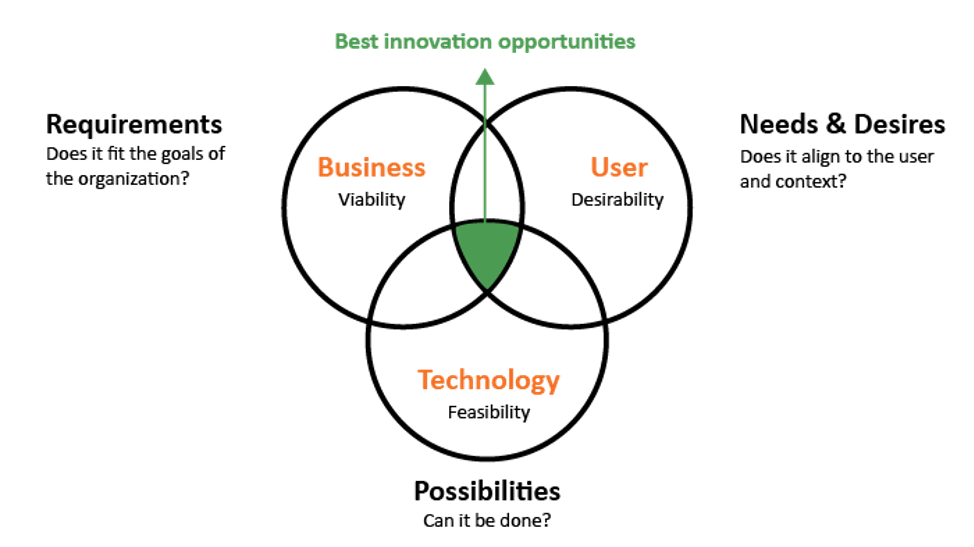
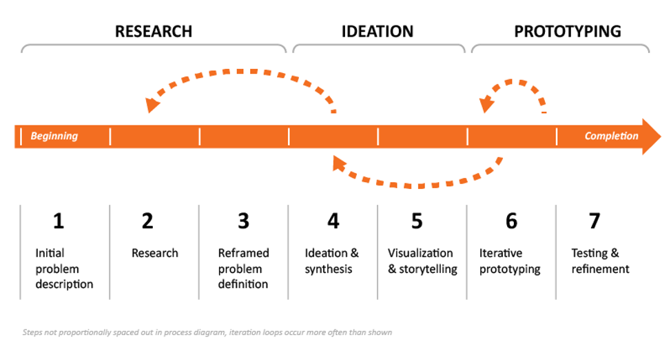

## What is Design Thinking?

Design thinking is a user-centered, creative, and collaborative problem-solving methodology. Design thinking also describes a set of attitudes and a way of thinking about one’s own participation in the problem-solving process.

While individuals can perform design thinking, it is best done in cross-functional teams that represent key areas of expertise, as illustrated by the 3-circle Venn diagram shown below. The key areas of expertise are:

1. **Technology:** Knowing what is feasible. The systems, mechanisms, or science that makes something work. The tools and materials available to work with.

1. **Business:** Knowing what is viable. The goals of the organization, or alignment to organization mission or strategic direction. The financial and human resource requirements.
1. **User:** Knowing the particular needs and wants of a population of users. Also knowing about their context and how that context affects any potential situation.

A problem might require many different types of expertise to solve and many iterations to target the best solution. The teams that practice design thinking are more powerful when members have a diverse set of perspectives and areas of expertise. Design thinking requires that all members of the team understand user research to uncover the real needs and desires of the target market. In fact, more than simply understanding user research, design thinking requires that you place the needs of the user and your understanding of their problem at the center of your work. Then, grounded in research and fueled by creativity, teams come up with ideas, create models of those ideas, and critique those ideas in a cycle of iteration that moves toward a solution.

Design thinking produces solutions with users and their contexts always in mind, increasing the likelihood that your solution will be useful, usable, and desirable. Design thinking is a proven and repeatable problem-solving methodology that anyone can employ to achieve successful results.

## What Design Thinking is Not

A “design” is a plan or drawing that reveals how something works. Design can also be the series of choices one makes when deciding on the look or function of an object or a space, but the purpose of design thinking is not simply to make something attractive. In design thinking we pay attention to how something looks, but we are just as concerned with the other aspects—the materials, whether it accomplishes the desired task, how it works within the user’s personal or work life, how much it costs to create, and so on. Design thinking is called “design thinking” because it represents how designers go about solving problems.

While you can perform some aspects of design thinking on your own, design thinking is best done with a group of people, each one bringing special talents and areas of expertise. To activate the best thinking from your group, you need to get active. You need to get something to write on and take notes and sketch and diagram. You need to hear from experts who can tell you more about the problem you’re working on. You should go out and see the problem in context and meet your users. You should go out and see how people use your products or see the service in action.

## 5 Principles of Design Thinking

In design thinking, there are five core principles for improving or creating a new product or service:

1. User Centered – find out what they want and need. Talk to, experience, and embed yourself in what your customers are looking for and need.
2. Co-Create – design together, seek feedback. Have conversations with your customers and create with them.
3. Sequence – order of activities/tasks in a service. There is nothing more irritating for a customer than a service that isn’t sequenced correctly.
4. Evidence – data to indicate you are on the right track.
5. Holistic Process – consider the whole process, be iterative and flexible.

## Design Thinking Process Overview

The initial problem description is the beginning of the design thinking process. Problems can come from all sorts of places. They can come from a negative user experience, a newspaper story, a product that is not functioning well or expectations that are not being met. They can also come from a market that is not responding to certain needs or failing products and services. The research that you conduct helps you to understand more about the problem and more about the people affected by this problem.

The research portion of design thinking involves three major areas: 1) User Understanding; 2) Technology; and 3) Business. When it comes to the user, our interest is to identify the latent and obvious needs the user has and certain trends that relate to the user. To understand the user’s obvious and latent needs, we use ethnographic methodologies such as observations, interviews, and immersion in the user’s lives in the context of the environment where the problem exists. With respect to technology research, we need to understand certain technological trends, how things work, and what other possible solutions exist in the market that can help our process. Business research consists of data. And statistics related to the organization’s interests or focus area such as a product portfolio plan, revenue/profit requirements, establishing geographic interests for product distributions, etc.

The last element of the design thinking research process is to reframe the problem definition. This is important because all the data from the research is now available to the solution team. This allows them to fine-tune the original problem description. The reframed problem definition is actually part of the design brief that needs to be produced.

After the design thinking research portion is completed and a design brief is written, it is up to the solution team to produce ideas that relate to user needs, technology possibilities, and business requirements. Ideation is the stage in which all ideas, no matter how wild, are welcome. All ideas are then assessed against the research done in the preceding stage. In a more traditional sense, teams place Post-it notes on a board randomly—no connection between the ideas and no organization. Then those ideas are grouped and clustered based on links between them.

The next phase of the design thinking process is the idea of visualization and storytelling. This is important because it makes it easier to share ideas with others for decision making. In this exercise, a creative person would illustrate what they understand from ideas that were previously written down on post-it notes (i.e. “pill bottle with battery alarm” or “weekly pill box, timed lights”). You don’t do this for all the ideas, just the top ideas that were selected. These ideas would be illustrated in a storytelling fashion and a way that describes a scenario for a solution. It also may give the designers a better look at the vision behind a particular idea or ideas. Illustrations could be as simple or as elaborate as necessary, but the point is that they are visual and make it easier for others to understand.

Ultimately, this process needs to end with a criteria for selecting top solutions and a strategic mapping of these top solution ideas by theme, such as product categories or timelines. This is also the beginning of the process in which concepts would be built, prototyped, and tested. Prototypes are an opportunity to make your ideas real, or at least real in model form. Prototypes are a useful way of testing out strong ideas or products with users. Do your solutions really work like you thought they might? What do your users think of them? Prototypes can be used during any stage of the design thinking process and can help with 1) iterative development, user validation, and refinement; 2) demonstration to stakeholders.

While we talk about design thinking as a series of stages, it’s important to know that there are many cycles of design thinking within a single project. As you proceed along the stages, you always want to check back with your understanding of the problem description, the research you’ve done, the ideas you came up with, and so on. You may find when you’re ideating that you have a gap in your understanding of your users or the definition of the problem, and that’s exactly why design thinking is so powerful. Design thinking is built on iteration, or successive cycles of a process, each cycle getting closer to a solution. Iteration can feel like a lack of progress, that’s why the “thinking” part of design thinking is so important.

## The “Thinking” Part of Design Thinking

The different stages in the design thinking process require different ways of thinking. During one stage you may be open to all ideas. In the next stage you will think more critically about the ideas you generated, grouping them, refining them, and selecting ideas that seem to best address the problem. Design thinkers approach problems with a flexible, positive, and critical thought process that helps them synthesize information from a variety of sources. This ability to apply many ways of thinking to solve a problem is what helps design thinkers identify new ideas, innovations, or improvements from the insights they gather during this stage.

Once a problem description has been finalized, design thinking in the early stages of the process can feel very vague, especially when first considering design problems or opportunities. During this early stage you will brainstorm, create mind maps, and use other strategies to get everything you think of that is associated with this problem out in the open and onto paper or a whiteboard. This early stage takes time. In later stages of the design process, thinking can be lightning fast. These “a-ha!” moments that may occur later in the process are fueled by the work that is done early on. The thinking you do during prototyping can be very linear as you consider issues associated with evaluating and implementing your solution.

Through the entire process, the most important question you can ask is “why”. Asking “why” keeps your thinking fresh and prevents you and your team members from settling for a solution that isn’t as good as it could be. “Why” helps you test out the problem description in the early stages and evaluate new ideas that emerge.

The key skill in design thinking is to be aware of your thinking throughout the design process, making sure that you’re not being limited by your own misconceptions. Identifying and correcting misunderstandings is incredibly difficult. Design thinking can help—it is a positive, highly conscious type of thinking that will open up solutions at the beginning stages of the process.

## Characteristics of Good Solutions

Before you begin any process, it is helpful to know what your goals are. In design thinking, these characteristics of a good solution apply, no matter what your particular situation or set of users. A good solution:

1. **Has a purpose:** you always start with a problem that needs solving and you arrive at the solution using the design thinking process. You are not using design thinking to figure out who may benefit from a solution you already have. In other words, design thinking isn’t meant to work backward from solution to problem.
1. **Is useful:** the solution fulfills its intended purpose.
1. **Is understandable:** a good solution should be easy to understand or learn. Or, the work to learn the solution should be worth the effort.
1. **Is honest:** a good solution does not promise more than it provides.
1. **Is sustainable:** a good solution does not adversely affect the environment, nor does it require resources (whether material or personnel) in a way that can’t be maintained over time.
1. **Is long-lasting:** make sure the work you put into the design thinking process is worth it. Provide a solution that does not break often or deteriorate quickly.
1. **Fits to the context:** a good solution makes sense for the location it is used in, the people who use it, and the function it was meant to perform.
1. **Is compelling:** it should resonate with the user by making them feel confident when they use it. They should want to use your solution.
1. **Is simple:** the solution should include only those elements necessary for fulfilling the rest of the criteria in this list.

To begin a design thinking process that will provide you with a good solution, you need to begin with a strong problem description.
