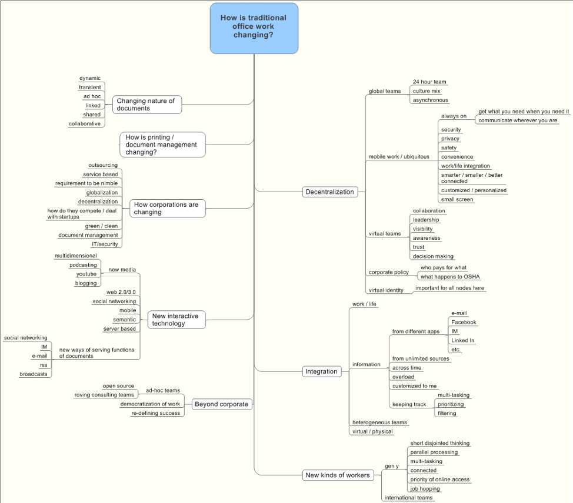
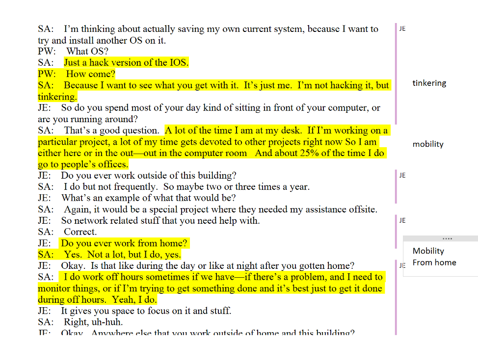
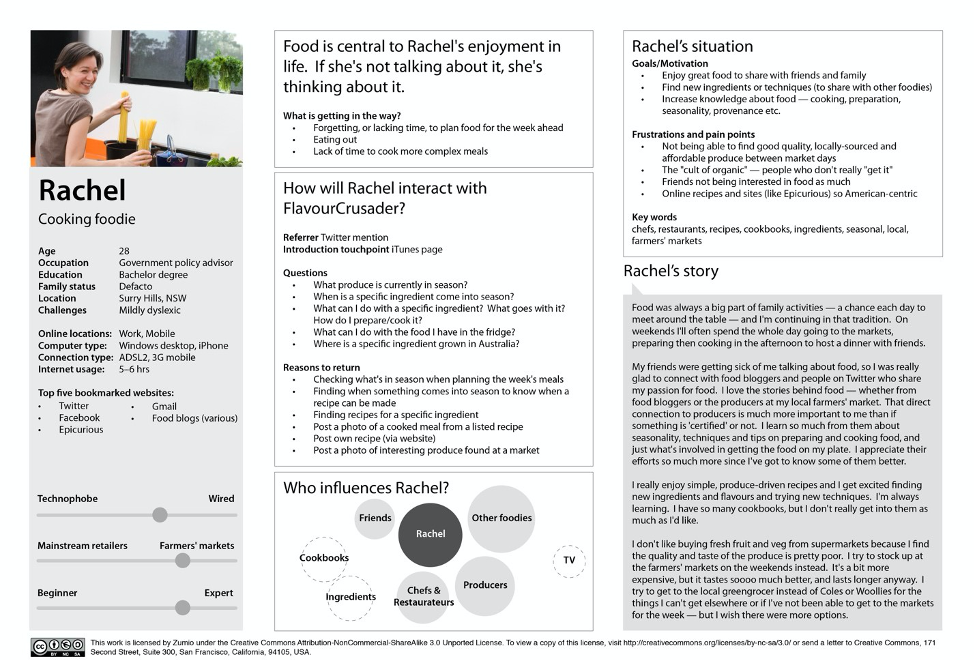
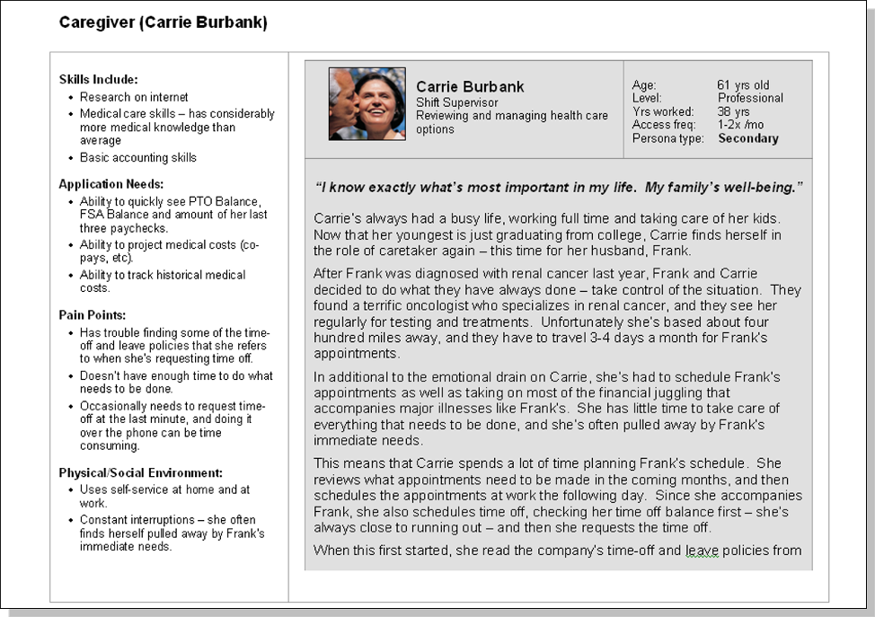

## Initial Problem Description

The very first step in the design thinking process is for the design team to find out more about the problem. In an initial problem investigation, the manager or team leader seeks to answer these questions:

1. **What** is the problem?
1. **Who** and/or what is affected by this problem? What has the competition, if any, done to solve this problem? Are others working on it in other companies or countries?
1. **When** has this been a problem? Why hasn’t there yet been a solution? Is there a record of proposed solutions to the problem? Why wasn’t a past solution sufficient? If it was sufficient at one time, why isn’t it sufficient now?
1. **Where** is this a problem? What is the scope of the problem? Local? Regional? Global?
1. **Where** did this problem come from? Did it come from management? Another corporation? From entrepreneurs, human needs, new technology applications, new materials applications?
1. **Why** is the problem worth solving? Why is it a problem? Ask why early and often in the design thinking process.

With each answer to the question above come two more questions: **What** expertise is required to understand this problem? **Who** has this expertise? These answers will give the team leader a better understanding of the areas of expertise that should be represented on the design team. Once you have formed your design team, you will begin a thorough user research study to empathize with your potential users and better understand the problem you are trying to solve.

## User Research

User research will help you see your product or service from an outside perspective. To develop deep insights about your users, you can’t start in the “solution space” where your product or service exists. You must start in the “problem space” that drove the need for it in the first place. You may already be working on an idea for a product, but if you want a truly user-centered solution, you shouldn’t focus solely on your user’s reaction to your current solution. Instead, you should expand your inquiry to understand their current experience. When you focus on a holistic understanding of your users’ experiences, you can gather deep insight about their authentic persistent needs. This kind of deep insight can help you develop solutions that fully support your users and deliver long-term satisfaction and loyalty. Deep user insight helps you challenge your assumptions about what your users need (i.e. is what you’re delivering actually relevant and desirable for your users?). It also informs your design (i.e. will your solution be useful and usable in the environment and conditions where the customer is likely to use it?). A deep understanding of your users can also help you connect with your customers when it’s time to deliver the offering. It can help you target your messaging to highlight the parts of your offering that matter most to your users. This is how you empathize with users—by seeing their experiences in context through their eyes so you can develop solutions that are truly relevant to them.

## Planning Your Study

While design research should be an iterative, open-ended process, it’s important to go into it with a clear plan of what you’re trying to find out and what you will deliver as a basis for ideation. It starts with a **conceptual framework**, which is a visual representation of the user landscape that you’re going to explore. Developing the conceptual framework doesn’t have to be overly formal, and the framework itself may change as you learn more. However, it provides a touchstone for the team throughout the process.

Next, you need to define your question or **problem statement**. What exactly are you trying to find out? Your question can be broad (i.e. how do teenagers use mobile phones?) or it can be narrow (i.e. what do people like least about cleaning up after dinner?). But it should provide a focus for what you’re trying to find out from participants.

Then we move on to the research participants themselves. Who should they be? How should we describe them? How many should we engage? How do we find them? An important part of your planning is developing a rigorous process for this.

Finally, we’ll put together a **Project Brief**, which is a document that lists all of these pieces to guide your research process.

## The Conceptual Framework

The Conceptual Framework is a structure that organizes your interests and provides a focus for your study. It helps you lay out what you think you know about the topic, as well as what you think you don’t know. Usually, what you think you know about a topic will change as your study progresses. The framework helps you track how your knowledge is changing and helps you recognize new relevant information that you did not expect to find. You can create the Conceptual Framework from your own experience and knowledge. You can also use information from other relevant sources, such as research papers and websites. Once you have the framework in place, it can help your team identify participants and develop research questions. After you’ve collected data, it can also help with your analysis.

Conceptual frameworks can take lots of different forms. Some are very simple, and others are more complex. The important thing is that they capture the range of topics that the study will examine. The best ones find a way to portray the study space clearly and concisely.

The diagram below was created for a study of how office work was changing. The branches off the central spine list some of the possible drivers of this change. These branch off further, listing trends, technologies, or just characteristics that the team wanted to examine. The framework summarizes topics and findings derived from the team’s literature review. The goal of the study was to explore these topics further and see how the topics took shape in participants’ lives.

## Creating the Problem Statement

Your problem statement is a concise statement of the goal of your study, including the current context and ultimate purpose. Your study questions will grow out of this problem statement. The elements of a problem statement include:

1. **The context of the study:** The main topic you are interested in. What you know about it (via research, experience, etc.)
1. **The gap in the knowledge base:** What do we not know about this topic?
1. **The significance of the problem:** Why is it important to know about the knowledge gap?
1. **Purpose statement:** What your research will accomplish

Here’s an example for a study on how experienced teachers account for learners’ emotional states in their teaching practices:

1. **Context:** Studies have identified 16 emotions that can affect learning in children.
1. **Gap:** Few studies have examined how adult educators account for emotions in their teaching.
1. **Purpose:** To better understand the practices of experienced teachers in reading and responding to learners’ emotional states.
1. **Significance:** This study will allow us to provide training and recommendations for new and developing teachers.

## Identifying Research Participants

It’s important to find the right kinds of people to participate in your study. Unlike quantitative research (where you would use a large, random sample), in qualitative research, the number of participants will be smaller, and you will need to find participants who have experience with your topic of interest. For example, if you’re designing a cockpit of an airplane, you’ll have to study pilots. You can’t get relevant data by studying people who’ve never flown an airplane. This is called purposeful sampling because the purpose of the study helps you figure out what kinds of people to recruit. There are several types of **purposeful sampling**.

1. **Typical Sample:** Look for people or situations related to the topic of interest (i.e. if you’re studying students, look for people who represent typical students. For example, you might recruit students who receive an average amount of homework or who spend an average amount of time on homework each day).
1. **Unique/Atypical Sample:** Seek rare attributes or occurrences in relation to your topic of interest (i.e. recruit students who spend an unusually long or short amount of time on their homework).
1. **Maximum Variation Sample:** Recruit a wide variety of people who have different attributes that are relevant to the topic of interest (i.e. if you’re designing the next version of a software system, you might want to choose some participants who have had lots of experience with the current version and some participants who have just started using the system. Or you might want to recruit different types of users of the system, like administrative users and end users. If your system is used by different domains like health care or financial services, you may want to recruit participants in each of these domains. This will give you a view of the range of experiences with the system and will identify which parts of the software are working well and which parts need improvement.).

Other factors to consider when recruiting participants include:

1. **Time:** How long has the participant experienced the topic of interest? (i.e. you may want to target people who have owned an iPhone for at least five years or people who have only owned an iPhone for less than six months).
1. **Frequency:** How often does the participant experience the topic of interest? (i.e. you might want people who use their iPhone at least three times a day).
1. **Types of Experience:** (i.e. people who work for a Fortune 500 company and use a smartphone for work tasks or moms of teenagers who use their phones to coordinate schedules with their families).
1. **Accomplishments or Roles:** (i.e. college students or people with executive experience).
1. **Level of Expertise:** novice to expert

If you’re unsure of which criteria to use, go back to your problem statement. Think about what kinds of people will be using your design and what types of experiences they may have had. Then try to recruit participants who represent the range of experience and backgrounds that your users will have. Once your criteria are set, you will need to find participants. There are many different ways to find participants. For example, if you’re studying a specific group of workers or professionals, your team can engage professional associations, unions, or other organizations to find people. Social media can also provide opportunities to find study participants, whether by profession through LinkedIn, or interests and hobbies through Pinterest or online discussion forums.

There are no simple rules for determining sample size, but generally, you can stop sampling when you have looked at enough participants, sites, or activities to answer the question posed in the purpose statement. If you are analyzing data in parallel with data collection, you may reach a point of saturation or redundancy when you realize that you’re not receiving any new information from continued research.

## The Project Brief

The last thing to do before starting your study is create a Project Brief. The **Project Brief** or **Statement of Work** lays out the plan for your research, based on the work you’ve done so far. This is important for your team and for your ultimate client or customer so that everyone has a common understanding of what your research aims to uncover and how you intend to carry it out. The following is a Project Brief template:

#### Title of Your Project

Your title should summarize the main focus of your study

#### Overview

1. Describe your topic area and why you are interested in it
1. Problem Statement
   1. The context of the study: The main topic you are interested in, what you know about it (via research, experience, etc.)
   1. The gap in the knowledge base: What is not known about this topic?
   1. The significance of the problem: Why is it important to know about the knowledge gap?
1. Purpose: What your research will accomplish, what kinds of solutions your research could inform
1. List your research questions

#### Literature Review

1. Summary of relevant points from the papers and other resources your team reviewed.
1. How did these papers influence your problem statement and the questions you are exploring?

#### Conceptual Framework

1. Include a picture of your framework.
1. Describe the main elements of the framework, tell the reader what parts of the framework you plan to focus your research on and how these elements help you define your research questions.

#### Participant Overview

1. Explain the criteria you will use to choose participants
1. Explain why you chose these criteria
1. Explain how your criteria will contribute to your study goals. How will your chosen participants provide the information you need to answer your main research questions?
1. Explain how you plan to recruit your participants

#### Study Plan

Use this section to explain the methods you plant to use. The following template sections are examples.

1. Interviews
   1. List your interview questions and any sub-topics you want to follow up on
   1. How will these questions help you answer your main research questions?
1. Observations
   1. Describe what you plan to observe
   1. How will these observations help you answer your main research questions?
1. Artifact Analysis
   1. Describe what artifacts you plan to collect
   1. How will these artifacts help you answer your main research questions?

#### References

List the references for the papers that your team reviewed in your literature review

## Research Methodologies and Analyzing User Data

A research methodology is a process used to collect information and data for the purpose of making decisions about your design thinking problem. The three main types of qualitative research methodologies are: 1) Interviews, 2) Observations, and 3) Artifact Analysis.

A research interview is a conversation that has a structure and a purpose. Interviews show you how people talk about their work and lives, and they help you get a general feel for how people do the things that are relevant to your study. Talking to users and customers helps you understand what is important to them and lets you hear the words they use to describe their activities. However, the wording you use for interview questions are very important because it can influence how people respond. Generally, you want to avoid asking questions that limit, or influence the answers that your participants can provide. Just keep in mind that the goal of your study is to elicit stories from your participants—to help them tell you about their experience and their perspective. Good questions:

1. Are open-ended; they can’t be answered with a quick “yes” or “no”
1. Use words that are clear and familiar to the respondent
1. Are phrased to provoke descriptive data or stories

Also keep in mind that what people say, what people do, and what they say they do are entirely different things. Using these different research methodologies can help you compare what users say they do and what they actually do. Usually, when you ask people to tell you what they do, they’ll start with the formal ideal version of what they do. However, when you observe the process, you’ll generally see that there were a lot of things left out of your original conversation. There may be activities that they didn’t mention or maybe they didn’t talk about their informal networks and interactions with other people or what happens when something goes wrong. Sometimes they may not remember all of the details or they may not know the level of detail you really want to hear about. That’s why it’s important to also observe user behavior. Observations help you to see the things that people don’t think to tell you about. You also get the chance to ask questions based on cues in the environment—things like Post-it note reminders, piles of paper on a desk, or notes on a whiteboard. These kinds of cues can bring up topics that you otherwise didn’t think to ask about.

Another research methodology is artifact analysis. Artifacts are physical or digital objects in the environment that have some kind of meaning to the user. The goal of artifact analysis is to uncover the meaning that participants assign to these objects. In other words, how are these things useful? How do these objects support tasks and goals? Artifacts can range from something simple like a pencil and notebook for taking notes during meetings to something as complicated as displays in a nuclear powerplant. You can’t understand people’s activities without understanding the tools they use to accomplish them. There are a couple of approaches to artifact analysis. One way is to ask a participant to gather materials that are relevant to the activities you’re interested in. Another approach is to discuss artifacts that you come across during your observations (i.e. copies or pictures of the documents your participants refer to). For example, in a study on medication management, a participant may have a hand-written list of medications they have to keep track of. You can take a picture of the list to record the kinds of details they have to keep track of and how these details are organized on the paper.

It’s important to remember that you should constantly be collecting and maintaining data using these research methodologies—whether it is in documents, audio recordings, or other forms. You then need to categorize the information into similar types of data because it is usually very unstructured. Once your data is organized, you need to figure out what story your users are trying to tell you, because you’ll need to present that story to the rest of your design team.

## Managing Your Data

You should also have a plan to manage the data that you and the team collect—especially if there are multiple researchers working on the project. Your plan should make it easy for everyone working on the project to inventory and organize their data. Data should be labeled consistently to include:

1. Study name
1. Researcher’s name
1. Participant code (don’t include the real name in reports or notes)
1. Date

Remember that in most cases of design research, you want to preserve the anonymity of your participants and protect their privacy whenever possible. The best way to do this is to use pseudonyms or other codes, instead of real participant names. These codes can be used in deliverables like reports and presentations, and then, you can keep a master list that maps the codes to the real names. Just make sure the master list is kept in a secure location that only the research team has access to.

When you begin your study, you should also establish a process to transcribe recorded interviews. While this can be time-consuming, recording and transcribing your interviews gives you a wealth of detail that you can’t capture with notes. Transcriptions can also make it easier to find and share specific parts of an interview. Remember that transcripts are part of your data, so keep them organized and label them.

## The Qualitative Analysis Process

After interviews are transcribed, the next step in analysis is to organize the data by grouping similar data into groups or categories. This is often referred to as coding because a common way of organizing the data is to label it with codes that describe the category or categories that the data belongs to. Many of the categories come from the original study questions, but it is also important to look for new categories that become apparent based on the participants’ experiences and priorities.

In this example, a researcher is interviewing a tech support employee about their work habits, focusing on how, when, and where they use their computer. As the researcher reviewed the transcript, she highlighted passages and tagged them in the margin with the relevant code.

The key element of qualitative analysis is codes. Codes are words or phrases that relate to trends or patterns in the data and can be used for all of the data—transcripts, photos, etc.—to organize and communicate things. Here are the basic steps to analyze qualitative data:

1. Create initial list of categories and themes
2. Develop codes for the categories and themes
3. Assign codes to relevant passages in transcripts or notes
4. Assign codes to pictures or video segments
5. Continue developing codes as new themes emerge
6. Share codes frequently with other researchers on the project
7. Use the codes to group similar data
8. Identify relationships and patterns within similar data
9. Create sub-categories within larger themes
10. Combine sub-categories to create new themes
11. Collect quotes, images, and other data examples to illustrate your findings

The set of codes the team uses to analyze data will shape how the results are communicated and understood. Top-down codes are the ones that you expect to use based on the goal of the study (i.e. for study of smartphone usage: logging in, app usage, camera usage, texting, phone calls). Bottom-up codes are ones that often emerge as you discover additional insights from participants (i.e. multitasking, how users manage data-overload, or how they carve out downtime). When you code your data, you’re labeling it with these themes or categories so that you can organize the data and look at the similarities or differences across participants. As you analyze your data, more codes will emerge. You may also find that several codes belong to a larger category or that one code belongs to a different category. The iterative process of refining your code set and assigning emerging codes helps you synthesize your data and truly see your findings from your participants’ points of view.

## Summarizing Your Findings

As you develop codes in the process of your analysis, you’ll first need to think about the purpose of your study and identify the main themes, insights, or “answers” to your original research questions. As the study progresses, you’ll also identify new patterns and insights that you did not expect to find. As you expand the number of codes, you can combine them into fewer, more comprehensive categories as needed.

Now the team is ready to construct a **Summary of Findings**. Begin by prioritizing the data categories. For example, you can prioritize the answers to your main questions, as well as other patterns based on frequency, impact/consequences, or the element of surprise. Where appropriate, condense categories into higher level themes, but be sure to keep the categories intact, as they can provide detailed insights about the user experience. Conversely, you may need to break some higher-level themes into separate categories. Next, organize the findings based on your themes or research questions. Then write a description of the findings within each theme. This description should reflect the user perspectives and experiences. Include the similarities or variations across participants, and make sure to include quotes, pictures, artifacts, and other examples as evidence to support your claims and to help your team better understand the user’s point of view. Don’t limit your summary to text. Include diagrams or other visual formats to indicate relationships across themes or across categories within a theme. From here, you’ll create the report for the ideation team.

Keep in mind throughout this process that your research and subsequent analysis is not simply an exercise in verification. The point of doing qualitative research is to be surprised. Your goal is to be surprised in relation to a commonsense point of view or in relation to current literature or theoretical expectation. Data that solely confirms your expectations should raise suspicions that you missed something. Surprising and unexpected data indicates new findings, new contributions to the field, and, for the design team, new opportunities for innovation. The reason for doing this research is to discover things we did not already know.

## Communicating Your Findings

When you’ve finished collecting and analyzing your data to produce a Summary of Findings, you’re ready to communicate the findings of your study to your team and stakeholders. Summary reports and presentations can make the data come alive for your team. Here’s the overall strategy for summarizing your study results and creating a report:

1.  Determine the audience: Who are you communicating the findings to? You may need to make several versions of your findings at different levels of detail (i.e. the product team may need more details than the executive management team).
1.  Determine your focus: What was the main purpose of your study? Your project brief and your problem statement contain your initial ideas about your focus and study goals. Has anything changed? Your original goal may have been to refine a current product, but your study might have revealed ideas for new products, in addition to insight about the current product.
1.  Make an outline: use the outline framework below to order and prioritize the findings that will have the most impact on the product or service you’re designing.
1.  Write a draft of your report or create a presentation: start with a very detailed presentation and from there you can create smaller, more focused presentations for different audiences or other materials to inform the design process. Your report or presentation should include not just your findings, but also the evidence that supports them in the form of quotes, pictures, and observed or described examples. In either case, don’t limit your draft to text. Use visuals to help communicate your discoveries and insights.
1.  Team member review: circulate the draft across the researchers for review and comments. At this stage, each researcher can add any missing quotes or examples from the sessions they observed.
1.  Write the Final Version: This can be the source for any other deliverables you produce, like presentations that focus on a subset of the findings, or other materials to inspire the design.

Here’s a basic Qualitative Research Report outline:

1. **PROJECT TITLE**
1. **Overview/Executive Summary:** Provide a high-level summary of the study
1. **Literature Review:** Summary of relevant points from the papers your team reviewed.
1. **Problem Statement:** The context of the study
   1. The main topic you are interested in and why
   1. The significance of the problem: how this research will be used
   1. Main research questions
1. **Conceptual Framework:** Describe the main elements of the framework and how thee elements helped you define your research. Include a picture of your framework.
1. **Participant Overview:** An overview of your participants and how they met the criteria from your design brief. You can also explain how you selected and recruited your sample of participants, how many were included in the study, and how you ensured that they met the criteria.
1. **Research Methods:** Describe the research methods you used. Here are some examples:
   1. Interviews: Describe how long the interviews were, and where you conducted them
   1. Observations: Describe what you observed, how long you spent, and where you conducted them
1. **Findings:** Main findings of the study
   1. Use quotes, pictures, and examples to provide a rich description of your findings
   1. Include tables, diagrams, timelines, and other formats
   1. You can also include one or more personas of key user groups
1. **Implications:** How findings can influence the design work. Focus on the highest-impact insights
1. **References:** List the references for the papers that your team reviewed in your literature.

## Creating Personas from User Research Results

When you’re in the beginning stages of your design project and you have just finished some highly informative interviews and observations in the context of your users, your head is full of impressions. You have a feeling for the different types of users who exists, and you have heard some similarities in their stories that you feel should guide the design process. But how do you get these impressions out, into the minds of your co-designers and the client? Personas are very powerful tools that will help you do just that. They are commonly used by design teams around the world and have proven to be very effective.

Developing an engaging persona starts with user research. Collecting insights about the social and cultural backgrounds of the users, their psychological traits, their feelings of frustration, and their goals will help you develop a broad knowledge of the users. But that’s not enough. In the personas, the data you collect should be balanced with some fictitious information that evokes empathy. Just compare the following two user descriptions:

1. Description of the target group of a social media platform for seniors, based on research results only:
   1. Single elderly inhabitants of the Timbuktu region
   1. Living independently in the house they own
   1. Children living at a distance with their families
   1. Are feeling loneliest when they have to eat alone
2. Description of an archetypical user of a social media platform for seniors, including some fictional elements:
   1. Mrs. Green is 68 years old, and always loved cooking for her husband. Since he passed away, she has been living alone in her house. Her children are all grown up and living outside the Timbuktu region with their families. They only come to visit her every other week. Mrs. Green doesn’t want to bother them more, since they have busy lives with their work, children, and friends. She often feels lonely when there’s no one around, especially during mealtimes. She hates sitting at the table all by herself, so she doesn’t cook as often as she used to. Sometimes she just has a sandwich in front of the television.

Both descriptions are based on the same research data. The first is not incorrect, but it is far less helpful when you want to evoke the same empathy you have developed for the target group, in your fellow designers or client. Once you start putting this data in context, the archetypical user will come alive as a person they can feel for. An image of the user in context will help you strengthen this effect even further, as will some other elements that you should include in a persona.

As you want to use personas throughout the whole design process, to remind all people involved of the people you’re developing your products for, you don’t want to create voluminous documents that nobody would want to read. You want to focus on creating easily accessible overviews that instantly let the most important insights stand out. Ideally, you would print them out and hang them on the wall of your workspace, to glance over every time you’re thinking about a design decision you need to make.

There are six common pieces of information that make up a persona:

1.  Name, age, gender, and an image of the persona, preferably including some context in the background
1.  A tag line, indicating what the persona does or considers relevant in his or her life
1.  The experience and relevant skills the persona has in the area of the product or service you will be developing
1.  Some context to indicate how he/she would interact with your product or service (i.e. the voluntariness of use, frequency of use, and preferred device)
1.  Any goals, attitudes, and concerns he/she would have when using your product or service
1.  Quotes or a brief scenario that indicate the persona’s attitude toward the product or service you’re designing. If the persona already uses an existing product or service to meet his or her needs, you might describe the use of that here.

These elements can then be combined into a layout, one that is the same for every persona you create in a project. As you’ll most likely develop more than one persona for a design problem, to cover the whole breadth of your user group and the diversity of characteristics in it, keeping to one layout will help you communicate the variety in personas clearly. Below is an example of what such a layout could look like, when filled with the research data and fictional components.

It might take some practice to get the balance between research data and fictional details just right. In the end, you want to enhance empathy for people who actually form your target group. Without the research data, nobody in real life will use your designs; without fictional details, nobody in your design team will remember whom you’re designing for.

Creating personas is a powerful way to make the user group come alive to your design team members and clients. Developing an engaging persona starts with user research. Then, you balance the data you collected with some fictitious information that evokes empathy. When developing a persona, you should strive for a good balance between research data and fictional details to ensure credibility and applicability. Also, the balance between short and to-the-point information, and more elaborate scenarios is important for overview and engagement.

## Using Research to Reframe the Problem Definition

Robust user research and a strong analysis of the data are critical for refining and clarifying your understanding of the user problem. This new understanding of the problem is based on your empathetic understanding of the users’ problem. You will use the story that emerges from your research to communicate your new understanding of the problem to stakeholders, help the team focus its work in upcoming design thinking stages, and use it to check against proposed solutions. This is the point where you will reframe your initial problem description into a more clear and detailed problem definition.

What are the aspects of a solid reframed problem definition?

1. Provides clear and concise descriptions of deficiencies, inefficiencies, or lack of responsiveness to needs in the current situation
1. Identifies the individual or entity most likely to benefit from a strong solution
1. Describes why the problem matters to users
1. Describes why previous solutions to the problem did not succeed
1. Indicates the advantages of the new potential solution(s)
1. States the most promising opportunities and potential risks

Throughout the rest of the design thinking process, you will come back to the reframed problem definition to select which ideas and potential solutions are more or less likely to be successful based on your current understanding of the user research. Further, once you’ve reframed your problem after research, you should still be open to continually refining your understanding of the problem as your work progresses through upcoming stages of the design thinking process.

## Creating a Design Brief

Your goal for the research stage should be to emerge with a clear problem definition. Some companies ask their design teams to create a design brief. A design brief is a document that summarizes all user requirements following an extensive research stage and provides a thorough description of the problem the team is being asked to solve. Design briefs are useful for team members and stakeholders and can be adjusted over the life of the project to reflect new understandings. Design briefs generally contain the following elements:

1. A summary of the research that includes, but is not limited to:
   1. User characteristics
   1. User needs and desires
   1. User context
   1. Any user personas that you have developed
   1. Technology possibilities and feasibility
   1. Business options and viability
   1. Inspirational and competitive benchmarking
   1. A reframed problem definition
1. The scope and deliverables of the project, including:
   1. Requirements for functionality, aesthetics, and what will be appealing to users
   1. Project timeline
   1. Budget
   1. Other business requirements, such as existing or future product-line needs

Although the design brief is created primarily for the deign team as it prepares for the project’s next steps, the brief is also reviewed by key stakeholders. The brief is often used as a set of criteria to evaluate solutions as they are being developed. It can also be used after a solution is achieved to determine how the project met schedule, budget, and other expectations.

Whether you create a design brief or not, you should at least have multiple sources of data for each of the bulleted items in the list above. Strong research provides support for the important work to come. The reframing of the problem definition and creation of the design brief is critical, as it directs the next stage of teamwork, ideation and synthesis. Ideation that is based on an inaccurate or misleading problem definition will result in solution choices that are not in line with stakeholders’ interests.
