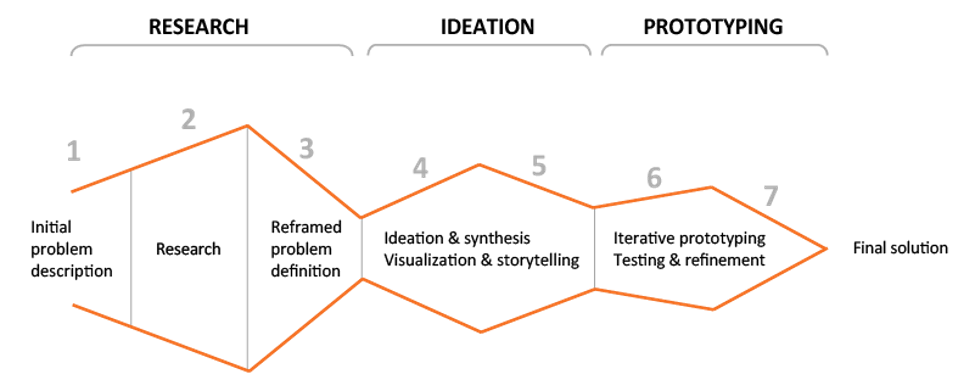
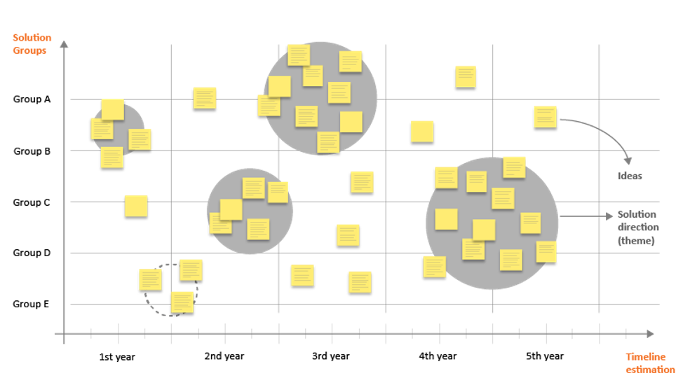

## Divergent and Convergent Thinking

Once you’ve done enough research to feel confident about your understanding of the problem definition, you will begin to work through cycles of divergent-convergent thinking, or ideation and synthesis. Both divergent thinking—creating choices—and convergent thinking—making choices—are essential. You cannot succeed by focusing on one at the expense of the other. And yet many in business tend to focus on the convergent side of the equation. You must spend time in divergent thinking and ideation to generate robust responses to the problem.

Divergent thinking, or ideation, is creative and generative. Your job during ideation is to come up with ideas, not criticize them. Convergent thinking, or synthesis, is analytical. During synthesis you select those ideas most likely to solve the problem. The criteria you use to make your decisions should be defined at the end of the research stage. You’ll then take those few good ideas and use different divergent-convergent strategies to test these potential solutions according to your criteria. As you continue your diverge-converge work, you may identify the need for more research or you may discover the need to tweak your understanding of the problem definition. You may also come closer to a set of ideas that you want to test out in more detail in the prototyping stage.

Before the design team begins ideation, individual team members have work to do. Each team member must prepare for ideation by spending some time with the user research, other information gathered relating to the project, and the criteria established in the reframed problem definition or design brief. You will likely consider questions such as these:

1. What questions do I have about the research findings?
1. What does a research finding remind me of and why might that be significant in finding a solution?
1. What research findings seem to contradict or conflict with other research findings?
1. Which are the research findings that would seem to most limit the possibilities of a solution? Which findings are the least restrictive?
1. Is there any other information that the team needs to gather?

Write down any preliminary ideas you have, in the first team meeting, you and the other team members will discuss these and other questions. The work that you do as an individual prior to the team’s first ideation meeting will help ensure that this first meeting is energetic and productive.

## People, Resources, and Location

Ideation can be disorganized and unproductive if you do not have a person to provide some structure to this activity. You will want to select an ideation facilitator to help the team members get in the right frame of mind, remind people of the task at hand, and encourage new ideas when people feel “stuck.” It is likely that your ideation facilitator will also be your design team or project leader. But whoever it is, you need a facilitator who has the following qualities:

1. Can inspire creativity
1. Has high energy
1. Is trustworthy and will not shoot down a particularly divergent idea with a sarcastic comment
1. Is good at moderating a discussion in which the ideas are the star, not the person leading the discussion
1. Has good people skills and conflict management skills
1. Has experience leading ideation discussions

You will also want to appoint someone to be a note-taker or records-keeper to capture all of the ideas generated at this meeting. This person may write down ideas that people say, organize ideas as they are generated, or be responsible for capturing photographs of all of the ideas after the session is over. This person’s role may be flexible based on your ideation method and ground rules, but it is important to document the team’s results.

You will need a comfortable place to work and share ideas. Make sure that the space and materials available to your team support their creative work. Ideally, the team will have a conference room or other space that they can claim as their own for the duration of their work together. They will need at least one large empty wall, many sticky notes, markers, writing pads, pens, tape, and any other materials that will facilitate their work. Display information such as personas, criteria, and key research takeaways on the walls so that you can always refer to these as you ideate. Keeping this work up on the walls between meetings can help your team jump back to where they left off at the end of the previous meeting.

## Setting Ground Rules

You and your team members have been reflecting on the findings from the research stage and are ready with ideas and questions. The first step in ideating is to set ground rules. Ground rules outline how the group will work together in this ideation stage and are particularly valuable for ideation, which is dissimilar to the sorts of work meetings many of us are used to.

The following seven rules are a good start, but you should feel free to draft additional rules as a group.

1.  **Defer judgment.** You never know where a good idea is going to come from. The key is to make everyone feel like they can say the idea on their mind and allow others to build on it.
1.  **Encourage wild ideas.** Wild ideas can often give rise to creative leaps. In thinking about ideas that are wacky or out there we tend to think about what we really want without the constraints of technology or materials.
1.  **Build on the ideas of others.** Being positive and building on the ideas of others takes some skill. In conversation, we try to use “and” instead of “but.”
1.  **Stay focused on the topic.** Try to keep the discussion on target, otherwise you can diverge beyond the scope of what you’re trying to design for.
1.  **One conversation at a time.** Your team is far more likely to build on an idea and make a creative leap if everyone is paying full attention to the person sharing a new idea.
1.  **Be visual.** In live brainstorms we write down on sticky notes and then put them on a wall. Nothing gets an idea across faster than drawing it.
1.  **Go for quantity.** Aim for as many new ideas as possible. In a good session, up to 100 ideas are generated in 60 minutes. Crank the ideas out quickly and build on the best ones.

## Ideation Methods

The main goal of an ideation session is to generate and record as many ideas as possible to solve the problem. Some ideas may build on other ideas. Some ideas may be unusual and unique. Do not judge ideas at this time, just generate ideas and record them. Ideas will be evaluated at a later stage.

There are many methods for generating. Ideas and you will likely use a combination of these during ideation. Here is a collection of a few ideation methods:

1. **Review the Research:** This is a basic but powerful ideation strategy that works best when each member of the team takes some time to review the research findings and personas on their own. When the team re-convenes for an ideation meeting, each team member will be ready with ideas and questions based on their re-examination of the research. You can also review the research and your personas at any time for inspiration during the ideation session.
1. **Brainstorming:** A common strategy where groups build on the ideas of others. Wild idea generation may help you break out of stale thinking or an unacknowledged set of assumptions about the problem. Some people criticize brainstorming as ineffective, but when used properly it is a good method to get ideas flowing.
1. **Note and Vote:** This requires individual team members to sit and write down ideas on their own, edit them, then share the best ones with the rest of the team. The team as a whole then votes on which ideas to carry forward.
1. **Brainwrite:** Each member of a team takes a few minutes to write down their ideas on paper. Then each person passes their piece of paper to another person, who will elaborate on the ideas. After a few minutes, team members bass the papers to yet another person, who elaborates, and so on. After 15 minutes or so, collect the papers and post them for discussion.
1. **Worst Possible Idea:** This method helps re-energize a tired team or provides a fun way of getting started. Some people refer to this as “reverse brainstorm.” Rather than finding a good situation, team members identify the worst possible ideas or even ways of causing or worsening the problem you’re trying to solve. Finding the worst possible solution can relieve the stress and scrutiny involved in ideating good suggestions.
1. **Mindmap:** This is a technique in which participants draw a web of relationships. To get started, write a problem definition or a key phrase in the middle of a large piece of paper or a whiteboard. As team members have ideas, write those on the same page in a location that indicates how this new idea is related to the others. After that, begin to connect associated ideas by drawing lines. This can be a helpful way of understanding particularly complex problems.
1. **SCAMPER. (Substitute/Combine/Adapt/Modify/Put-to-another-use/Eliminate/Reverse):** This set of seven action words helps groups generate more ideas or think about ideas in a new way.

Remember to keep your thinking positive while you are generating new ideas. Very often the best new ideas and innovations come after you have developed some ideas, so don’t cross any solutions off your list yet. This will also get you into action—physically recording words and drawings so you can remember all the ideas and so others can see what you are thinking.

## Recording and Visualizing Your Ideas

As you think of ideas, immediately record what you are thinking. Don’t stop to edit your writing or self-criticize. Use a new piece of paper for each idea and use both writing and sketching to capture the essence of the idea. Whether you are creating a simple sketch of a new product, connecting ideas with shapes or arrows, or showing how stick figure people engage with your service, visualized ideas are much easier to convey than expressing ideas with words alone.

Sketching is quick and only includes the impression (look, shape, feel) of the proposed solution. It allows you to put your ideas in visual form so that others can respond to it. It is much easier to discuss a product or service when it is illustrated in some way. It gives the team something to point to or refine. Sketching also helps people with idea generation. The interaction of the mind, the eye, and the hand working together can lead to many solutions. Sometimes the need to sketch quickly is warranted when the ideas start to flow freely. Visual communication of an idea is key here and will generally consist of a combination of sketches, words, and photos. It is important that the team members see what the other team members came up with for ideas. It may trigger a different idea or an enhanced solution.

Later on, in storyboarding, you tell the story of the user interacting with the idea by sketching the proposed solution along with the intended environment and the user.

## How do you Know you are Done with Ideation?

Your team has come up with some ideas and you feel you have a set of possible solutions. Are you finished ideating? Maybe. Your team may feel as though they can’t come up with any other ideas. But your team may still have some great ideas that just haven’t been discovered yet. It is natural for a team to go through a slump, where you feel as though all the good ideas were already said. This is when you may want to take a break, try some creativity exercises and review the research, then come back for one last push for ideas.

Your ideation facilitator should have a sense of when the team has come up with enough ideas to move forward with. An experienced ideation facilitator will know the difference between a slump and being ready for prototyping. Some signs that can help an ideation facilitator know the team is done are:

1. Everyone has contributed ideas
1. You are seeing a lot of the same ideas being suggested
1. You have many ideas that address the problem well and that fit your criteria
1. Asking for more ideas feels unproductive

If the facilitator ends the ideation session and you think of a new idea, record the idea and bring it to the next session. Even ideas thought of after the formal ideation session can be incorporated in the later stages of the process.

At this point it is time to move to synthesizing your ideas, or convergent thinking. In this stage you will evaluate your ideas and select the best ones for prototyping. You likely already have been doing this as you were ideating as it is natural to start organizing the ideas as they come up. It is important to re-evaluate all ideas now that you have the full set in front of you.

## Convergent Thinking (Synthesis) Overview

Once your team has come up with many ideas, the ideation facilitator should start to work with the team to organize and evaluate the ideas. This is the convergent thinking, or synthesis part of the process.

You may find that you do this multiple times within the ideation stage—you ideate (diverge) for a while, synthesize the ideas (converge), then ideate some more and synthesize again. For example, you can evaluate the ideas you came up with on your own before the ideation session to see if they are in alignment with the problem definition and to make sure you are on track before launching into a full ideation session. Then you can have a dedicated session at the end of the ideation session to group the ideas into common themes and evaluate all ideas generated. In the end, convergent thinking, or synthesis, helps you identify the ideas that seem most likely to solve your stated problem. You move from quantity of ideas to quality of ides.

## Methods for Initial Organizing and Evaluation of Ideas

During your ideation session you should have recorded each idea on a separate piece of paper or sticky note so that it is easy to move around. This is so that later you can physically organize the ideas in meaningful ways to make them easier to see patterns and evaluate them. It’s likely you have already started to pair related ideas together as you were thinking of them, placing your idea on the wall next to another idea that shared some related element. Or perhaps all of your ideas are still mixed all together on a wall or table and still need sorting.

During this stage of the process you will organize or group your ideas so you can evaluate them against the reframed problem definition and start to filter out ideas you will not proceed with. The following are some methods you can use, but your team may decide on other ways that better suit your project:

1. **3-Circle Sorting:** Draw the 3-circle Venn diagram (business, user, technology) on a whiteboard or a large piece of paper. Place ideas where they best fit in the Venn diagram. For example, if an idea fits the user needs and the technology for it is already owned by the organization, but it isn’t viable for the business from a cost standpoint, the paper with that idea on it would be placed in the overlap of the User and Technology circles. Ideas that don’t fit anywhere are placed outside the circle and not a good fit for this project. The most promising ideas are placed in the center and should be considered for prototyping.
1. **Affinity Diagram:** Begin with a blank wall or whiteboard and each idea written on a sticky note. Find two similar ideas and place them next to each other on the blank wall. Take one more idea and decide whether it is similar to the two on the wall or needs its own separate group. Work through the rest of the notes, determining whether it is similar to emerging groups on the wall or different, creating new groupings when that seems sensible. Move notes from one group to another as the group discovers different ways of thinking about your ideas. Begin to label the groups when that makes sense to you. Feel free to reorganize groups as you review other ideas. By the end you should have organized all ideas into themes and/or hierarchies.
1. **Criteria Marking:** Determine a color for each of your main criteria from the reframed problem definition/design brief. You may want to use colored stickers or markets. Place colored marks/stickers on each idea based on what criteria it fulfills. Move all ideas that have the most colored marks into a separate pile for further evaluation.
1. **Voting:** Similar to the criteria marking method, you can have the team vote on the ideas that best solve the problem by placing a colored sticker or mark on the idea paper of their choice. Team members each can have a certain number of vote marks/stickers to use so they can vote for multiple good ideas. You don’t need a consensus, but if the majority of the team is supportive of a solution or idea, it should be further evaluated and likely prototyped.

As you begin to group and organize ideas, you may find that this sparks some new ideas. Record these and add them to your collection. You can continue to ideate as you are working on synthesis. The repeated cycles of divergent thinking and convergent thinking is one of the benefits of the design thinking process.

## Methods for Further Narrowing to the Most Promising Ideas

Your next step is to decide which ideas to proceed with for prototyping. Your grouping and organization tasks or your critiques may have revealed these. If not, the following are some methods you can use to further refine and select ideas to move forward with. These methods are best used with a smaller subset if ideas which is why we are covering them separately from the initial set of methods. Again, your team or organization may have other methods that better suit your project.

1. **Decision Matrix Analysis:** A matrix that evaluates each option against a set of criteria. Best for when you have well-defined criteria that will come into play for the decision.
1. **Paired Comparison Analysis:** A matrix that evaluates the relative importance of an option against the other options. Best for decisions where criteria is subjective or ideas are very different.
1. **Strategic Direction Map:** This tool is like an affinity diagram overlaid on a timeline. Draw a horizontal line on a whiteboard or large piece of paper and label it with year 1, year 2, etc. Take the most promising groups of ideas from your initial round of convergent thinking and begin to think about when the ideas might be implemented. Place the groups of notes on the timeline. You may need senior leadership’s input to do this. Make sure to keep idea groups or key themes together. This tool can help your team identify what ideas are possible to do right now versus ones that should be saved for later. An illustration of how ideas can be grouped on a timeline is shown below:

## What Happens to Ideas You Don’t Proceed With?

During the convergence/synthesis stage you will likely have many ideas you will not be moving forward to prototyping. What happens to all these ideas? All ideas generated by the team should be saved and recorded, rather than discarded. Even though the ideas may not have been ideal for this problem or did not meet the target interests of the stakeholders, they may still be relevant in other circumstances or applications. They should be archived and revisited as necessary. Make sure to include the date on the collection of ideas so you know when they were generated. For record-keeping purposes, your organization may also want you to document the name of the person who came up with the idea. Your organization can help you decide what to do with the ideas you will not move forward with, including selling or trading the ideas, saving them for a future development, applying their use to a different project, or storing the unfit ideas for an unanticipated future use.

## What Happens to Ideas You Do Proceed With?

When you select the ideas to take forward into prototyping, you may ask someone with more refined sketching skills to make detailed drawings or models that visualized added features, colors, typefaces, animations, etc., to be used as prototypes. Remember to put a date on the drawings. This is also the time where you will want to bring in all stakeholders to review your most promising options and get their initial impressions. Having your detailed sketches and storyboards can help you communicate your ideas. How many ideas you decide to take forward into prototyping will depend on the amount of time you have, your budget, and the feedback you receive from users and from management.
