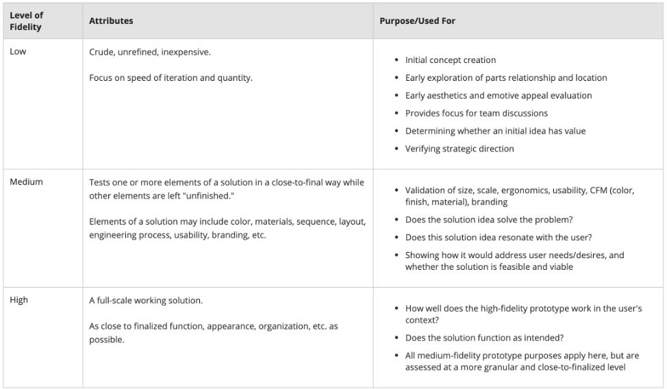
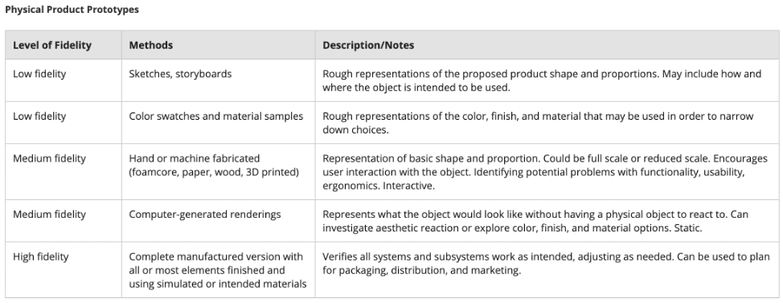
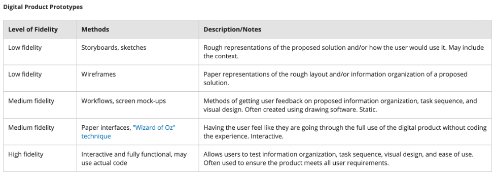
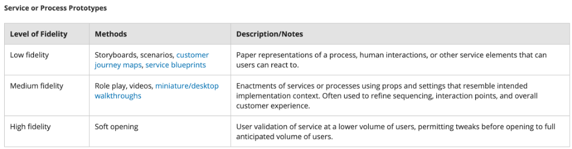

## Your Prototype is a Hypothesis

In science, a hypothesis is a proposed explanation of a phenomenon. Even more important, for a proposed explanation to be a hypothesis, it must be testable. A prototype is a proposed solution that is based on your research and your understanding of the users’ problem. You must test a prototype to discover whether it is effective. In user testing, users interact with prototypes and provide feedback, which you incorporate into additional prototypes.

Don’t get too attached to ideas at this stage before you test them thoroughly with users. Even though prototype production can be expensive, the ROI in prototyping is high. It is better for your organization’s reputation and often less expensive to catch and fix a problem before your product or service is released to the public. The investment in producing prototypes should also be based on how they help you better understand the user and the market. Also note that prototypes are not just for the end of the process right before launch. Prototypes can be done at any stage of the design thinking process, anytime you have an idea or want to explore something with a user.

As with the research and ideation stages, iteration is important in prototyping. You will want to prototype quickly and you should plan on creating many prototypes, incorporating user feedback along the way. It doesn’t matter whether you are creating a product or a service, testing your solution ideas with users and using their feedback to make your solution better will help you be more successful.

## Which Type of Prototype Do You Need?

Some prototypes are made quickly by printing versions in a machine, mocked up in software tools for a look and feel of the intended interaction, or just put together with foam board and tape for a ‘quick and dirty’ idea of the shape and scale. Others take more time and expertise to create so the full experience of the solution can be evaluated. You will need to choose the right prototype to fit your process and to visualize what you are testing. The type of prototype you create will depend on a number of factors, including what information you need from users, how close you may be to completion, whether you are exploring a hypothesis or testing a conclusion, and in what environment the user will be interfacing with the prototype.

Some common ways to talk about the type of prototype you need are the fidelity level of the prototype, the method you use to create it, and the criteria you plan to test.

## Fidelity Levels of Prototypes

The fidelity of a prototype describes the amount of detail in the prototype and how much it resembles a finished solution. The following table lists the levels of fidelity and what each is typically used for.

Your first instinct may be to make a prototype closest to the finished solution so that everything about it can be tested immediately. However, starting with a high-fidelity prototype can be problematic for a few reasons:

1. Higher fidelity prototypes generally take more time and cost more money than other levels of prototype, so you can invest a lot in making a prototype only to find out that this solution does not work with your users. In the beginning, it is best to start with low-fidelity to medium-fidelity prototypes as these will be quicker and easier to make, while still conveying enough about an idea for a user to react to it.
1. Higher fidelity prototypes also feel more “finished” to both you and your users, which means they also feel harder to discard or change. In contrast, when you give a user a low-fidelity or medium-fidelity prototype, it feels unfinished and can spark users to want to give you more feedback to finish it. You generally only move to higher fidelity prototypes once you need to validate the full solution you are planning to release to the public.

## Methods of Prototyping

There are many different methods for creating prototypes based on the fidelity level needed and the type of solution you are working on. Some methods are easy to make by people of all skill levels. Other methods may need a person skilled in doing that type of work. This is where having a diverse team can help you to create the necessary prototypes. The following three tables list some suggested methods for each of the main solution categories.

## Criteria to Test

You’ll decide which type of prototype to test based on the information you want from your users, but how will you interpret their feedback? Before you begin testing, you must make a series of decisions.

1. **Develop criteria:** Criteria are principles or standards that you use to judge or evaluate something . Your criteria will be the aspects fo the prototype that you’ll be testing with users. How do you decide which criteria to use? Your problem definition can help. The list below describes some criteria that are common to testing product prototypes. Some fo these criteria can also be used for services.
   1. **Functionality:** How well does the product or the system work?
   1. **Usability and ergonomics:** How safe, easy to use, or aligned with standards and rules is this prototype?
   1. **Aesthetic appearance and emotive preferences:** To what degree do users want to purchase or use this prototype? Doe users feel happy when using this prototype?
   1. **Sustainability:** Is a sustainable or recycled material used whenever possible? Can we continue to use the resources needed over time?
   1. **Contextual relevance:** How is the solution suitable for the user’s situation and their environment?
   1. **Business assumptions:** How viable is the solution? In other words, will it increase profits or strategically expand market share? Does it align to our organizational mission?
   1. **User experience:** How does the prototype solution represent a better experience for the user?
2. Set levels and determine the success threshold: Once you’ve defined criteria, you’ll need to think about the data that you’ll be gathering for each criterion. What type of data, qualitative or quantitative, will you need to collect? How will you analyze the data to determine whether a prototype’s approach to a criterion is successful? This can be confusing, so let’s use an example.
   1. You’ve developed a prototype for a television remote and you’d like to know whether it is easy to use. One of the primary functions of a remote is to turn a television on and off. You decide to measure ease of use in turning off the television in two ways: time and user satisfaction. You will measure how long it takes a user to turn the television off and have decided that anything faster than 5 seconds is a successful result. Then you decide to ask users a Likert scale question, so that users can tell you whether they felt the remote was easy to use. You define the levels of ease of use as “Very easy,” “Somewhat easy,” “Neither easy nor difficult,” “Somewhat difficult,” and “Very difficult.” You decide that three responses—“Very easy,” “Somewhat easy,” “Neither easy nor difficult”—are acceptable responses. You’ve set levels in your Likert scale question by defining five possible responses to your question. You’ve set thresholds for success by determining that 5 seconds or fewer is a good result, as is anything better than “Neither easy nor difficult.” By setting levels and thresholds, you can now gather and analyze data quickly and confidently.

It takes work to determine criteria, levels, and thresholds, but doing this work will allow you to make confident decisions about which prototypes are most effective. Document these criteria and their levels before you start testing . Share them with your team so that everyone understands how to interpret and assess the user feedback on prototypes. Work with management to rank criteria by importance. If you get mixed feedback from users or a solution cannot meet all criteria, prioritizing some criteria over others can help you make confident decisions about which prototypes to refine for further testing.

## Testing Prototypes with Users

All of the hard work you’ve put into design thinking finally pays off when you begin to get user feedback on your prototypes. You may wish to have the same person or people who conducted your initial user research gather the feedback on your prototypes. Or if you are working independently, you will need to take on this role. Rather than the generative research conducted earlier in the design thinking process, this research is evaluative and will help you understand how well your prototypes address the users’ problem.

You are always testing a prototype to validate and inform each iteration. Your tests should try to answer the following questions:

1.  Are our findings and assumptions correct? Are we looking at the right scenario?
1.  Does this idea have value?
1.  Does this solution work right? Does the solution solve the problem?
1.  Does this solution resonate with you? Is this solution marketable?

Overall, you want to get your prototypes in front of users as early as possible. Always keep an open mind. Don’t make assumptions. Focus on observing.

## A General Process for Testing Prototypes

The following are some things you should do when setting up your testing session:

1.  Similar to conducting research, you should test potential solutions with your intended users in the users’ context
1.  Plan to take notes throughout the entire session. Besides writing down general comments about what you observe, you should record the data specific to the testing criteria and levels/thresholds you previously established. This is necessary in order to reveal how well the solution performed and what needs to be done to prepare the solution for the next stage of development.
1.  If you can, also capture photographs and record audio and/or video. This will help when sharing your findings with your stakeholders and team. Before photographing or recording, you must obtain consent from your users.

The following is a general process for testing prototypes with users:

1.  Begin the testing session by explaining the problem definition you had.
1.  Tell the users this is a rough version of the idea and not all of the functionality/look/etc. is finalized.
1.  Tell the users that that you are seeking honest, open feedback on what works, what doesn’t work, how they feel, etc. so that you can improve your idea.
1.  Let the user explore the prototype in their own way at their own pace first. Do not explain what the prototype is supposed to be or do at this point. Allowing the user to interact with the prototype without your direction may provide you with surprising user feedback.
1.  Ask the user to complete certain tasks or to answer questions relating to the criteria you developed. Do not interrupt them or help them unless there is no way to continue without your intervention.
1.  Do the same test with multiple users and test different prototypes with the same user.
1.  After each session, identify what you can improve for the next iteration and what you should keep about the current vesion. After collecting information from multiple sessions, work with your team to decide on an prioritize changes for the next iteration.

## Iteration in Prototyping

Prototyping is getting information from users, but it is also the work that you do to apply the user feedback to a new and more finely targeted solution. After testing, you should change or refine the prototype to ensure that the next prototype incorporates user findings and advances the development until the right solution is found. Sometimes you will move from a lower-fidelity prototype to a higher-fidelity prototype. Other times you may need to go back to make a different lower-fidelity prototype to test a different element of your solution idea or a different version. This iteration is key in this stage to understand if your solution is desired by and works for your users.

During iterative prototyping, you may develop an idea or new approach that doesn’t work for the current problem but might be applied to future problems. Keep records of all prototypes, and all tests of both “good” and “bad” prototypes, for use in future projects.

## How do you Know You are Done Prototyping?

With each prototype you test with users, you should gain confidence that you have a better understanding of the problem. You will also find that there is one solution that begins to stand out as meeting most or all of your established criteria. You will know you are done prototyping when you are confident in the solution and in your design thinking process, and your user is happy with your solution and how it works in their context.

## The “End” of the Design Thinking Process

Once you’ve reached the end of your testing, you will need to present the work from the prototype stage to your stakeholders. Be sure to ground your presentation on the research findings and reframed problem definition communicated to stakeholders earlier in this process. Include data collected on the criteria, levels set, whether thresholds for success were met or not met, and any new understandings of the problem. This is where your photographs or recordings can augment your presentation.

When everything is approved by your stakeholders and ready to move forward, it is important to implement your solution as a real solution in the world. The release cycle associated with your product or service will vary based on industry, organization, and the problem that you’re addressing.

So now your solution is public, your users are happy, and you’re done with the design thinking process, right? No. Think of the release of your product or service as a very finely tuned prototype. You need to continue to capture user feedback and track the competition to determine when you need to update your product or service. While the work of the current team may be over, in the context of design thinking and prototype development, the cycle of innovation never stops.
