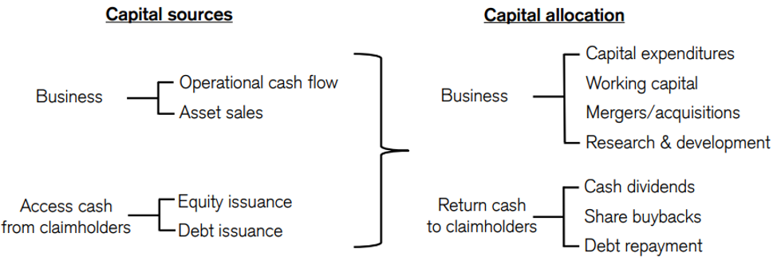
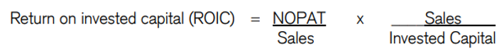
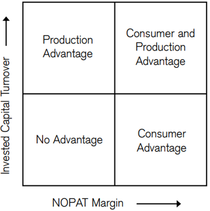
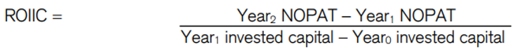

## Overview

Capital allocation is the most fundamental responsibility of a senior management team. Successful capital allocation means converting inputs (i.e. money, things, ideas, and people) into something more valuable than they would be otherwise. The net present value (NPV) test is a simple, appropriate, and classic way to determine whether management is living up to this responsibility. Passing the NPV test means that $1 invested in the business is worth more than $1 in the market. This occurs when the present value of the long-term cash flow from an investment exceeds the initial cost.

Why should value determine whether a management team is living up to its responsibility? There are two reasons. The first is that companies must compete. A company that is allocating its resources wisely will ultimately prevail over a competitor that is allocating its resources foolishly. The second is that inputs have an opportunity cost, or the value of the next best alternative. Unless an input is going to its best and highest use, it is underperforming relative to its opportunity cost.

The process of making inputs more valuable has a number of aspects. A logical starting point is a strategy. Properly conceived, a strategy requires a company to specify the trade-offs it will make to establish a position in the marketplace that creates value. A strategy also requires a company to align its activities with its position and to execute effectively.

Since a company’s strategy is often in place already when a new CEO takes over, capital allocation generally becomes his or her main responsibility. The problem is that many CEOs don’t know how to allocate capital effectively. Warren Buffett describes this reality in his 1987 letter to shareholders:

_“The heads of many companies are not skilled in capital allocation. Their inadequacy is not surprising. Most bosses rise to the top because they have excelled in an area such as marketing, production, engineering, administration or, sometimes, institutional politics. Once they become CEOs, they face new responsibilities. They now must make capital allocation decisions, a critical job that they may have never tackled and that is not easily mastered. To stretch the point, it’s as if the final step for a highly talented musician was not to perform at Carnegie Hall but, instead, to be named Chairman of the Federal Reserve.”_

Intelligent capital allocation requires understanding the long-term value of an array of opportunities and spending money accordingly. It also includes knowing the value of a firm’s individual assets and being willing to sell them when they are worth more to others.

Capital allocation is a dynamic process, so the correct answer to most questions is, “It depends.” Sometimes acquiring makes sense and other times divesting is the better alternative. There are times to issue equity and times to retire it. Because the components that determine price and value are changing constantly, so too must the assessments that a CEO makes. As Buffett says, “The first law of capital allocation—whether the money is slated for acquisitions or share repurchases—is that what is smart at one price is dumb at another.” Proper capital allocation requires a sharp analytical framework and independence of mind.

So, if the job of management is to deploy capital so as to add value, it makes sense to start with a discussion of where capital comes from and how management teams have spent it in the past. The sources of capital include the cash the business generates and access to the capital of claimholders, including debtors and shareholders. A company can also sell an asset, which is a one-time realization of the cash flow the asset is expected to generate over its life.

Businesses that grow rapidly generally require a sizable amount of investment. For example, imagine a restaurant concept that is highly successful. To satiate that demand that firm must build lots of restaurants and hence invest a substantial sum in expansion. The rate of return on incremental capital is the maximum growth rate in operating profit a business can reach without external financing. By extension, a company with a return on invested capital (ROIC) greater than its growth rate will generate surplus capital.

Companies that cannot fund their growth internally must access cash externally, either by borrowing or selling equity . The pecking order theory is an idea in corporate finance that says that mangers of companies will typically choose to fund investments first with cash that the company generates internally, next with debt, and finally with equity. One essential tenet of thoughtful capital allocation is that all capital has an opportunity cost, whether the source is internal or external.

The uses of capital are where money goes. Executives can invest in the business through capital expenditures, increases in working capital, research and development, or mergers and acquisitions. These investments allow a company to grow. But growth, in and of itself, is never the goal of a thoughtful capital allocator. The proper metric of success is an increase in long-term value per share.

A company can also return cash to debt and equity holders. Debt repayment—a return of some or all principal and interest a company owes—is straightforward. A company can return cash to shareholders either by paying a dividend, where all holders receive the same amount, or by buying back stock. In a buyback, shareholders sort themselves. Those who want cash sell their shares and those who want to increase their stake in the company hold their shares. A dividend treats all shareholders the same no matter what the stock price.

In a buyback, selling shareholders benefit at the expense of ongoing shareholders if the stock is overvalued, and ongoing shareholders benefit at the expense of selling shareholders if the stock is undervalued. All shareholders are treated uniformly only if the stock price is at fair value.

## Mergers & Acquisitions

M&A is by far the largest source of redistribution of corporate resources of all the alternatives. For many companies, M&A is the most significant means to pursue strategic goals and the most costly way to do so. Companies should assess the merit of an M&A deal using the following formula: Net present value of the deal = present value of the synergies – premium. Simply stated, the formula says that a deal is good if the acquirer gets more than it pays for. The underlying premise is that the target’s stock price, pre-deal, accurately reflects the present value of the company’s future free cash flow. So the deal creates value for the buyer only if the synergy from putting the businesses together exceeds the premium for control the acquirer must pay to close the deal. This equation is more fundamental than superficial metrics such as accretion to earnings per share, which doesn’t appear to factor into the market’s reaction. As a result, the formula provides much more insight into a deal’s economic virtue.

Taking a closer look at the terms of the equation—there is a clear difference between cost synergies (the cost the companies can save by removing redundancies) and revenue synergies (the anticipated increase in sales from combining businesses). Cost synergies are much more reliable than revenue synergies. Other forms of synergies have historically played a less substantial role. The most common challenges companies cite for synergy realization include delays in implementing planned actions, underestimation of costs and complexities, and flat-out overestimation of synergies.

Any analysis of M&A should focus on the difference between the synergy and the premium. Succeeding at M&A is not easy for a number of reasons. First, if the premium is too large a company cannot recoup its investment, no matter how strategic the deal. Second, often competitors can replicate the benefits of a deal or take advantage of a company’s lack of focus as it goes through an integration process. Third, M&A requires payment up front for benefits down the road, which creates legitimate skepticism for investors. Finally, M&A deals are generally costly to reverse. The empirical evidence on M&A underscores the challenges that buyers face. Over time, it appears that a majority of acquirers see their stock prices decline following the announcement of a deal.

## Capital Expenditures

Capital expenditures are the second largest use of capital for companies. Executives and investors frequently distinguish between “maintenance” capital expenditures and total capital expenditures. Maintenance spending is the minimum required to maintain or replace the long-term assets in place. We can assume that capital expenditures beyond the maintenance level are in pursuit of growth. Depreciation expense serves as a rough proxy for maintenance capital spending. That maintenance is essential explains a good deal of the stability of capital expenditures. Further, it suggests that in assessing the value creation prospects of capital expenditures, you are best served to focus on the component that supports growth.

What factors should you consider to judge whether capital expenditures create value? The industry is a good starting point. Companies that invest in industries with a high return on invested capital and good growth prospects are more likely to create value. You can refine this analysis by considering whether the company has a specific competitive advantage as a low-cost producer or through differentiation.

The cyclicality of the industry is another important consideration in assessing capital expenditures. Spending in cyclical industries tends to follow the same pattern as M&A and buybacks: companies spend when things look good and hunker down when they don’t. As a consequence, companies tend to add too much capacity at the top of the cycle and suffer when the cycle recedes.

## Research and Development

Unlike M&A and capital expenditures, R&D is a capital allocation choice that shows up on the income statement rather than the balance sheet. Accountants expense R&D in the period the company incurs it, notwithstanding the potential long-term benefits, because they deem the outcomes too uncertain and difficult to quantify. R&D is a set of activities that seeks to develop new products or the tools to create new products.

R&D productivity is the relationship between the value a new product creates and the company’s investment in that product. But assessing productivity is a challenge because there is a lag between investment and outcome. A host of other factors, which are hard to capture, also weigh on the outcome. It is useful to distinguish between the cost to launch, or “R&D efficiency,” and the value per launch, or “R&D effectiveness.” One company may be good at bring a product to market (R&D efficiency) while a different company may be able to create more value for the product as the result of better design, marketing, or distribution capabilities (R&D effectiveness).

One approach to asses a company’s R&D productivity is to capitalize R&D, amortize it over an appropriate period, and calculate the return on invested capital (ROIC) so as to be comparable to businesses that are not R&D intensive. R&D capitalization has the effect of increasing profit (the R&D amortization amount is almost always less than expensed R&D, hence adding to profit) and increasing invested capital (since R&D is reclassified as a capital item rather than an expense). The challenge is to determine the appropriate amortization period, or roughly the time to develop a product. Some researchers who study the pharmaceutical industry assess R&D productivity by dividing a company’s R&D budget over some period by the number of drugs the company has brought to market. Rather than examining the cost of successful drugs only, this method captures the total costs a company incurs including the cost of failure.

## Net Working Capital

Net working capital is the capital a company requires to run its day-to-day operations. It is defined as current assets minus non-interest-bearing current liabilities. Net working capital equals about one-quarter of assets on average for companies in the U.S. The primary components of net working capital include inventory, accounts receivable, and accounts payable. Interest-bearing current liabilities, which include short-term debt and the current maturities of long-term debt, are a form of financing and are therefore not part of net working capital.

The cash conversion cycle (CCC), a calculation of how long it takes a company to collect on the sale of inventory, is the standard way to analyze working capital efficiency. The CCC equals days in sales outstanding (DSO) plus days in inventory outstanding (DIO) less days in payables outstanding (DPO).

Some firms, such as Apple, have a negative CCC, which means that the company receives cash on the sale of inventory before it pays its suppliers. This effectively makes the company’s suppliers a source of financing and can be relevant in competitive interactions. For instance, Walmart’s CCC in 2016 was 11 days, while Amazon’s was -24 days. With a CCC for each company in hand, you can compare the efficiency of working capital use from one company to the next.

Academic research shows a strong relationship between a lower CCC and a higher return on capital within, and across, industries. In other words, good working capital management is associated with high returns on invested capital. The impact on total shareholder returns, however, is less clear. Research suggests that a dollar invested in working capital is worth less than a dollar either held in cash or invested in the firm. Further, extending credit to customers through increasing receivables has a bigger effect on shareholder value than increasing inventory.

## Divestitures

Companies use divestitures to adjust their business portfolio. Actions include the sale of divisions, spin-offs, and equity carve-outs. A company will divest an operation when it perceives the value to another owner to be higher, or if the divestiture adds focus to the parent and hence improves results.

There are a few considerations in assessing divestitures. First, research has established that most of the value creation for a typical company comes from a relatively small percentage of its assets. This means that most companies have businesses or assets that do not earn the cost of capital and that may be more valuable to another owner.

Divestitures can lead to “addition by subtraction” when a company that divests an operation with a low return on invested capital receives more than what the business is worth as an ongoing part of the firm. So, there’s an addition of value to the company even as there’s a subtraction in the size of the firm.

Second, while M&A creates value in the aggregate, acquirers struggle to capture much, if any, of that value. This suggests it is better to be a seller than a buyer on average. This point is particularly relevant when there are multiple bidders for an asset. Contested deals frequently lead to what economists call the “winner’s curse.” When this occurs, the “winner” of the bidding pays too much for the asset, hence the “curse.” The winner’s curse means there is a wealth transfer, above and beyond the value of the asset, from the buyer to the seller.

Finally, most companies have a natural tendency to want to grow rather than shrink. As companies grow and diversify, capital allocation and strategic control can become more challenging. When a CEO who understands capital allocation takes the helm of a company with underperforming assets, there is a great opportunity to create value through divestitures.

Spin-offs are a prominent form of divestiture. In a spin-off, a company distributes shares of a wholly owned subsidiary to its shareholders on a pro-rata and tax-free basis. Analysis shows that spin-offs create value for the spin-offs themselves as well as the corporate parents.

## Dividends & Share Buybacks

A dividend is a cash payment to a shareholder that is generally paid from profits. Dividends and share buybacks are the main ways companies return cash to shareholders. Companies can also return cash to shareholders by selling the company for cash.

A share buyback is the second main way that companies return cash to shareholders. Whereas all shareholders are treated equally with a dividend, only shareholders who sell to the company will receive cash with a buyback. This means that shareholders realize very different outcomes based on whether they choose to sell or hold the stock when the deem it to be overvalued, fairly valued or undervalued.

The golden rule of share buybacks is that a company should repurchase its shares only when its stock is trading below its expected value and when no better investment opportunities are available. The golden rule addresses both absolute and relative value. Companies should only invest where they anticipate a payoff that has a positive net present value. This is a fancy way of saying “you will get more than what you pay for.” This absolute benchmark applies to all of a company’s capital allocation decision, including M&A, capital expenditures, and R&D.

The rule also addresses relative value when it emphasizes that companies should prioritize higher return internal investment opportunities over buybacks. Ideally, executives should rank their investment opportunities by expected return and fund them from highest to lowest. A company should expect that all of the investments it funds will earn above the cost of capital. While access to capital can be a constraint, most companies generate sufficient cash flow to fund their internal investments.

## Assessing Management’s Capital Allocation Skills

The framework for assessing a management team’s capital allocation skills has four components. First, you want to study how a company has allocated capital in the past. Next, you need to examine the company’s return on invested capital and, more importantly, return on incremental invested capital. Third is a careful consideration of incentives and corporate governance. And finally, you can compare management’s actions to the five principles of capital allocation.

### Past Spending Patterns

The first step in assessing a company’s capital allocation skills is to see how management has allocated capital in the past. You should break the analysis in two parts, one dealing with investments in the operations (M&A, capital expenditures, R&D, and working capital) and the other with returning cash to claimholders (dividends, buybacks, and debt repayment).

The value of a business is the present value of future free cash flow (FCF). Free cash flow is defined as net operating profit after tax (NOPAT), a measure of the cash earnings of the business that assumes no financial leverage, minus investment (I) in future growth:

FCF = NOPAT – I

NOPAT is determined by sales and sales growth, operating profit margins, and the cash tax rate. Investment is determined by changes in working capital, capital expenditures net of depreciation, and acquisitions net of divestitures. You can calculate these sums using what Alfred Rappaport calls “value drivers.” Capital allocation is primarily about the value drivers that determine investment.

To make the comparison clean, Rappaport defines value drivers as the number of cents the company invests in each use for every $1.00 change in sales.  For example, if a company’s working capital grows by $10 in a given year and its sales grow by $100, the incremental working capital rate is 10% ($10/$100).  If in the same year capital expenditures are $130 and depreciation is $70, the fixed capital rate is 60% ($60/\$100). You can calculate the value driver for acquisitions less divestitures in the same way.

A useful first step in assessing capital allocation is to see how much was invested in each area for an incremental dollar of sales over time. Calculate results for a minimum of three years, if available, and go back five to ten years when possible. Here are the numbers for Walmart for the five years ending in fiscal 2016:

Incremental working capital investment rate = 3.6%
Incremental fixed capital rate = 31.6%
Incremental M&A rate = 0.2%

Instantly, you will see whether the company is investing in working capital, capital expenditures, or M&A. That allows you to focus your attention. In this case, it is clear that capital expenditures are the main use of capital.

Here are the numbers for Cisco Systems over the past five years (fiscal 2011 – 2016):

Incremental working capital investment rate = 17.0%
Incremental fixed capital rate = 41.2%
Incremental M&A rate = 226.7%

Now you can see that M&A has been more important than capital expenditures. In this case, you would roll up your sleeves and figure out how management approaches its M&A decisions. You might also review past deals to see how the market reacted.

This analysis is also useful to assess the change in practices from one CEO to the next. Some CEOs may seek to grow primarily organically, which will raise one set of analytical issues. A successor may be more acquisitive, raising a separate set of issues. Assuming past behaviors provide some basis for anticipating future behavior, this analysis is very useful.

Look for inflection points as well. Are capital expenditures ramping up versus prior levels of spending? Is the company improving its cash conversion cycle? You want to note changes in spending patterns so as to align your analysis with the developments at the company.

The second component of this analysis is to understand how and why management has returned cash to claimholders. This also requires considering a company’s capital structure and whether it can or should change. The key is to understand the rationale and motivation for the decisions management makes to evaluate whether they are consistent with the principles of building long-term value per share. Most companies say they use the net present value rule to make investments, but the reputation of the division manager requesting resources is important as is senior management’s “gut feel.”
As a practical manner, many companies approach capital allocation through a budgeting process. In a simple version, each division has a capital budget and can either accept that amount or ask for more. Such a request may be subject to a value audit. Research shows that such a budgeting process can lead to overinvestment in low return projects if the budget exceeds the opportunities and underinvestment if the opportunities exceed the budget.

### Calculating Return on Invested Capital and Return on Incremental Invested Capital

The second component to assessing capital allocation is determining the output of management’s decisions through an analysis of return on invested capital (ROIC) and return on incremental invested capital (ROIIC). ROIC provides a picture of the company’s overall performance while ROIIC dwells on the efficiency of incremental spending.

NOPAT is the numerator of ROIC. Because NOPAT assumes no financial leverage, the sum is the same whether a company is highly levered or free of debt. This is essential for comparability within and across industries.

Invested capital is the denominator of ROIC. You can think of invested capital in two ways that are equivalent. First, it’s the amount of net assets a company needs to run its business. Alternatively, it’s the amount of financing a company’s creditors and shareholders need to supply to fund those net assets. These approaches are the same since dual-entry accounting requires that both sides of the balance sheet equal one another.

You should calculate ROIC using the assets side of the balance sheet if given a choice, as that allows you to see how efficiently the company is using capital. In contrast, the right-hand side shows only how much capital the firm has and how it ahs chosen to finance the business. Ideally, you should calculate ROICI from both the left- and right-hand sides of the balance sheet.

In fiscal 2016, Walmart’s NOPAT was $15.5 billion, and its average invested capital was $143.0 billion, for an ROIC of 10.8%. This is well in excess of the company’s cost of capital. Since strategies, a bundle of investments, must earn a return in excess of the cost of capital in order to pass the NPV test, ROIC can be a rough proxy for value creation.

Academic research shows that the market rewards investment in organic growth in high return businesses. Typically, companies that earn high ROICs are said to have some sort of competitive advantage. A quick analysis of ROIC indicates whether a company has a competitive advantage and, if so, what lies at the foundation of that advantage.

Bruce Greenwald argues that there are two sources of competitive advantage: consumer advantage and production advantage. The key to each advantage is the creation of barriers to entry that fend off competition. Barriers to entry are particularly strong when a company enjoys economies of scale, which mean that the cost per unit for the incumbent is lower than that for a challenger.

A consumer advantage is the result of the habitual use of a product, high costs of switching to a new product, or high costs of searching for a superior product. A production advantage allows a company to deliver its goods or services more cheaply than its competitors and is the result of either privileged access to inputs or to proprietary technology that is difficult or costly to imitate. A competitive strategy analysis focuses on identifying these sources of advantage and assessing their durability.

ROIC can provide a quick and useful way to investigate competitive advantage. You can decompose ROIC into two parts, a modified version of what is known as a DuPont Analysis:

The ratio of NOPAT/Sales, or NOPAT margin, is a measure of profit per unit. Sales/Invested Capital, or invested capital turnover, is a measure of capital efficiency. Sales cancel out when you multiply the terms and you are left with NOPAT/Invested Capital, or ROIC.

The exhibit below summarizes the analysis. If a company gets to a high ROIC through a high NOPAT margin, you should focus your analysis on a consumer advantage. If the company’s high return comes from a high turnover ratio, emphasize analysis of a production advantage. For companies that are high in both, consider how the advantages are reinforced by economies of scale.

Having defined and discussed ROIC we must now emphasize that it’s not the absolute ROIC that matters but rather the change in ROIC. Or, even more accurately, what’s crucial is the expectation for changes in ROIC. Needless to say, the market is not always perfect at anticipating change in ROIC, so having a sense of where ROIC is going can be of great value.

One potentially useful measure is return on incremental invested capital, or ROIIC. ROIIC properly recognizes that sunk costs are irrelevant and that what matters is the relationship between incremental earnings and incremental investments.

The definition of ROIIC is as follows:

In words, ROIIC compares the change in NOPAT in a given year to the investments made in the prior year. It is preferable to calculate ROIIC on a rolling three- or five-year basis for businesses with investments or NOPAT that are lumpy. At the other extreme, you can take quarterly changes and annualize them if you want to see if there are any recent trends or improvements. Obviously these results will be the most volatile, but they can give you some insights into how the business is doing.

High ROIICs generally indicate that a business is either capital efficient or has substantial operating leverage (which often proves transitory). Calculating a company’s historical ROIIC can be very helpful in understanding potential earnings moves.

A final note of warning: ROIIC—for a host of technical reasons—is not really an economic measure of value. Further, ROIIC makes the strong underlying assumption that the ROIC on the base business remains stable. This is clearly not always true. So use the measure to determine the likelihood of change and to understand past patterns, but don’t compare it with the cost of capital or consider it a true return measure.

### Incentives and Corporate Governance

One of the essential lessons of economics is that incentives matter. But it is also the case that incentives designed to achieve one objective can lead to unintended consequences. The goal of this section is to consider whether the incentives a company has in place encourage judicious capital allocation. Most of these incentives address compensation.

Agency theory is the classic way to explain why the managers of a company may not act in the interests of the shareholders. The idea is that conflicts can arise when there is a separation between ownership and control of a firm. There are three areas where these conflicts tend to arise.

The first is that while it is clear that shareholders want management to maximize the value of their holdings, management may derive benefits from controlling resources that don’t enrich shareholders. For example, if remuneration is roughly correlated with the size of the firm, management may seek to do value-destroying M&A deals to grow.

The second area of conflict is with tolerance for risk. Since shareholders tend to hold stocks as part of a diversified portfolio and managers are disproportionately exposed to their own company, managers may seek less risk than shareholders would deem appropriate.

The final conflict is with time horizon. To the degree that compensation plans have a shorter time horizon than the period shareholders use to assess the merit of an investment, there can be a mismatch. So, managers may dwell on short-term boosts in earnings. Indeed, research shows that a large majority of managers are willing to forego value-creating investments to deliver near-term earnings.

So what kind of executive compensation scheme provides the proper incentives for management to build value? You can start with what you don’t want, which is incentive compensation that is completely independent of value creation. In this case, an executive would have limited incentive to build value because he or she would not benefit directly from that increase. At the other extreme would be the case where the CEO owns 100% of the company, blunting any concerns about agency theory.

As a broad characterization, compensation for CEOs in the past 30 years has moved from one based heavily on salary and bonus to one much more sensitive to stock price performance. Both the shift to stock-based compensation, seemingly a step in reducing agency costs, has brought with it a host of other challenges. Most pronounced is that many executives are now focused on boosting the stock price by whatever means they can rather than focus on creating value, which ultimately gets reflected in the market price.

There is a spirited debate about whether equity-based compensation is doing a proper job of encouraging management to focus on long-term performance. In practice, there are two challengers to equity-based compensation that makes it less effective than it might be. Properly structured compensation programs can address both challenges, but rarely do. The first is a company’s stock price is only a rough measure of corporate performance. Factors outside of management’s control, including general economic conditions, interest rates, inflation expectations, and the equity risk premium, can play a larger role in stock price changes than corporate results do.

The second challenge is that while the stock market does provide managers with information about investment opportunities and the past decisions of managers, that information can be noisy in the short run. That few managers understand market expectations effectively compounds this challenge.
So, what elements should you look for in an effective incentive program? The key is to look for a company that seeks to build long-term value per share with the belief that the stock market will ultimately follow that value. If the market fails to reflect that value, management can take action by sharpening communication nor buying back stock.

There are three elements to an incentive compensation program that supports judicious capital allocation. The first is to compensate senior executives with stock options or restricted stock units that are indexed to either the market overall or an appropriate peer group. Presuming that exogenous factors affect peers in a similar fashion as the target firm, indexing takes a large step toward isolating management skill and reducing the role of luck. Only individuals who can influence the stock price should be paid in equity, which limits the number of eligible executives.

Second, executives who run operating units, as well as front line employees, should be paid for exceeding long-term goals for the operating value drivers. These include sales growth, operating profit margins, and some measure of return on invested capital. Broader value drivers can be further broken down into leading indicators of value, performance measures that roll up to the value drivers.

For example, if a retailer has a goal of opening five new stores in a year, a leading indicator of value might include finding a store location and signing a lease. Here again, the incentives are awarded based on what the individual employees can control. Warren Buffett explains that a good plan “should be (1) tailored to the economics of the specific operating business; (2) simple in character so that the degree to which they are being realized can be easily measured; and (3) directly related to the daily activities of the plan participants.”

Finally, recognize that the debate about the short term versus the long term is an empty one. Instead, acknowledge that the goal is to maximize long-term value per share. This applies to activities that management expects to pay off quickly or in the distant future. Amazon is a company that appears comfortable taking a long-term view. The company’s CEO, Jeff Bezos, argues that there is less competition for long-term initiatives. He says, “If everything you do needs to work on a three-year time horizon, then you’re competing against a lot of people. But if you’re willing to invest on a seven-year time horizon, you’re now competing against a fraction of those people, because very few companies are willing to do that. Just by lengthening the time horizon, you can engage in endeavors that you could never otherwise pursue. At Amazon we like things to work in five to seven years.”

Incentives are an important determinant of behavior. Examine whether a management team is committed to building long-term value by examining their words, incentives, and actions. Agency costs are alive and well, and in many cases companies try to boost their stock price using artificial or superficial methods versus boosting underlying long-term value through the proper conception and execution of a strategic plan.

### Five Principles of Capital Allocation

1. **Zero-based capital allocation.** Companies generally think about capital allocation on an incremental base. For example, a study of more than 1,600 U.S. companies by McKinsey found that there was a 0.92 correlation between how much capital a business unit received in one year and the next. For one-third of the companies, that correlation was 0.99. In other words, inertia appears to play a large role in capital allocation. The proper approach is zero-based, which simply asks, “What is the right amount of capital (and the right number of people) to have in this business in order to support the strategy that will create the most wealth?” There is no reference to how much the company has already invested in the business, only how much should be invested.
2. **Fund strategies, not projects.** The idea here is that capital allocation is not about assessing and approving projects, but rather assessing and approving strategies and determining the projects that support the strategies. Practitioners and academics sometimes fail to make this vital distinction. There can be value-creating projects within a failed strategy, and value-destroying projects within a solid strategy. Another reason to be cautious about a project approach is that it is easy to game the system. It is common for companies to have thresholds for project approval. For instance, a plant manager can approve small projects, business unit heads larger ones, the CEO bigger ones still, and the board of directors the largest investments. But at each level, analysts can manipulate the numbers to look good. One of the aspects of the institutional imperative, as Buffett describes it, is, “Any business craving of the leader, however foolish, will be quickly supported by detailed rate-of-return and strategic studies prepared by his troops.” The key to this principle is recognizing that a business strategy is a bundle of projects and that the value of the bundle is what matters. The CEO and board must evaluate alternative strategies and consider the financial prospects of each.
3. **No capital rationing.** The attitude at many companies is that capital is “scarce but free.” The sense is that the business generates a limited amount of capital which makes it “scarce,” but since it comes from within it is “free.” The primary source of capital for companies in the U.S. is the cash they generate. The patterns of spending on the various uses of capital indicate the attitude of managements. Capital expenditures, R&D, and dividends receive priority, and M&A and share buybacks are considered when economic results are good. Internal capital allocation tends to be very stable from year to year, and inertia plays a large role. Business units may jockey for more capital, but the changes in year-to-year allocation tend to be modest. These observations are consistent with the “scarce but free” mindset. A better mindset is that capital is plentiful but expensive. There are two sources of capital that companies can tap beyond the cash generated internally. The first is redeploying capital from businesses that do not earn sufficient returns. Management can execute this inside the company or sell the underperforming business and redeploy the proceeds. The second is the capital markets. When executives have value-creating strategies that need capital, the markets are there to fund them in all but the most challenging environments. The notion that internally generated capital is free is also problematic. Thoughtful capital allocators recognize that all capital has an opportunity cost, whether the source is internal or external. As a consequence, many managers should explicitly account for the cost of capital in all capital allocation decisions. Too frequently, companies select actions that add to earnings or earnings per share without properly reckoning for value. The limiting resource for many companies is not access to capital but rather access to talent. Finding executives with the proper skills for success, including an aptitude for allocating capital, is not easy. This is a valid challenge but relates to recruiting and development, not access to capital.
4. **Zero tolerance for bad growth.** Companies that wish to grow will inevitably make investments that do not pay off. The failure rate of new businesses and new products is high. Seeing an investment flop is no sin; indeed, it is essential to the process of creating value. What is a sin is remaining committed to a strategy that has no prospects to create value, hence draining human and financial resources. Executives who follow this principle invest in innovation but are ruthless in cutting losses when they see that a strategy is unlikely to pay off. Many companies have the opportunity to create substantial value by exiting businesses where they have no advantage. This reduces cross-subsidization within the organization and allows for the best managers to work for the businesses that create the most value.
5. **Know the value of assets and be ready to take action to create value.** Intelligent capital allocation is similar to managing a portfolio of stocks in that it is very useful to have a sense of the difference, if any, between the value and price of each asset. This includes the value of the company and its stock price. Naturally, such analysis must include considerations such as taxes. With a ready sense of value and price, management should be prepared to take action to create value. Sometimes that means acquiring, other times that means divesting, and frequently there are no clear gaps between value and price. As we have seen, managers tend to prefer to buy than to sell, even though the empirical record shows quite clearly that sellers fare better than buyers, on average. The answer to most capital allocation questions is, “It depends.” Managers who adhere to this final principle understand when it makes sense to act on behalf of long-term shareholders.
