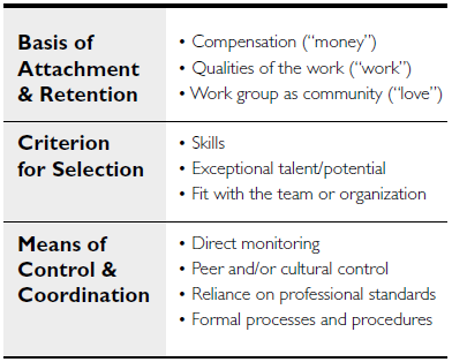
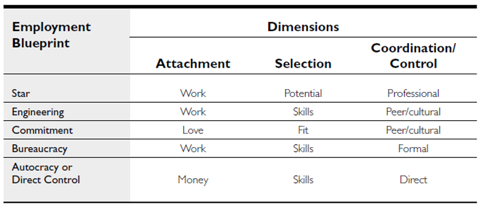
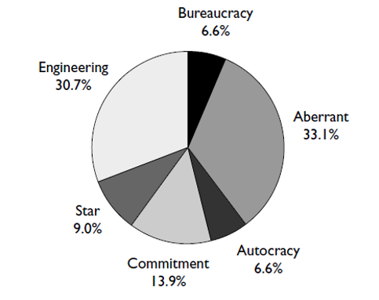

Though some observers might think that most start-ups look pretty much the same, or that the appropriate organizational design and culture for a high-tech venture is “obvious,” the data suggest otherwise. The Stanford Project on Emerging Companies (SPEC) found that founders’ notions about how work and employment should be organized varied along three main dimensions—attachment, coordination/control, and selection—each characterized by three or four fairly distinct options or approaches from which organizational architects seemed to be selecting. The figure and list below summarize the three dimensions and the main variants along each dimension.

1.  **Attachment:** Founders articulated three different bases of employee attachment, which the researchers labeled: love, work, and money. Some founders envisioned creating a strong family-like feeling and an intense emotional bond with the workforce that would inspire superior effort and increase retention of highly sought employees. What binds the employee to the firm in this model is a sense of personal belonging and identification with the company—in a sense, love. Many firms pursuing cutting-edge technology found that the primary motivator for their employees was the desire to work at the technological frontier. Recognizing this, many founders anticipated providing opportunities for interesting and challenging work as the basis for attracting, motivating, and (perhaps) retaining employees. Here, employees were not expected to be loyal to the organization, the supervisor, or even co-workers per se, but instead to a project. Finally, other founders stated that they regarded the employment relationship as a simple exchange of labor for money.
2.  **Basis of Coordination and Control:** A second dimension concerned the principal means of coordinating and controlling work. The most common conception involved extensive reliance on informal control through peers or organizational culture. Other founders intended to rely on professional control, even if they did not explicitly use this terminology. They took it for granted that workers were committed to excellence in their work and could perform at high levels because they had been professionally socialized to do so. (Not surprisingly, this approach tends to be accompanied by an emphasis on hiring high-potential individuals from elite institutions.) Professional control emphasizes autonomy and independence, rather than enculturation. A third group of founders took a more traditional view of control as embedded in formal procedures and systems. Finally, some founders indicated that they planned to control and coordinate work personally, by direct oversight.
3.  **Selection:** The third dimension concerns the primary basis for selecting employees. Some founders’ responses suggested that they conceived of the firm as a bundle of tasks, seeking employees to carry out particular tasks effectively. Time and money tended to be the paramount concerns here, so the focus was on selecting employees who could be brought onboard and up-to-speed as quickly and cheaply as possible. In these cases, founders envisioned selecting employees having the skills and experience needed to accomplish some immediate task(s). Other founders focused less on immediate and well-defined tasks than on a series of projects (often not yet even envisioned) through which employees would move over time. Accordingly, these entrepreneurs emphasized long-term potential. Finally, some founders focused primarily on values and cultural fit, emphasizing how a prospective hire would connect with others in the organization.

These blueprints can be classified into three types of attachment and selection and four types of control, yielding 3 x 3 x 4 = 36 possible combinations. However, the observations cluster into a few cells, which Baron and Hannan refer to as five basic model types for employment relations, as summarized in the figure below.

The **Engineering** model involves attachment through challenging work, peer group control, and selection based on specific task abilities. This model parallels standard descriptions of the default culture among high-tech Silicon Valley start-ups. The **Star** model refers to attachment based on challenging work, reliance on autonomy and professional control, and selecting elite personnel based on long-term potential. The **Commitment** model entails reliance on emotional or familial ties of employees to the organization, selection based on cultural fit, and peer-group control. The **Bureaucracy** model involves attachment based on challenging work and/or opportunities for development, selecting individuals based on their qualifications for a particular role, and formalized control. Finally, the **Autocracy** model refers to employment premised on monetary motivations, control and coordination through close personal oversight, and selection of employees to perform pre-specified tasks.

The labels attached to each model are fairly evocative of their character. To provide a bit more of the flavor for each blueprint type, consider these excerpts from SPEC interviews, which illustrate the types of responses that tended to be associated with each blueprint type:

1. **Star:** “We recruit only top talent, pay them top wages, and give them the resources and autonomy they need to do their job.”
1. **Commitment:** “I wanted to build the kind of company where people would only leave when they retire.”
1. **Bureaucracy:** “We make sure things are documented, have job descriptions for people, project descriptions, and pretty rigorous project management techniques.”
1. **Engineering:** “We were very committed. It was a skunk-works mentality and the binding energy was very high.”
1. **Autocracy:** “You work, you get paid.”

Baron and Hannan found significant diversity of organization-building templates among the SPEC companies. The figure below diagrams this distribution (cases that do not fit into any of the five primary categories were labeled as Aberrant):

Not surprisingly, founders’ blueprint choices had implications for how they built their nascent enterprises. For instance, the five different blueprints entail quite different notions of the urgency of gaining expertise in human resource management and of the key HR imperatives. Commitment and Star firms tended to be the fastest to bring in HR expertise. For the Star firm, success depends crucially on the ability to recruit and select start talent, which is the urgent HR challenge. For the Commitment model company, the key HR imperative is fostering a strong culture and ensuring that new hires fit that culture. For firms founded on an Engineering model, a typical activity of HR is to ensure that the hard-working “techies” are supplied with enough caffeine and sugar to keep them energized; entrepreneurs in Engineering companies sometimes seemed to view the HR department as the people who buy the beer, chips, and dip for the Friday afternoon festivities. For Bureaucracy-model firms, HR is part of the administrative apparatus intended to promulgate rules and procedures in order to retain control. Autocracy-model firms tend to eschew HR altogether, believing it is simply a cost item and that control over employees rightfully belongs in the hands of the autocratic entrepreneur anyway. In young Autocracy companies, often the “HR” function is handled by the boss’ secretary, who processes payroll.

Founders’ HR blueprints were also associated with other differences in how entrepreneurs launched their new ventures (i.e. drafting a mission or values statement, creating an organization chart, hiring a full-time personnel specialist, preparing a personnel manual, announcing or selling the first product, receiving external financing, writing a business plan, legally incorporating, securing a patent, hiring first employees, etc.). Those entrepreneurs who envisioned the most enduring attachments to their employees—those who chose the Commitment model at founding—were particularly slow to hire their first employees. Presumably, founders who embraced the Commitment model were more selective and devoted more effort up front to designing their cultures and employment practices.

Of course, the organizational models of SPEC companies often differed from what the founder had in mind at the firm’s inception—even when the founder and the then-current CEO were the same person. The main difference, not surprisingly, was that the Bureaucratic model was considerably more prevalent later on in these companies. One obvious question to ask is: Do changes in HR blueprints accompany changes in senior management within start-ups? The answer is yes. The data shows that changes in HR blueprints were more likely and more substantial in start-up companies that experienced CEO succession; yet even in start-ups with stable leadership, organizational models appear to undergo considerable transformation in the early years.
Interestingly, those companies that were initially product-driven (i.e. announced or sold a product as one of their first two milestone activities) were especially likely to alter their initial employment model over time. This suggests that early-mover advantages that technology-based companies garner by being quick to launch products may be counterbalanced by at least two potential disadvantages: failing to embrace a coherent organizational blueprint initially and having to modify the blueprint significantly at a later date, both of which adversely affect subsequent performance according to the analyses summarized below. In contrast, companies that focused early on organization-building were more likely to retain their initial employment blueprint.

Scholars have suggested that organizations evolve in a “path dependent” manner. By this they mean that, wittingly or unwittingly, initial choices made by entrepreneurs become imprinted indelibly on their nascent organizations, determining the development path the enterprise is likely to experience down the road. According to this view, efforts to alter what might be thought of as a company’s genetic material, including its blueprint for employment relations, are destabilizing. Such changes potentially antagonize insiders by eroding skills, altering bases of power and status, and calling cherished belief systems into question; and they potentially confuse outsiders about the organization’s reputation and established methods for doing business. The notion of path dependence implies two simple, yet powerful, predictions about the evolution and performance of young companies:

1. **Origins Matter.** Just as some developmental psychologists profess that “biology is destiny,” notions of organizational inertia and imprinting imply that a company’s early organization-building activities might preordain its destiny.
1. **Change is Disruptive.** In their best-selling Built to Last, James Collins and Jerry Porras argued that companies that have prospered over the long haul have adhered to enduring values, which have served as guideposts for strategy and operations over time. Of course, adherence to enduring values can also impede a company’s ability to respond effectively to dramatic environmental changes. However, the evolutionary perspective on organizations suggests that the potential benefits of altering a company’s deeply held values and longstanding practices have to be traded off against the significant risks that such changes often entail, in terms of undermining internal routines and external relations that help make life predictable and controllable.

On the other hand, it is hard to imagine a context in which constant flux and change is a more routine fact of life than in the high-technology sector in California’s Silicon Valley. In such a technological race, fast development of superior technologies and rapid response to changes in technologies and markets might outweigh organizational capabilities in generating success. Furthermore, the geographical proximity, intense labor mobility, and dense network ties among Silicon Valley firms give founders timely information about the activities of other enterprises, which might foster the diffusion of managerial approaches and lower the difficulty and cost of changing organizational blueprints. Finally, the benefits of having a consistent, reproducible organizational structure might not loom as large in Silicon Valley: the fluid labor market; the rapid pace of technical, market, and social change; and the abundance of relative newcomers in the regional economy might make consistency less of a virtue than in some other venues. In short, in many respects it is hard to imagine a setting where companies should be less constrained by their origins or less destabilized by organizational change than Silicon Valley’s high-tech sector in the mid- to late-1990s.

The results of the SPEC research program can be stated fairly succinctly:

1. Even in the fast-paced world of high-tech entrepreneurship in Silicon Valley, founders’ employment models exert powerful and enduring effects on how their companies evolve and perform. Indeed, the founder’s initial blueprint generally has at least as powerful an impact over the course of the study as does the blueprint articulated by the then-current CEO when Baron and Hannon first visited each SPEC firm. The enduring imprint of the founder’s blueprint was evident even after taking account of numerous other factors that might be expected to affect the success or failure of young technology ventures, such as company age, size, access to venture capital, changes in senior leadership, and the economic environment. In particular, despite its being widely pronounced dead in Silicon Valley in the mid-19909s, the Commitment model fares very well in the sample.
1. Changes in organizational blueprints are in general very destabilizing to young technology start-ups, adversely affecting employee turnover, bottom-line financial performance, and even mere survival.

Administrative overhead also matters for young technology companies, not just because of its obvious financial costs, but also because top-heavy administrative structures can slow decision making and reduce the ability to adapt to rapid technological and market changes. Advocates of high-commitment work systems argue that organizations can economize on formal control by providing long-term employment prospects, relying on peer pressure, encouraging employees to internalize the organization’s goals and values, and investing in workers’ development.

Baron and Hanan’s findings suggest that this propensity toward self-management is programmed into (or out of) companies early in the start-up phase. For instance, relative to otherwise comparable companies whose founders embraced other blueprints, firms founded along Commitment model lines were significantly leaner in terms of administrative overhead—measured in terms of the number of full-time administrators and managers for an organization of a given labor force size.

Recall that, on average, the SPEC companies were five to six years old when Baron and Hanan first visited them. For these companies, this is generally a long time, often subsuming several generations of products, stages of financing, and executive turnover events. An enduring imprint of founding conditions on administrative structures five to ten years into the lives of technology companies seems to be fairly compelling evidence of path-dependence in the development of organizations. The enduring effect of founding conditions is particularly striking given the frequent changes in leadership and organizational models experienced by these start-ups, who were also confronting many other dramatic events (i.e. rapid growth, mergers, going public, etc.).

Interestingly, the blueprint embraced by the CEO when Baron and Hannan visited each firm did not have a strong association with the extent of administrative intensity at that same point in time. Rather, the blueprint articulated by the founder at the firm’s inception was more important in determining how rapidly the enterprise added overhead as it grew and aged. Put differently, through their initial choice of an HR blueprint, founders appear to have directed whether administrative duties were to be the responsibility of self-managing individuals or teams versus the province of specialists. That early imprint had a more powerful bearing on the present-day administrative burden than did the model of the present-day CEO. This is a compelling example of what we mean by path dependence in the evolution of organizations—the fateful, constraining impact of early choices on how companies develop over time.

Labor turnover is also a crucial consideration. Few imperatives are more vital to the success of young technology companies than retaining key technical personnel, whose knowledge often represents the firm’s most valuable asset. Baron and Hannon found compelling evidence that changing the HR model is destabilizing to high-tech start-ups. Changing the blueprint significantly raises turnover, especially among the employees who have been with the enterprise the longest.

Given that changes in organizational blueprints tend to accompany CEO succession, it is reasonable to ask if the increased turnover observed when blueprints change merely reflects the dislocation that occurs in start-ups when the CEO leaves. It turns out that CEO succession does have a strong effect on turnover. However, this effect appears to be due entirely to the tendency for CEO succession to be accompanied by changes in HR blueprints. In other words, changes in the nature of employment relationships wrought by new CEOs—not the entry of new leadership per se—drive up turnover in high-tech start-ups. In fact, changing the blueprint appears to be most disruptive when the company’s first CEO implements the change and then stays on. Baron and Hannon speculate that this reflects the nature of implicit contracts. Founders generally establish the implicit contracts with employees that get embedded in an organizational blueprint. Consequently, it might be more contentious for a founder-CEO to alter that blueprint and to then remain at the helm, as a continuing reminder to employees of how the enterprise has strayed from its initial model, than for a newcomer CEO to implement the same change. Put differently, wiping the slate clean by bringing in new leadership can dampen the dislocation that start-ups experience when they change their underlying HR model. This is likely to be most true for companies founded on Commitment or Star models, where early employees tend to feel the strongest personal bond to the founder (the spokesperson for the culture in Commitment firms, and often the person whose Rolodex enabled the recruitment of the initial hires in Star companies).

Shifts to or from the Engineering model—the Silicon Valley default—seemed to be somewhat less turnover-prone than other kinds of changes. Indeed, the relative ease of transitioning to and from the Engineering model might help to explain its prevalence in Silicon Valley.

Labor force turnover is, of course, an inherently important organizational outcome. Two otherwise identical organizations with persistent differences in turnover rates will evolve very different tenure distributions, with implications for stability and change in organizational culture. However, employee turnover matters critically for the success of technology start-ups as well, because the primary asset of most young technology companies is the knowledge of its core scientific and technical personnel. The data show that turnover wrought by changes in HR blueprints had a direct and powerful effect on revenue generation among young technology companies during the period in which it is often crucial for them to demonstrate their financial viability.

This brings us to the bottom line. Do founders’ early organization-building choices, or subsequent changes in organizational blueprints, have any demonstrable enduring effects on companies? Many observers would suspect not, particularly in the fast-paced high-technology arena of Silicon Valley. Indeed, some might be inclined to agree with a founder interviewed as part of the study—a prominent and highly successful Silicon Valley entrepreneur—who argued that it is a grave error for founders to articulate a particular model of organizing in the early days of a new enterprise:

_“Organization models and culture are a source of failure for start-ups . . . In order to have a successful company organization, one must first have a successful company. Companies that strive to put in place organizational norms and models, cultures from the outsets are working on the wrong thing. Hewlett-Packard’s written document of seven corporate objectives got written almost 20 years after the company was started, after more than 20 years of practice building a successful company to develop its norms and culture. We in Silicon Valley have forgotten this and have become too enamored with ‘Gosh, I’ve started a company, now I have to have a culture.’ One of the first mistakes I made when I got involved with [prior company] was at one company meeting I got up and outlined what the company culture was . . . After the meeting one of the founders came up to me and said ‘You’ve only been here 3 months, the company is only a year old . . . Why don’t we come back in five years and do this.’”_

However, Baron and Hannon’s research examined how founders’ HR blueprints, and efforts to change those blueprints, have influenced subsequent organizational performance along three dimensions: the likelihood and speed of going public; the likelihood of surviving versus failing; and, for companies that went public, growth or decline in market capitalization following the IPO. They followed firms from the mid-1990s through the end of June 2001 and thus examined both the boom of the late-1990s and the bust that began around March 2000. They were also careful to take account statistically of other internal and external factors that could influence firm performance, such as age, industry, and strategy; changes in revenues and employment levels; VC financing; macroeconomic conditions; the volume of IPO activity in each industry; historical trends; and changes in the level of the NASDAWQ index.

Their first main finding is that organization-building and high-commitment HRM seems to pay, even in the turbulent “built to flip” environment of Silicon Valley. In particular, firms founded with Commitment models were the fastest to go public, relative to otherwise comparable companies whose founders embraced a different model. Companies with Non-type (i.e. “Aberrant”) founder blueprints were the least likely to go public, all else being equal. Consider two companies that were identical in very respect except that Firm A was founded along Commitment model lines and Firm B’s founder espoused a Non-type blueprint. Firm B’s probability of going public was only 16% of that of Firm A. Firms with Commitment-model founders were also the least likely to fail, whereas firms founded along Autocracy lines were the most likely to perish. Companies founded on a Star model fared the best in terms of growth in market capitalization following the IPO; the worst performers were companies founded on Autocracy lines.

These results do not seem to jibe with the viewpoint of the entrepreneur quoted above, because neither adoption of the Engineering model (the Silicon Valley default) nor avoidance of all five primary blueprints (i.e. the Non-type category) has proven especially beneficial in the years spanned by the study. Nor do the findings support the viewpoint some veteran entrepreneurs express namely, that given the inevitable need for a more “bureaucratic” managerial approach as start-ups grow and mature, it’s best to embrace such an approach from the outset.

However, a number of venture capitalists have said that the resilience of the Commitment model resonates with their experience. They note that technological and economic uncertainties inherent in high-tech entrepreneurship, combined with the interpersonal stresses involved, put a premium on employees and organizational designs that can cope and adapt. In their judgment, blueprints that manage to capture the hearts and minds of employees up front can better achieve this adaptation.

Furthermore, it is not just coping with failure that is a challenge. Success also challenges many technology start-ups, as one interviewed founder explained:

_“We worried about IPO a lot because from the earliest days that was a clear corporate focal point. Get to the IPO point, get the company public. It’s the big payoff for people who have stock. Every person in our company is a stockholder. We grant them options when they join. Everyone worked hard for six years to get to that point. Our concern was, after the IPO and after the lockups expire [so that] people have the ability to sell stock, we were concerned what the motivation levels in the company would look like and what we could do to influence that motivation level. One thing we are working very diligently on right now is identifying what the next corporate milestone will be. 25-30% growth isn’t the kind of corporate objective or singularity of purpose that gets people riled up. We are looking for something a little more specific, like that \$100 million benchmark. We’re in the process of making a final decision of what that overall, superordinate goal is going to be.”_

By articulating enduring overarching goals from the outset and by creating a powerful sense of belonging, the Commitment model can help companies avoid or minimize the “post-partum depression” syndrome that sometimes accompanies an IPO, release of the first product, or achievement of other key corporate milestones. To paraphrase one prominent venture capitalist, “I automatically ding anyone who comes in here pitching their business plan if they tell me that their goal I the IPO. If that’s their goal, there are going to be huge organizational problems down the line. An IPO might be a means to an end, but it should be an end in itself.”

Baron and Hannon’s second main finding is that changing HR blueprints adversely affects organizational performance. As previously noted, changing the blueprint is associated with markedly higher employee turnover. Further, enterprises in which the blueprint changed were roughly 2.3x as likely to fail subsequently as similar firms that had retained a stable blueprint. Lastly, changing the blueprint along any dimension reduces subsequent growth in market capitalization after the IPO by about 3% per month. The analysis implies that over a three-year period, firms with unchanged blueprints grew at nearly triple the rate of firms that had previously altered their blueprint. In short, even after going public, technology companies apparently pay a significant and enduring price for having altered the HR blueprint at an earlier point in time. On balance, “staying the course” seems to be a winning HR strategy for technology start-ups, particularly for firms founded along Commitment model lines.

In many contexts, the costs and risks of transitioning to a new organizational model might outweigh the advantages. Therefore, selecting an initial blueprint that adequately suits the present and anticipated future strategy and environment might be better than selecting one that is ideally suited to the current milieu but likely to be dramatically mismatched in the future and to therefore necessitate disruptive changes.

This observation highlights an important implication of these findings for entrepreneurs: there might be a powerful tradeoff between risk and reward in selecting an HR blueprint for new enterprises. The study suggests that when companies that embraced a Commitment or Star blueprint managed to weather the inevitable crises and challenges of a young technology venture and then avoided the need to recraft the blueprint at a later date on average, they tended to survive and prosper. Recall that firms founded with Star models were among the least likely to go public. Yet if they surpassed that milestone, they garnered the greatest financial rewards. The performance of the Star model among SPEC firms is similar to baseball legend Reggie Jackson, who ranks fourteenth in career home runs among major leaguers and is also (by a wide margin) the batter who struck out the most times during his career. Players who “swing for the fences” tend to strike out often, and companies founded on a Star model seem to be the organizational analogue. To push the analogy, Commitment firms seem more reminiscent of players like Ted Williams, with a high “on-base percentage” or “slugging percentage”: they may not be the best bet to hit the ball out of the park, but they are very likely to get on base and help the team score some runs.

Although the Commitment and Star models might have a higher upside, they are also, in some respects, more fragile, unstable, and difficult to manage. For example, when firms founded on Commitment or Star models did change their HR blueprints, they were more likely to implement more pronounced changes. They were also more likely to witness the departure of the founder-CEO, an additional source of dislocation and disruption for a young start-up company.

Commitment and Star model firms are also harder to scale in some respects. For example, firms founded along Commitment lines were significantly less likely to bring women into core scientific and technical positions, relative to otherwise comparable companies founded according to other blueprints. The strong emphasis on “fitting in” that accompanies the Commitment model seems to represent a barrier to the inclusion of women in technical roles as companies grow. Insofar as Commitment firms have greater difficulty attracting, retaining, or integrating a diverse workforce, this obviously represents a potentially significant constraint on the ability of such enterprises to scale.

Star model firms face their own sources of fragility and problems of scalability. In particular, they are highly prone to employee turnover for several reasons:

1. The need to screen out the non-stars builds in some turnover by design.
1. Star model companies rely most heavily on stock options, which typically do one of two things as technology companies evolve: stock options become worth a great deal of money, in which case employees are prone to depart; or stock options become worthless, in which case employees are prone to depart.
1. The original roster of stars sometimes become disillusioned as technology start-ups grow and mature, due to the rise in bureaucracy, a perceived decline in the technical challenge, changes in top management, and the like.
1. Relatedly, sometimes the star technical employees (and the privileged status they occupy) become a source of resentment as technology ventures mature and broaden their occupational mix. For instance, production, sales, and marketing often become more critical as technology ventures move out of the initial R&D phase, and personnel in those area might feel undervalued for their contributions and grow increasingly frustrated with the treatment accorded to the technical “prima donnas.”

The point here is that entrepreneurs might face a fundamental choice in building a company: selecting an HR blueprint that is distinctive (such as Commitment or Star) but potentially quite fragile and harder to scale; versus one that is more robust and scalable (such as Engineering or Bureaucracy) and therefore perhaps better able to weather unforeseen growth spurts and changes in the external environment.

It is impossible to imagine a serious business plan failing to be specific about the marketing or manufacturing or financial requirements that the enterprise will face if it achieves various targets or milestones during its first eighteen to twenty-four months. However, remarkably few business plans give equal thought to the organizational and HR requirements that will be faced if the organization meets its business targets (or does not). This is true even among high-technology ventures, which depend more profoundly on human resources than most other kinds of businesses do. The implicit belief seems to be that it’s best to “stick to your knitting” up front and unwise to squander scarce time and resources on such organizational concerns. However, the experience of nearly 200 SPEC companies suggest otherwise. Any plan for launching a new enterprise should include a road map for evolving the organizational structure and HR system, which parallels the timeline for financial, technological, and growth milestones. It’s very rare to hear an entrepreneur say that, on reflection, he or she believes they spent too much time worrying about people issues in the early days of their venture.

More broadly, the powerful effect of HR models or blueprints on the performance of technology ventures suggests that all managers—in established concerns, as well as new enterprises—should devote careful thought and attention to their HR blueprint. Can you articulate it succinctly and clearly? Could current and prospective employees articulate it and understand it? Would senior management agree about the blueprint? Are multiple blueprints being applied in different parts of the organization? If so, is this intended or not, appropriate or dysfunctional?

A useful diagnostic exercise is to ask a group of managers in an organization to identify the different blueprints being applied within their respective units (i.e. across functions, divisions, geographies) and the not map out the interdependencies and resource flows that occur across those units. Do they frequently exchange personnel? Do they (or should they) share knowledge, innovations, or other resources? Do they need to cooperate closely on teams, task forces, and projects? When very different and distinctive blueprints are applied across units, it will generally be much tougher to achieve cooperation, lateral movement, and healthy interdependence. Conversely, when an organization seeks to foster multiple blueprints within a single organization, it is often helpful to reinforce the distinction through formal and informal organization, physical separation, and symbolic distinctions, such as labels and dress. (The color-coded factory apparel in Japanese manufacturing plants comes to mind as an example).

Another useful diagnostic is to ask the same group of managers to identify the overarching corporate HR blueprint. Groups of managers often cannot articulate a clear coherent HR blueprint for their company as a whole, or else they voice quite disparate views of what it is. Psychologists have used what is called a Q-sort methodology—in which subjects are given numerous value statements and asked to array them in terms of how representative or characteristic they are of the organization’s culture—to assess the degree of consensus around organizational culture and the extent of person-organization fit. Similar methods could be used to assess the extent of management consensus on the underlying HR blueprint and the extent to which that blueprint gets internalized among lower levels of the organization.

By being clearer and more explicit about their HR blueprint, companies could do a better job of targeting acquisition and alliance partners and managing those relations. It has become a truism that cultural issues are central to the success or failures of mergers, acquisitions, and alliances. Yet, corporate HR staff often are uninvolved in the negotiation process leading up to the acquisition or alliance; instead, they are brought in afterwards and told to “handle” the integration issues. Differences in HR blueprints between a target and acquirer or among alliance partners can have profound implications for whether a transaction makes sense in the first place, and, if it does make sense, for how to structure relations between the two entities. Clear and explicit representations of the HR blueprints for each of the organizational units involved could be a powerful tool for anticipating and managing the cultural issues that appear to be so crucial to the success of mergers, acquisitions, and alliances.

In conclusion, as companies of all stripes fight the “war for talent,” they would also be well advised to devote as much careful thought to building a brand in the labor market as they do in the product market.
