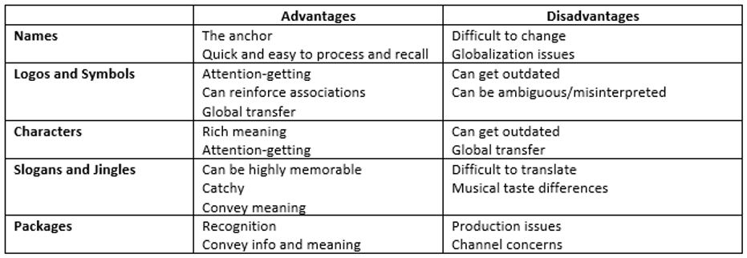
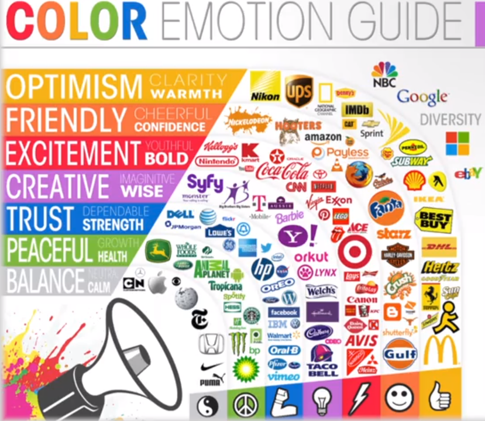

Perception is the process of developing an interpretation of a stimulus, or in other words, deciding what a stimulus means. It is perhaps the most crucial process in customer behavior for two reasons: 1) what customers perceive is what affects their actions; and 2) what is perceived is not necessarily what is “true.”

Perception is constructive. People construct interpretations as a function of context. The meanings are constructed as needed and are based upon two major factors: 1) the “actual” stimulus or event (i.e. exposure and attention); and 2) our prior expectations and what we know (perceptual interpretation). These concepts are important to keep in mind when choosing your Brand Elements.

A variety of brand elements can be chosen that inherently enhance brand awareness or facilitate the formation of strong, favorable, and unique brand associations. These generally include items such as brand name, logo, symbol, characters, packaging, slogan, and colors. When choosing brand elements, you want to be sure that they work well together to provide an identity for the product or service. A good question to ask is: “what would customers think about the product if they only saw the brand elements?” Each brand element plays a different role in creating the overall perception of the company, and each brand element has different strengths and weaknesses.

Brand elements should be used strategically to achieve balance and impact. You also need consistency and integration. The following are key criteria for strong brand elements:

1. **Memorable:** easily recognized and easily recalled
2. **Meaningful:** descriptive (i.e. of customer attributes, segment, etc.) and persuasive (usually positive)
3. **Appealing:** fun and interesting, aesthetically pleasing, and rich in visual and verbal imagery
4. **Protectable:** both legally (i.e. trademark) and competitively (i.e. hard to copy)
5. **Adaptable:** flexible and updateable
6. **Transferable:** within and across product categories as well as across geographic boundaries and cultures

You also have to take into consideration how these brand elements will affect different stakeholders in your business. For example, the effect on consumers impacts the likelihood of purchase. The effect on employees impacts morale and productivity. The effect on the firm can limit opportunities, such as new products and new regions. The brand elements can also impact investors’ subconscious judgments about the company’s merits and strengths.

There are a few rules about color that are also worth diving into. The ultimate goal is to won a color (i.e. Tiffany’s light blue). Color can also be used to separate product lines (i.e. black card). Keep in mind that different viewers experience color differently and ensuring consistency of color across platforms and media is difficult. Colors also can create very strong perceptions (i.e. luxury colors: gold, silver, black, white | gender colors: blue, pink). The general guide to color is as follows:

1. Red: thought to stimulate the appetite, also love (passion) and excitement
1. Blue: color most preferred by men; productive color; curbs appetite
1. Green: tranquility and health; money, nature; fertility (i.e. M&M’s)
1. Brown: reliability, boredom, practicality, earth
1. White: purity, innocence, empty, spacious (creates the illusion of space)
1. Black: evil, death, mourning, slimming
1. Yellow: bright, gives you energy; been shown to make babies cry; causes eye fatigue
1. Orange: excitement, enthusiasm, warmth, caution
1. Lavender: calms the nerves, relaxation
1. Purple: royalty, ,wealth, success, wisdom
1. Pink: girl’s color, calming, warm

After choosing a brand name and color, symbols can be useful for communicating associations and positive feelings:

Slogans and taglines can be tailored to a positioning strategy. It can be used to remove some of the ambiguity associated with a brand and/or symbol. Slogans and taglines can also generate its own equity and emotion (i.e. “reach out and touch someone.”). It can also reinforce the name or symbol (i.e. from sharp minds come sharp products). Below are a few key tagline basics:

1. Must be short
1. Must be differentiated from competition
1. Must be unique
1. Must be easy to say and remember
1. Cannot have any negative connotations
1. Can be protected and trademarked
1. Evokes an emotional response

There are also several different types of taglines. These include:

1. Imperative: Just Do It (Nike), Invent (HP), Think Different (Apple)
1. Descriptive: Moving at the Speed of Business (UPS), Bullish on America (Merrill Lynch), You’re in Good Hands (Allstate)
1. Superlative: The Ultimate Driving Machine (BMW), There’s No Better Way to Fly (Lufthansa)
1. Provocative: Got Milk? (Dairy Council)
1. Clever: Drivers Wanted (VW)

The next core brand element is packaging. Packaging can both influence at the point of purchase and have a continuing influence at the point of consumption. There are multiple objectives with respect to packaging: 1) Identify; 2) Present Information (descriptive and persuasive); 3) Protect and Allow Transportation; 4) Store; and 5) Aid Consumption. In creating impactful packaging, it’s important to understand that package aesthetics and function are both critical. The package has to grab the consumer’s attention in a sea of competing messages. But it also has to work well so that consumers will buy again. It is also important to know your distribution channels when creating impactful packaging. How do retailers view your package? How are channels changing? Which retailers like which package configurations?

Overall, brand equity must be actively managed over time, and brand meaning must be constantly reinforced. However, sometimes brand meaning must be adjusted, and brand programming will need to be changed and new sources of equity identified and build. There are five key rationales for brand change:

1. The identity/execution was poorly conceived: can often be identified by measures of consumer interest, brand associations, sales, etc.
1. The target for the identity/execution is limited: may need to change to reach a broader market
1. The identity/execution has become out of date: markets change such that a working position may become obsolete
1. The identity/execution loses its edge and becomes old-fashioned: consumers and markets change such that positions/executions that were once contemporary become less so
1. The identity/execution has just become “tired”: the same thing over time may be come boring to consumers and lose the ability to attract attention. Further, change can generate news.

While at brand change is sometimes necessary, be cautious. Consistency over time is very valuable in building strong brands.
