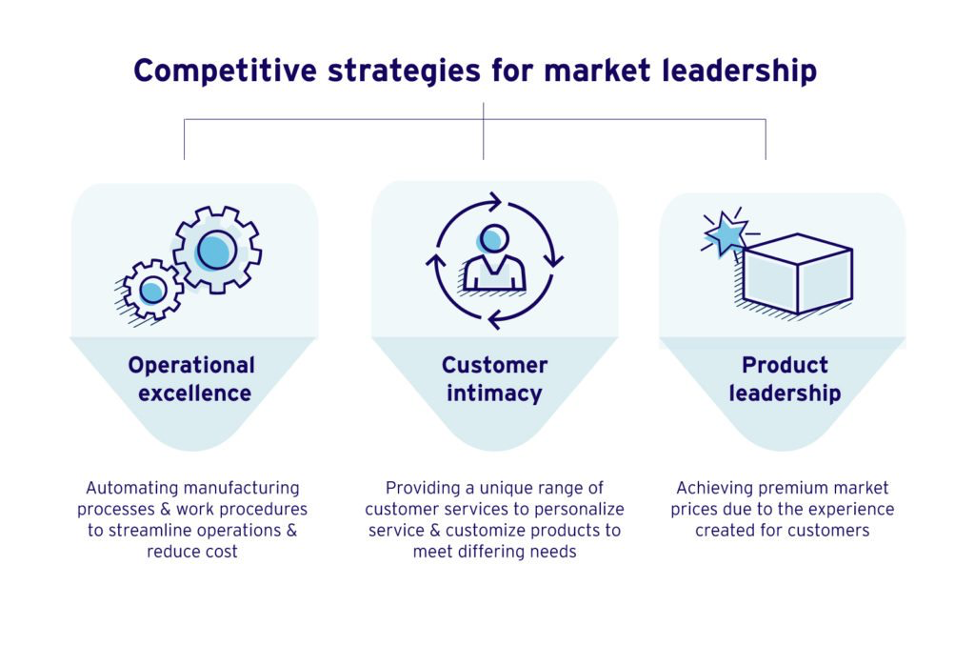
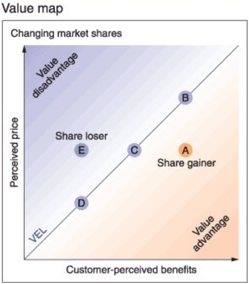
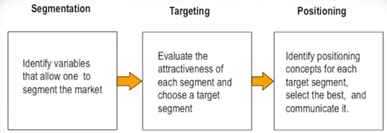
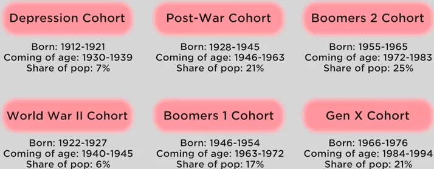
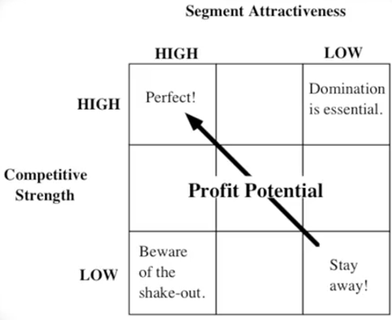
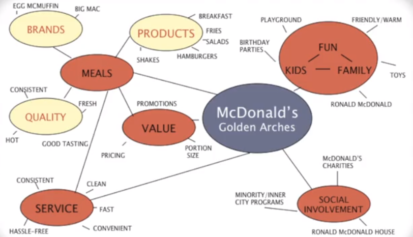
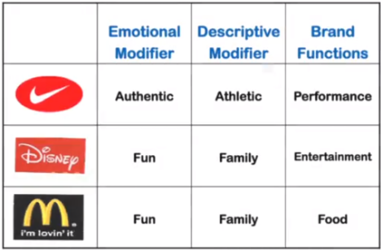

Marketing is the study of a market. A market is an exchange between two parties. These exchanges are frequently between a buyer and a seller, but they can also include nonprofits and non-money transactions. In extreme scenarios, you can have a buyer’s market or a seller’s market. Marketing should not be the same in a seller’s market as it is in a buyer’s market.

In a seller’s market, you have the product and if the customers want it, they have to come to you. The seller has all the power, and the focus should be on the company. You should develop the product to the best of your ability. You should innovate, try to reduce costs and really focus on the product. In a product-focused market, profitability is going to come from volume, and your business objective is to sell as much as you can. The focus is on market share, and you grow by either developing new products or entering new markets. The focus is inside-out (i.e. “I’m the expert, and I create the very best product I can based on my expertise.”

In a buyer’s market, there’s lots of competition and other products out there. The buyer has the power, and in this case, the company should focus on the customer and competition. You should look at what the customer wants and deliver a product that meets the needs of that customer. The focus is outside-in. When asking yourself what the customer wants, you have to first ask, “which customer?” You can’t give every customer what they want because different customers want different things. The intuition of customer-focused marketing is to pick and choose customers. You deliver value to some customers and say no to other customers. This is the process of segmentation. Profitability comes from creating value. If I give you exactly what you want, most of the time you’d be willing to pay a premium price. The profitability doesn’t come from reduced costs (i.e. seller’s market), but from price premium. The other way that customer-based marketing is profitable is by delivering what the customer wants time after time. You don’t think about just one transaction. Instead you focus on building customer loyalty and delivering value to that customer over time. This concept is called customer share. Rather than trying to increase market share and get a little bit from everybody, the idea of customer share, or share of wallet, is that I go after a more narrow market and try to get more from each of those customers’ wallets. Loyalty, if you do it right, can be very profitable because it’s cheaper to retain customers than it is to acquire new ones, and that’s where the profitability comes from. The other thing—if you’re thinking about building share of wallet in the customer-focused market—is that you can sell more than one product to a customer. You should think about all the things the customer might need and try to cross-sell around it. In a buyer’s market, the focus is on increasing customer share. Give the customer exactly what they want, and they’ll be willing to pay a premium price for it. Further, if you keep giving them what they want and delivering value over time, they will stay loyal to you. And if you understand their needs, you can not only sell them one product, but you can cross-sell other products that may meet their needs.

In a buyer’s (i.e. customer-based) market, profitability comes from 1) premium price, 2) loyalty, and 3) cross-selling. You focus on the customer, what the customer wants, and you deliver value to the customer better than the competition. In a seller’s (i.e. product-oriented) market, you focus on the product and persuade the customer to want what the firm has. Expanding on this concept, there are four key orientations in marketing:

1. **Product Orientation (generic products):** persuade the customer to want what the firm has. Product-oriented companies make generic products and focus on product innovation while reducing costs. Bigger companies tend to win in these markets due to economies of scale, and market share is the key profitability driver.
2. **Marketing Orientation (differentiated products and services):** persuade the firm to offer what the customer wants and seek differentiated products and services. Quality, service, and customer knowledge (i.e. lots of customer data and knowing how to use that data to deliver better value) are the key sources of competitive advantage in markets with this orientation. The key profitability drivers are customer share and customer loyalty.
3. **Experience Orientation (experiential value):** manage the customer’s entire experience with the firm. Viewed through this lens, the customer is a co-creator of value, and the key profitability drivers are buzz, word-of-mouth, and referrals.
4. **Trust Orientation (genuine value):** prioritize building a relationship of trust and discipline. The competitive value here comes from trust, which is driven by a long history and transparency.

There are a few other important marketing lists to keep in mind. The first is the Three Principles of Marketing:

1. **Principle of Customer Value:** if you want a customer to buy something from you rather than the competition, you have to give them real, genuine customer value.
2. **Principle of Differentiation:** you have to provide customer value (i.e. what the customer wants), but you have to do it better than the competition (i.e. differentiate your offering).
3. **Principles of Segmentation, Targeting, and Positioning:** you cannot deliver value to everybody and make money. It’s too difficult. Instead, segment the market into different segments. Then target or choose a segment you want to focus on and position your brand to meet the needs of that target segment.

Next, we have the Four P’s of Marketing:

1. Product: what the seller puts into the exchange
2. Place: the way the seller delivers the product to the customer (i.e. physical store, online, etc.)
3. Promotion: the way the seller communicates the benefits of the product to the buyer (i.e. advertising, sales, etc.)
4. Price: what the buyer puts into the exchange.

The key concept to keep in mind is that marketing is the study of a market. You have to know what your customers want, and you have to know how your competitors are going to react. You’re trying to find a way to provide customer value better than the competition, and the only way you can really deliver on this is to know your markets. Ultimately, the customers are going to choose what they want, an in marketing, we assume that customers will look at all the information and group everything into three bundles:

1. Operational Excellence (i.e. price, cost, delivery, service, reliability, etc.)
2. Performance Superiority (product differentiation: attributes, style, innovation, technology, etc.)
3. Customer Intimacy (i.e. customer responsiveness & whether or not it’s customized to meet my needs)

Customers will likely decide which one of these dimensions is the most important to them and pick the product that is 1) the best on one of those dimension and 2) good enough on the other two. The key takeaway is that you can’t just be “pretty good” in all three of them because the customer won’t pick you. Your market strategy should be to the best at something and “good enough” in the other decision factors. Once you decide which factor you’re going to be the market leader at, that will drive the way that you structure your business, the way you prioritize resources, and the type of people you hire.

To use this framework in your marketplace, figure out the product attributes that relate to operational excellence in your market, and then define that dimension. Then you have to ask: what are the attributes that matter to the customer? Are they design, technology, etc.? And then you have to figure out how much customization there is in your market and define that dimension.
The second thing you have to do with this framework is anticipate where fair value is. Sometimes people think of fair value as the average of what everybody offers. However, sometimes nobody offers fair value. You need market research to figure out what fair value is. Once you figure out what fair value is, the next step is to plot where your company is delivering on each of these axes relative to fair value (see value map below).

Then you figure out where your competition is on each one of these axes, and then you start playing the market strategy game. You think about a short-term strategy, a long-term strategy, and you figure out what you should be doing right now in order to beat the competition. Ultimately, what you’re looking for in a long-term strategy is to be the best at one dimension and good enough on the other two. Once you decide what your leadership strategy is, then that has implications for everything you do in your firm.

To supplement these competitive strategies for market leadership, you want to use the **STP Framework (Segmenting, Targeting, and Positioning)**.

**Market Segmentation** is the process of dividing a market into distinct subsets, where any subset may conceivably be selected as a marketing target to be reached with by a distinct marketing mix (marketing mix = 4 Ps = Product, Place, Promotion, and Price). Common characteristics to segment the customer by include male vs. female, old vs. young, rich vs. poor, etc.). This can be done using a **Cohort Analysis** (see below) or by geography. People who are similar tend to live in similar places so techniques like regional segmentation, zip clustering, and PRIZM segmentation can be useful.

People can also be segmented by benefits sought (i.e. for running shoes: comfort, technology, style, etc.) and/or systematic, product-related behaviors (i.e. purchasing online, purchasing via phones, purchase frequently, etc.).

After using one or several of the aforementioned segmentation methods, you should select a **Target Segment**. For this, you want to balance segment attractiveness with your company’s capability, while continuously monitoring whether the actual buyers match the target segment. Some important selection criteria include: 1) segment size, 2) growth of segment, 3) \$ value of segment, 4) stability, 5) current company position within segment, 6) ease of entry into segment, and 7) number and strength of competitors. Ultimately, you want to pick the most attractive segment where you have a differential advantage over the competition:

Last is **Positioning**. Positioning is positioning your product to meet the needs of the target segment. One way to do this is to brand that positioning. Formally, a brand is a proprietary trademark for a specific product or service. Conceptually though, a brand is a “contract” from the company to its customers. It’s a relationship and a promise of specific benefits, quality, and value. A brand is not about “telling and selling.” It’s about bringing a relationship mindset to everything you do. For example, Apple “offers the best personal computing experience to students, educators, creative professionals and consumers around the world through its innovative hardware, software, and internet offerings.” There are three parts to a good positioning statement:

1. Who is the **Target Segment**? A brand should have a crisp target segment even if that’s not the only people who use the product.
2. What is the **Point of Difference** that you are offering to that target segment? For example, Apple is innovative.
3. What is the **Frame of Reference**? Who are the other competitors that you are comparing yourself to? For example, Apple’s frame of reference is other personal computers.

Positioning is implemented through all elements of the marketing mix: product, price, promotion, and place. Positioning should focus on a few key benefits (i.e. unique selling proposition) and requires making choices (i.e. you can’t be everything to everybody). Further, the position must be defensible and not easy to copy.

You want to focus on Points-of-Difference rather than Points-of-Parity. Points-of-parity are associations that are not unique to the brand. For example, a grocery store must have certain products (i.e. milk, eggs) to truly be considered a “grocery store.” Points-of-difference, on the other hand, are strong, favorable, and unique brand associations. They may involve performance attributes, benefits, imagery associations and anything you own that really differentiates your brand. There a key questions regarding POD that you must ask yourself. Are the PODs desirable to the customer? Is POD relevant (i.e. customers didn’t care about clear cola, or “unbreakable chips”). You also want to ask yourself if you will be able to deliver the POD to the customer. Is it feasible and affordable? (i.e. can airlines deliver on-time arrival?). Is it communicable? Is it sustainable? (i.e. internal commitment, difficult to attack, etc.).

A useful exercise in brand positioning is to create a Mental Map. A mental map portrays brand associations and responses for a target market. It also shows how the brand is actually received. Ask consumers: “what comes to mind when you think about V8?” Then group these brand associations into categories.

Red circles are characteristic of the category. Yellow circles are the associations with each one of these points of parity that are unique to McDonalds. This helps you to monitor and organize all of the thought associations that come with a brand.

The Mental Map should then be used to derive your **Core Brand Values**. The core brand values are a set of abstract concepts or phrases that characterize the five to ten most important dimensions of the mental map of a brand. Relate these to the points-of-parity and points-of-difference. Then use these Core Brand Values to derive your Brand Mantra. A **Brand Mantra** is an articulation of the “heart and soul” of the brand. The concept is similar to “brand essence” or “core brand promise,” and it should be short, three-to-five-word phrases that capture the irrefutable essence or spirit of the brand positioning and brand values. You want to 1) communicate, 2) simplify, and 3) inspire. It should also be used internally to guide decisions (i.e. what the brand should and should not be associated with). When designing the Brand Mantra, you want to think through the following three parts:

1. The **brand function** describes the nature of the product or service or the type of experiences or benefits the band provides.
2. The **descriptive modifier** further clarifies its nature.
3. The **emotional modifier** provides another qualifier—how exactly does the brand provide benefits, and in what way?

When determining these three parts, you want to clearly define the business and boundaries while clarifying what is unique about the brand. The Brand Mantra should also be memorable, short, vivid and crisp. Simplify it as much as possible. Lastly, the Brand Mantra has to be inspiring and have a higher level of meaning from employees and consumers.

Overall, great brands make clear promises that are kept over time. Great brands represent superior products and processes. Great brands are distinctive (i.e. you don’t get Coke and Pepsi confused). Great brands align the internal and external commitment to the brand. And lastly, great brands have the ability to stay relevant and adapt to constantly changing markets, customers, and times.
