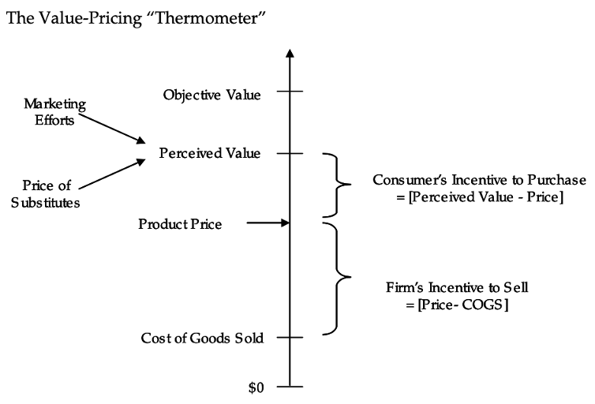
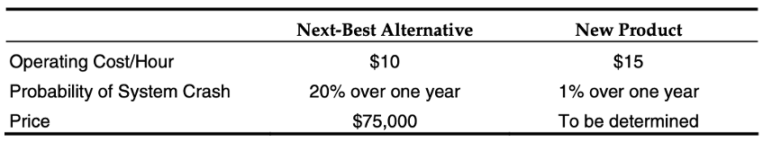
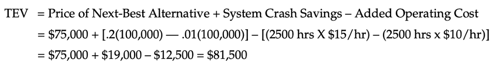
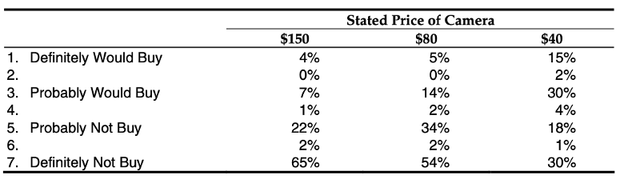
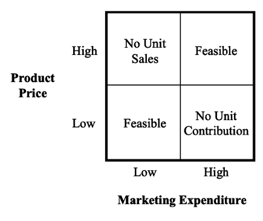

A firm’s marketing efforts are directed toward creating value for its chosen customers. Understanding customers’ wants and needs is the foundation for building this value. In turn, capturing that value falls to the marketing mix, commonly referred to as the Four Ps:

1. Developing a **product** that satisfies those wants and needs
2. Designing a **promotion** program that conveys the value of that product to customers
3. Choosing a distribution program (i.e. **place**) that makes that product readily available
4. Designing a **pricing** strategy that simultaneously creates a consumer’s incentive to buy that product and the firm’s incentive to sell that product

The first three of these marketing-mix variables represent costs to the firm. Pricing’s role in the marketing mix is to tap in to the value created and generate revenues (1) to fund the firm’s current value-creation activities, (2) to support research that will lead to future value creation, and (3) to generate a profit from the firm’s activities.

A complete pricing program has many components. For example, consider the pricing decisions surrounding the launch of a new MP3 player. These might include:

1. The unit price of the MP3 player to dealers and distributors
2. The accompanying terms and conditions, such as:
   1. Whether and to what degree there will be a quantity discount
   2. The schedule of payments (i.e. when payments are due)
   3. Whether there will be discounts for early payments or penalties for late payments
3. The manufacturer’s suggested retail price (MSRP) to the end consumer
4. Whether there will be any consumer pricing promotions (i.e. mail-in-rebates)

Such pricing decisions have broad implications for a firm’s net income—an average price increase of 1% would boost the net income of the typical large U.S. corporation by about 12%. However, getting price right is often an afterthought in many corporations. In particular, if _Profits = [Unit Price – Cost of Goods Sold] \* Unit Sales Volume_, there often is more emphasis on the Cost of Goods Sold (COGS) and Unit Sales Volume parts of the profit equation than on Unit Price. In these firms, price typically is seen as “determined by the marketplace” or “something we really do not have much control over.” In fact, one of the most common pricing strategies used by corporations remains “cost plus”—that is, determining the cost of goods sold and adding on what seems to be a reasonable margin. Marketers with this reactive attitude typically miss great profit opportunities.

## The Value-Pricing Approach

The value-pricing approach to product pricing is driven by a small handful of factors, as shown in the figure below. One of these factors is the “objective value” the product delivers to the consumer. Also called true economic value (TEV), this is a measure of the benefits that the product delivers to the consumer, relative to other products, regardless of whether the consumer recognizes those benefits.

A critical second factor is the “perceived value” of the product to a consumer. Perceived value is the value the consumer understands the product to deliver. Sometimes, a product’s benefits are readily apparent to the consumer and perceived value approaches objective value with little effort by the firm. Other times, a product’s benefits are less obvious and need to be communicated by the firm to the consumer (i.e. via advertising, personnel selling). In such cases, the perceived value of a product typically falls well below its objective value.

Note that both the objective and perceived value of a product can be (and, often, should be) influenced by the price of competing products or “substitutes.” Company A may develop a product that creates great objective value for consumers. Consumers may recognize this value and be willing to pay a high price to obtain the product. However, if consumers become aware of a new (or existing) product from Company B that provides identical benefits at a lower price, both the objective and perceived value of Company A’s product should be reduced to the price of Company B’s product.

It is important to note that the perceived value of a product to a consumer should equal the maximum price that the consumer is willing to pay for the product. Imagine a consumer who perceives the value of a DVD player to be $100.  If it is priced above $100, the consumer has no incentive to buy the DVD player. If it is priced at \$100 or less, however, the consumer always stands to gain from purchasing.

The last major component to the economic approach to pricing involves the firm’s COGS. Just as the consumer requires an incentive to purchase a product, the firm requires an incentive to sell the product. In order to stay in business and make a positive return, a firm must charge a price that covers its cost of production.

All of these economic factors come together to form the value-pricing approach to pricing. In optimally pricing a product, a firm is bound at the upper end by the consumers’ perceived value for the product. This perceived value is influenced by the objective value of the product to the consumer, by the firm’s marketing effort to communicate that objective value, and by the price of substitute products. At the same time, the firm is bound on the lower end by its COGS.

By pricing above COGS and below perceived value, the firm has an incentive to sell the product, measured as (price – COGS), and the consumer has an incentive to purchase the product, measured as (perceived value – price). In value-pricing terminology, the firm has “created” value by offering a product that the consumer values at a price greater than the firm’s COGS. In turn, by pricing between perceived value and COGS, the firm has “captured” some of that value for itself and has allowed consumers to capture the remainder.

## Assessing a Product’s Value to Customers

But how does a firm determine the objective and perceived value of a product to a customer? For determining objective value, firms often rely upon an understanding of the potential buyer’s cost structure. For determining perceived value, firms often employ surveys in which potential buyers are asked directly about value.

#### Determining Objective Value through Cost-Structure Studies

In a cost-structure study, one assesses the objective value or true economic value (TEV) of a product to a customer by understanding the competitive alternatives, the price and performance of those alternatives, and the buyer’s costs.

TEV has two major components: _TEV = Cost of the Next-Best Alternative + Value of Performance Differential_.

First, if the buyer has several alternatives, the calculation has to be relative to the best alternative. For example, what is the objective value of a flight on the Delta Shuttle to a busy banking executive needing to get from Boston to New York? One could calculate the TEV relative to going on the bus—but this leads to an irrelevant number, as the best alternative is the USAir Shuttle, flying essentially the same schedule as Delta from the same airport. In this case, the value of the performance differential is likely to be very small, as there is little product differentiation. Hence, in this situation, the executive’s TEV for Delta will be very close to USAir’s price.

This approach is more useful when there is a performance differential to be considered. A firm’s product may be superior to the next-best alternative in some dimensions but inferior in others. For example, consider a “next-best alternative” and a “new product” with the following characteristics:

Now consider a customer who needs such a system for a single year (after which it will be scrapped) and plans to use it for 2,500 hours over the course of that year. If the cost of a system crash to the buyer is \$100,000 (i.e. the selling firm will bear the cost of any system crash after the first), the TEV for the new product can be calculated as:

Thus, the objective value or TEV of this new product is $81,500, meaning a fully informed, rational consumer should be indifferent between the “next-best alternative” priced at $75,000 and the “new product” priced at \$81,500.

#### Determining Perceived Value

While it is important to understand the objective value a new product delivers, it is equally important to understand the value of that product as perceived by potential consumers. One common way to assess perceived value relies on survey methods. The most common of these is a direct-response survey, in which the respondent is typically asked a question such as:

1.  What is the likelihood you would buy this product at a price of \$25?
1.  At what price would you definitely buy this product?
1.  How much would you be willing to pay for this product?
1.  How much of this product would you buy at a price of \$1?
1.  At what price difference would you switch from product A to product B?

Consider a major camera maker that used this method to set the price for a new camera. In a survey, a set of respondents were provided a description of the new camera and were asked to indicate their purchase intention on a seven-point scale, from “Definitely Not Buy” to “Definitely Would Buy.” One-third of the respondents were told the camera would cost $150, one-third were told it would cost $80, and one-third were told it would cost \$40. Results of the survey were:

The fact that 47% of people responded with a 3 (probably would buy) for the $40 price (as opposed to only 19% for the $80 price) was instrumental in the firm’s introducing the camera at a suggested retail price of \$39.95.

It should be noted that there are potential problems with direct response surveys. For instance, they often induce an unrealistically high level of price consciousness in consumers. Similarly, given that consumers are only asked about their willingness to buy or to pay, and not actually required to spend their money, the results often paint an overly optimistic picture of a product’s potential. Nevertheless, such surveys are often a good first step in assessing perceived value.

## Assessing Price Sensitivity

Another key element in determining price is price sensitivity, with that sensitivity varying across customers, across time, and across products. Consider, for example, an interventional cardiologist preparing to do surgery on a heart patient with a blocked artery. The best solution may be to insert a stent to hold back the plaque blocking the artery, allowing blood to again flow freely.

Given that there are three different stent manufacturers, how sensitive to price will the typical doctor be in this situation? Contrary to some expectations, the answer is “not very.” First, given that this is a life-or-death procedure for the patient, product performance will be key. Second, the doctor is (hopefully) a very knowledgeable, sophisticated decision maker, aware of each stent’s advantages and disadvantages for various types of blockages. Third, he or she may have more experience inserting one type of stent and would prefer not to shift from the usual brand. Finally, the fact that the doctor is not the one paying for the stent may further depress his or her sensitivity to price.

Much of this may seem pretty intuitive. But a systematic approach can be helpful in judging price sensitivity. Some of the major factors that influence price sensitivity are now discussed in turn.

#### The Magnitude of Price

Price sensitivity tends to be far greater in high-cost than in low-cost product categories. Thus, a 10% price differential on a sports car will be a far bigger deal than a 10% price differential on a tube of toothpaste. More broadly, price sensitivity is likely to increase as:

1.  **The absolute dollar cost of the product increases**, as exemplified by the sports car/toothpaste example.
2.  **The aggregate cost of ongoing usage increases**. For example, a no-name golf ball may cost $1, and a high-end Titleist golf ball may cost $3. But a retired (not-so-good) golfer who plays 200 times per year and loses an average of three balls per round may view his choice of golf ball as a $600 versus $1,800 decision, not a $1 versus $3 decision.
3.  **The cost of the product increases as a percentage of the total cost**. For example, consider a chemical whose use accounts for 50% of the cost of producing insulation and 5% of the cost of producing polyesters. A 10% price increase in the price of the chemical would increase the insulation maker’s total cost by 5%, but it would increase the polyester maker’s total cost by only 0.5%. As a result, the insulation maker is way more sensitive to any price increase.

#### Who Pays?

Some products are paid for by the customer. Some are not. In the case of an automobile for personal use, for instance, the user of the car is also the payer. When the car is a company car, however, the user may bear none of the cost of that car. And in some situation, the ser of the product pays some, but not all, of the cost of a good, as is often the case with health insurance, where the employee pays some portion of the insurance and the company pays the remainder. Not surprisingly, to the extent that the user is responsible for the costs, the greater is their price sensitivity.

#### Competitive Factors

Competitive factors also impact price sensitivity. Price sensitivity is higher to the extent that:

1. **The customer does not perceive significant differences in alternative products.**
1. **It’s easy to compare products and their prices.** Some comparisons are apples to apples, as when two insurance policies each pay $1 million in the case of death.  Such easy comparisons tend to highlight price.  In contrast, price sensitivity is dampened when products are not easily compared, as when two disability policies vary in number of days covered, the frequency of payments, and the size of those payments.  Similarly, price sensitivity is dampened when price is hard to compare, as when one vendor charges 10 cents per unit consumed while another charges 8 cents per unit plus a $10 monthly fee.
1. **It is easy for the decision maker to switch products.** Difficulty in switching can arise for psychological reasons, such as when there is high perceived risk or there is a desire to stick with the familiar brand. It can also arise for economic reasons, as when there is a penalty for switching providers, when retraining or relearning is required, or when there is a loyalty program involved.

## Price Customization

Given our value-pricing framework and our discussion of price sensitivity, one realizes that the perceived value of a product can vary significantly across individuals. For example, the latest golf-club innovation is more highly valued by someone trying to make a living as a professional than it is by an amateur. A number of factors cause value variation across potential customers, such as:

1. **Taste**. Some people think Godiva Chocolates are the greatest, while others would just as soon have a Hershey bar.
1. **Importance of performance**. The experienced computer user values speed and storage more than the novice user.
1. **Ability to pay**. The dot-com millionaire has more resources to pay for a high-definition television than a true television fan of lesser economic means.
1. **Intensity of use**. A hands-free cell phone is more highly valued by a person using the device regularly as compared with those in “emergency-use-only” mode.
1. **Category knowledge**. The experienced car buyer who has researched the market views the invoice price of a car as the appropriate benchmark, while the novice buyer views the sticker price of a car as the appropriate benchmark.

When value varies across customers, a pricing program should consider whether to customize price according to the value received, thereby charging a higher price to those who value the product more. Several means to customize price are:

1. **Through the product line**. Firms can offer a high-end product with many features for the high-value customers and more basic models for the lower-value customers. For example, most new cars have a basic model, a number of intermediate models, and a fully loaded model. In turn, car buyers who place a higher value on basic transportation can choose the basic model, while those who value sunroofs and leather interiors can opt for the fully loaded model. Generally, the higher-featured items yield greater margins.
1. **By controlling availability**. For example, a mail-order clothes company can send different catalogs (with different prices) to different customer depending on their past purchasing behavior. Delivering \$1.00 coupons to selected households for redemption at the point of purchase is another method for selective pricing.
1. **Through demographics**. Here, one looks for some characteristic of buyers that correlates with willingness to pay. For example, major movie theaters often offer discounts to children and senior citizens, anticipating that they will increase demand at nonpeak hours (i.e. afternoons for children, weekdays for senior citizens).
1. **Through transaction characteristics**. Price is tied to the particular features of the transaction, such as how far in advance of consumption the product is purchased. For instance, in all likelihood, the customer who buys their plane ticket six months in advance has a far lower willingness to pay than the customer who buys their ticket three days in advance.

## Integrating Price with Other Marketing-Mix Elements

Finally, a key to effective pricing is to have a firm’s pricing strategy in sync with the other elements of the marketing mix. Consider, for example, when Glaxo first introduced its ulcer medication Zantac at a substantial price premium over the incumbent product, Tagamet. In spite of being second to market, it was able to become the market leader because the product was superior and because Glaxo invested in the marketing effort necessary to communicate that superiority to potential consumers. In other words, Zantac had a high objective value, and Glaxo’s marketing efforts were successful in raising potential consumers’ perceived value toward that economic value. In turn, the high margins generated by the premium pricing funded that marketing effort. Such pricing/marketing spending choices often are captured in the following 2 x 2 matrix:

As shown, two strategies are feasible. The company can follow a low-marketing-expenditure and low-price (i.e. low relative to its objective value) strategy. In such cases, the product’s value must speak for itself. But, because of the low price, the hurdle for consumers to purchase is not high. Similarly, it can follow Zantac’s “high/high” strategy. In particular, it can invest in marketing to boost perceived value but price so as to capture the perceived value thereby created, attaining the margins necessary to fund the high marketing effort.

Conversely, the other price/expenditure combinations are not feasible in the long term. High price/low marketing fails because the firm is not spending sufficient resources to convince potential consumers of the product’s value. And low price/high marketing is not feasible because, while the high marketing expenditures may create significant sales, the low price results in no profits.
