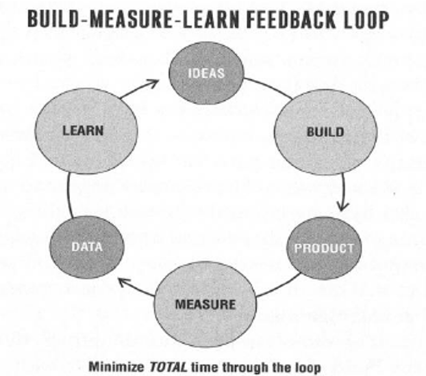
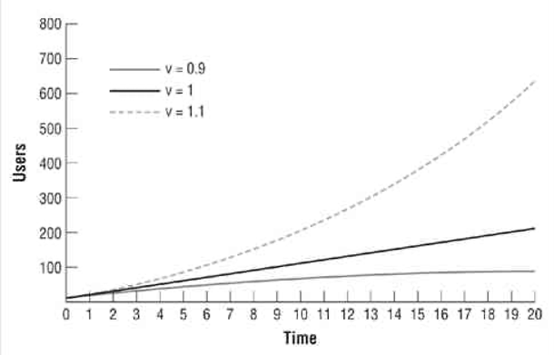

Old management methods don’t work well in startups. Planning and forecasting are only accurate when based on a long, stable operating history and a relatively static environment. Startups have neither. Yet most startups—in garages and enterprises alike—still are managed by using standard forecasts, product milestones, and detailed business plans.

The Lean Startup is a set of practices for helping entrepreneurs increase their odds of building a successful startup. To set the record straight, it’s important to define what a startup is: A startup is a human institution designed to create a new product or service under conditions of extreme uncertainty. The most important part of this definition is what it omits. It says nothing about the size of the company, the industry, or the sector of the economy. Anyone who is creating a new product or business under conditions of extreme uncertainty is an entrepreneur whether he or she knows it or not. Intuit is proof that this kind of thinking can work in established companies. CEO Brad Smith holds the company accountable for new innovation efforts by measuring two things: the number of customers using products that didn’t exist three years ago and he percentage of revenue coming from offerings that did not exist three years ago.

The Lean Startup asks people to start measuring their productivity differently. Because startups often accidentally build something nobody wants, it doesn’t matter much if they do it on time and on budget. The goal of a startup is to figure out the right thing to build—the thing customers want and will pay for—as quickly as possible. In other words, the Lean Startup is a new way of looking at the development of innovative new products that emphasizes fast iteration and customer insight, a huge vision, and great ambition, all at the same time.

## Learn

If the fundamental goal of entrepreneurship is to engage in organization building under conditions of extreme uncertainty, its most vital function is learning. We must learn the truth about which elements of our strategy are working to realize our vision and which are just crazy. We must learn what customers really want, not what they say they want or what we think they should want. We must discover whether we are on a path that will lead to a growing sustainable business.

The Lean Startup takes its name from the lean manufacturing revolution that Taiichi Ohno and Shigeo Shingo are credited with developing at Toyota. Lean thinking is radically altering the way supply chains and production systems are run. Among its tenets are drawing on the knowledge and creativity of individual workers, the shrinking of batch sizes just-in-time production and inventory control, and an acceleration of cycle times. The Lean Startup adapts these ideas to the context of entrepreneurship, proposing that entrepreneurs judge their progress differently from the way other kinds of ventures do. Progress in manufacturing is measured by the production of high-quality physical goods. The Lean Startup uses a different unit of progress, called validated learning. With validated learning as our yardstick, we can discover and eliminate the sources of waste that are plaguing entrepreneurship.

Validated learning is the process of demonstrating empirically that a team has discovered valuable truths about a startup’s present and future business prospects. It is more concrete, more accurate, and faster than market forecasting or classical business planning. It is the principal antidote to the lethal problem of achieving failure: successfully executing a plan that leads nowhere.

Which of our efforts are value-creating and which are wasteful? This question is at the heart of the lean manufacturing revolution; it is the first question any lean manufacturing adherent is trained to ask. Learning to see waste and then systematically eliminate it has allowed lean companies such as Toyota to dominate entire industries. In the world of software, agile development methodologies had their origins in lean thinking and were also designed to eliminate waste.

Lean thinking defines value as providing benefit to the customer; anything else is waste. In a manufacturing business, customers don’t care how the product is assembled, only that it works correctly. But in a startup, who the customer is and what the customer might find valuable are unknown, part of the very uncertainty that is an essential part of the definition of a startup.

Learning is the essential unit of progress for startups. It is also the right way to think about productivity in a startup: not in terms of how much stuff we are building but in terms of how much validated learning we’re getting for our efforts. Figuring out the right things to build is true startup productivity. The effort that is not absolutely necessary for learning what customers want can be eliminated. This is called validated learning because it is always demonstrated by positive improvements in the startup’s core metrics. It’s easy to kid yourself about what you think customers want. It’s also easy to learn things that are completely irrelevant. Thus, validated learning is backed up by empirical data collected from real customers.

The entrepreneur’s job is to find a synthesis between her vision and what customers will accept; it is not to capitulate to what customers think they want or to tell customers what they ought to want. An entrepreneur can run hundreds of experiments week in and week out as she starts to learn which customers would use the product and why. Each bit of knowledge she gathers suggests new experiments to run, which moves her metrics closer and closer to her goal. As you pivot and experiment—incorporating what you learn into product development and marketing efforts—your numbers will improve.

The Lean Startup is not a collection of individual tactics. It is a principled approach to new product development. The way forward is to learn to see every startup in any industry as a grand experiment. The question is not “Can this product be built?” In the modern economy almost any product that can be imagined can be built. The more pertinent questions are “Should this product be built?” and “Can we build a sustainable business around this set of products and services?” To answer those questions, we need a method for systematically breaking down a business plan into its component parts and testing each part empirically. In other words, we need the scientific method. In the Lean Startup model, every product, every feature, every marketing campaign—everything a startup does—is understood to be an experiment designed to achieve validated learning.

## Experiment

Many startups struggle to answer the following questions: which customer opinions should we listen to if any? How should we prioritize across the many features we could build? Which features are essential to the product’s success and which are ancillary? What can be changed safely, and what might anger customers? What might please today’s customers at the expense of tomorrow’s? What should we work on next?

These are some of the questions teams struggle to answer if they have followed the “let’s just ship a product and see what happens” plan. Unfortunately, if the plan is to see what happens, a team is guaranteed to succeed—to see what happens—but won’t necessarily gain validated learning. This is one of the most important lessons of the scientific method: if you cannot fail, you cannot learn.

The Lean Startup methodology reconceives a startup’s efforts as experiments that test its strategy to see which parts are brilliant and which are crazy. A true experiment follows the scientific method. It begins with a clear hypothesis that makes predictions about what is supposed to happen. It then tests those predictions empirically. Just as scientific experimentation is informed by theory, startup experimentation is guided by the startup’s vision. The goal of every startup experiment is to discover how to build a sustainable business around that vision.

The first step is to break down the grand vision into its component parts. Identify the elements of the plan that are assumptions rather than facts and figure out ways to test them. The two most important assumptions entrepreneurs can make are the value hypothesis and the growth hypothesis. The value hypothesis tests whether a product or service really delivers value to customers once they are using it. The growth hypothesis tests how new customers will discover a product or service. Run experiments on early adopters to test these hypotheses. Early adopters are the customers who feel the need for the product most acutely. These customers tend to be more forgiving of mistakes and are especially eager to give feedback.

If the numbers from such early experiments don’t look promising there is clearly a problem with the strategy. That doesn’t mean it’s time to give up; on the contrary, it means it’s time to get some immediate qualitative feedback about how to improve the product or service. Here’s where experimentation has an advantage over traditional market research. We don’t have to commission a survey or find new people to interview. We already have a cohort of people to talk to as well as knowledge about their actual behavior: the participants in the initial experiment. This experiment could be conducted in a matter of weeks, less than one-tenth the time of the traditional strategic planning process. Also, it can happen in parallel with strategic planning while the plan is still being formulated. Even when experiments produce a negative result, those failures prove instructive and can influence strategy.

In the Lean Startup model, an experiment is more than just a theoretical inquiry; it is also a first product. If this or any other experiment is successful, it allows the manager to get started with his or her campaign: enlisting early adopters, adding employees to each further experiment or iteration, and eventually starting to build a product. By the time that product is ready to be distributed widely, it will already have established customers. It will have solved real problems and offer detailed specifications for what needs to be built. Unlike a traditional strategic planning or market research process, this specification will be rooted in feedback on what is working today rather than in anticipation of what might work tomorrow.

At its heart, a startup is a catalyst that transforms ideas into products. As customers interact with those products, they generate feedback and data. The feedback is both qualitative (such as what they like and don’t like) and quantitative (such as how many people use it and find it valuable). The products a startup builds are really experiments; learning about how to build a sustainable business is the outcome of those experiments. For startups, that information is much more important than dollars, awards, or mentions in the press, because it can influence and reshape the next set of ideas. We can visualize this three-step process with this simple diagram:

This Build-Measure-Learn feedback loop is at the core of the Lean Startup model. We need to focus our energies on minimizing the total time through this feedback loop. By focusing our energies on validated learning, we can avoid much of the waste that plagues startups today. As in lean manufacturing, learning where and when to invest energy results in saving time and money.

To apply the scientific method to a startup, we need to identify which hypotheses to test. The riskiest elements of a startup’s plan—the parts on which everything depends—are leap-of-faith assumptions. The two most important assumptions are the value hypothesis and the growth hypothesis. These give rise to tuning variables that control a startup’s engine of growth. Each iteration of a startup is an attempt to rev this engine to see if it will turn. Once it is running, the process repeats, shifting into higher and higher gears.

Once clear on these leap-of-faith assumptions, the first step is to enter the Build phase as quickly as possible with a minimum viable product (MVP). The MVP is the version of the product that enables a full turn of the Build-Measure-Learn loop with a minimum amount of effort and the least amount of development time. The minimum viable product lacks many features that may prove essential later on. However, in some ways, creating an MVP requires extra work: we must be able to measure its impact.

When we enter the Measure phase, the biggest challenge will be determining whether the product development efforts are leading to real progress. Remember, if we’re building something that nobody wants, it doesn’t much matter if we’re doing it on time and on budget. The method Eric Ries recommends is called innovation accounting, a quantitative approach that allows us to see whether our engine-tuning efforts are bearing fruit. It also allows us to create learning milestones, which are an alternative to traditional business and product milestones. Learning milestones are useful for entrepreneurs as a way of assessing their progress accurately and objectively; they are also invaluable to managers and investors who must hold entrepreneurs accountable.

Finally, and most important, there’s the pivot. Upon completing the Build-Measure-Learn loop, we confront the most difficult question any entrepreneur faces: whether to pivot the original strategy or persevere. If we’ve discovered that one of our hypotheses is false, it is time to make a major change to a new strategic hypothesis. The Lean Startup method builds capital-efficient companies because it allows startups to recognize that it’s time to pivot sooner, creating less waste of time and money

Although we write the feedback loops as Build-Measure-Learn because the activities happen in that order, our planning really works in the reverse order: we figure out what we need to learn, use innovation accounting to figure out what we need to measure to know if we are gaining validated learning, and then figure out what product we need to build to run that experiment and get that measurement.

## Leap

Every business plan begins with a set of assumptions. It lays out a strategy that takes those assumptions as a given and proceeds to show how to achieve the company’s vision. Because the assumptions haven’t been proved to be true and in fact are often erroneous, the goal of a startup’s early efforts should be to test them as quickly as possible.

The first challenge for an entrepreneur is to build an organization that can test these assumptions systematically. The second challenge, as in all entrepreneurial situations, is to perform that rigorous testing without losing sight of the company’s overall vision. Facebook is a terrific example.
By all accounts, what impressed investors the most were two facts about Facebook’s early growth. The first fact was the raw amount of time Facebook’s active users spent on the site. More than half of the users came back to the site every single day. This is an example of how a company can validate its value hypothesis—that customers find the product valuable. The second impressive thing about Facebook’s early traction was the rate at which it had taken over the first few college campuses. The rate of growth was staggering: Facebook launched on February 4, 2004, and by the end of that month almost three-quarters of Harvard’s undergraduates were using it, without a dollar of marketing or advertising having been spent. In other words, Facebook also had validated its growth hypothesis. These two hypotheses represent two of the most important leap-of-faith questions any new startup faces.

Many assumptions in a typical business plan are unexceptional. These are well-established facts drawn from past industry experience or straightforward deductions. In Facebook’s case, it was clear that advertisers would pay for customers’ attention. Hidden among these mundane details are a handful of assumptions that require more courage to state—in the present tense—with a straight face: we assume that customers have a significant desire to use a product like ours, or we assume that supermarkets will carry our product. Acting as if these assumptions are true is a classic entrepreneur superpower. They are called leaps of faith precisely because the success of the entire venture rests on them. If they are true, tremendous opportunity awaits. If they are false, the startup risks total failure.

Two leaps of faith stand above all others: the value creation hypothesis and the growth hypothesis. The first step in understanding a new product or service is to figure out if it is fundamentally value-creating or value-destroying. A similar thing is true for growth. As with value, it’s essential that entrepreneurs understand the reasons behind a startup’s growth. There are many value-destroying kinds of growth that should be avoided. An example would be a business that grows through continuous fund-raising from investors and lots of paid advertising but does not develop a value-creating product.

A startup’s earliest strategic plans are likely to be hunch- or intuition-guided. And that is a good thing. To translate those instincts into data, entrepreneurs must, in Steve Blank’s famous phrase, “get out of the building” and start learning.

The importance of basic strategic decisions on firsthand understanding of customers is one of the core principles that underlies the Toyota Production System. At Toyota, this goes by the Japanese term genchi gembutsu, which is one of the most important phrases in the lean manufacturing vocabulary. In English, it is usually translated as a directive to “go and see for yourself” so that business decisions can be based on deep firsthand knowledge. You cannot be sure you really understand any part of any business problem unless you go and see for yourself firsthand. It is unacceptable to take anything for granted or to rely on the reports of others.

As Steve Blank has been teaching entrepreneurs for years, the facts that we need to gather about customers, markets, suppliers, and channels exist only “outside the building.” Startups need extensive contact with potential customers to understand them, so get out of your chair and get to know them. The first step in this process is to confirm that your leap-of-faith questions are based in reality, that the customer has a significant problem worth solving.

The goal of such early contact with customers is not to gain definitive answers. Instead, it is to clarify at a basic, coarse level that we understand our potential customer and what problems they have. With that understanding, we can craft a customer archetype, a brief document that seeks to humanize the proposed target customer. This archetype is an essential guide for product development and ensures that the daily prioritization decisions that every product team must make are aligned with the customer to whom the company aims to appeal. The customer profile should be considered provisional until the strategy has shown via validated learning that it can serve this type of customer in a sustainable way.

## Test

Next is testing. A minimum viable product (MVP) helps entrepreneurs start the process of learning as quickly as possible. It is not necessarily the smallest product imaginable, though; it is simply the fastest way to get through the Build-Measure-Learn feedback loop with the minimum amount of effort. Contrary to traditional product development, which usually involves a long, thoughtful incubation period and strives for product perfection, the goal of the MVP is to begin the process of learning, not end it. Unlike a prototype or concept test, an MVP is designed not just to answer product design or technical questions. Its goal is to test fundamental business hypotheses.

Before new products can be sold successfully to the mass market, they have to be sold to early adopters. These people are a special breed of customer. They accept an 80% solution; you don’t need a perfect solution to capture their interest. Early adopters use their imagination to fill in what a product is missing. They prefer that state of affairs, because what they care about above all is being the first to use or adopt a new product or technology. In consumer products, it’s often the thrill of being the first one on the block to show off a new basketball shoe, music player, or cool phone. In enterprise products, it’s often about gaining a competitive advantage by taking a risk with something new that competitors don’t have yet.
This is a hard truth for many entrepreneurs to accept. After all, the vision entrepreneurs keep in their heads is of a high-quality mainstream product that will change the world, not one used by a small niche of people who are willing to give it a shot before it’s ready. An early, buggy, incomplete product feels like an unacceptable compromise.

Minimum viable products range in complexity from extremely simple smoke tests (little more than an advertisement) to actual early prototypes complete with problems and missing features. Deciding exactly how complex an MVP needs to be cannot be done formulaically. It requires judgment. Luckily, this judgment is not difficult to develop: most entrepreneurs and product development people dramatically overestimate how many features are needed in an MVP. When in doubt, simplify. The lesson of the MVP is that any additional work beyond what was required to start learning is waste, no matter how important it might have seemed at the time.

Dropbox is a great example. To avoid the risk of waking up after years of development with a product nobody wanted, Drew Houston made a video. The video is banal, a simple three-minute demonstration of the technology as it is meant to work, but it was targeted at a community of technology early adopters. Drew narrates the video personally, and as he’s narrating, the viewer is watching his screen. As he describes the kinds of files he’d like to synchronize, the viewer can watch his mouse manipulate his computer. Of course, if you’re paying attention, you start to notice that the files he’s moving around are full of in-jokes and humorous references that were appreciated by this community of early adopters. Drew recounted, “It drove hundreds of thousands of people to the website. Our beta waiting list went from 5,000 people to 75,000 people literally overnight. It totally blew us away.” In this case, the video was the minimum viable product. The MVP validated Drew’s leap-of-faith assumption that customers wanted the product he was developing not because they said so in a focus group or because of a hopeful analogy to another business, but because they actually signed up.

Each week you should be focused on learning more and more about what is required to make your product a success. Each prototype should be a two- to four-week effort and use humans to replicate the back end as much as possible. Because of this short timeline, the prototype should not involve advanced technology. Instead, they are MVPs designed to test a more important question: what would be required to get customers to engage with the product and tell their friends about it? As you refine the product, bring in six to twelve people weekly to react to mockups, prototypes, or simulations you are working on. The group should be a mix of existing users and people who have never seen the product before. The engineers should also be involved both so that they can make modifications in real time and so that they can experience all of the pain of a user not knowing what to do.

Sometimes you can use what is called a Wizard of Oz test. In a Wizard of Oz test, customers believe they are interacting with the actual product, but behind the scenes human beings are doing to work. This approach is incredibly inefficient, but it is easy to build on a micro scale. At smaller scale, you can answer the more important questions (i.e. if we can solve the tough technical problems behind this artificial intelligence product, will people use it? Will their use lead to the creation of a product that has real value?). This method allows you to pivot over and over again, rejecting concepts that seemed promising but that would not have been viable. Then, when you are ready to start scaling, you have a ready-made roadmap of what to build.

Customers don’t care how much time something takes to build. They care only if it serves their needs. MVPs require the courage to put one’s assumptions to the test. If customers react the way we expect, we can take that as confirmation that our assumptions are correct. If we release a poorly designed product and customers (even early adopters) cannot figure out how to use it, that will confirm our need to invest in superior design. But we must always ask: what if they don’t care about design the same way we do?

Thus, the Lean Startup method is not opposed to building high-quality products, but only in service of the goal of winning over customers. We must be willing to set aside our traditional professional standards to start the process of validated learning as soon as possible. As you consider building your own minimum viable product, let this simple rule suffice: remove any feature, process, or effort that does not contribute directly to the learning you seek.

The most common objection to building an MVP is fear of competitors—especially large established companies—stealing a startup’s ideas. However, if a competitor can outexecute a startup once the idea is known, the startup is doomed anyway. Sooner or later, a successful startup will face competition from fast followers. A head start is rarely large enough to matter, and time spent in stealth mode—away from customers—is unlikely to provide a head start. The only way to win is to learn faster than anyone else.

Finally, it helps to prepare for the fact that MVPs often result in bad news. If an MVP fails, teams are liable to give up hope and abandon the project altogether. But this is a solvable problem. The solution to this dilemma is a commitment to iteration. No matter what comes of testing the MVP, you will not give up hope. Successful entrepreneurs do not give up at the first sign of trouble, nor do they persevere the plane right into the ground. Instead, they possess a unique combination of perseverance and flexibility. The MVP is just the first step on a journey of learning. Down that road—after many iterations—you may learn that some element of your product or strategy is flawed and decide it is time to make a change, which is called a pivot, to a different method for achieving your vision.

## Measure

At the beginning, a startup is little more than a model on a piece of paper. The financials in the business plan include projections of how many customers the company expects to attract, how much it will spend, and how much revenue and profit that will lead to. It’s an ideal that’s usually far from where the startup is in its early days.

A startup’s job is to (1) rigorously measure where it is right now, confronting the hard truths that assessment reveals, and then (2) devise experiments to learn how to move the real numbers closer to the ideal reflected in the business plan. Most products—even the ones that fail—do not have zero traction. Most products have some customers, some growth, and some positive results. One of the most dangerous outcomes for a startup is to bumble along in the land of the living dead. Employees and entrepreneurs tend to be optimistic by nature. We want to keep believing in our ideas even when the writing is on the wall. This is why the myth of perseverance is so dangerous. We all know stories of epic entrepreneurs who managed to pull out a victory when things seemed incredibly bleak. Unfortunately, we don’t hear stories about the countless nameless others who persevered too long, leading their companies to failure.

As a result, measurement is super important. Most milestones are built the same way: hit a certain product milestone, maybe talk to a few customers, and see if the numbers go up. Unfortunately, this is not a good indicator of whether a startup is making progress. How do we know that the changes we’ve made are related to the results we’re seeing? More important, how do we know that we are drawing the right lessons from those changes? To answer these kinds of questions, startups have a strong need for a new kind of accounting geared specifically to disruptive innovation. That’s what innovation accounting is.

Innovation accounting enables startups to prove objectively that they are learning how to grow a sustainable business. Innovation accounting begins by turning leap-of-faith assumptions into a quantitative financial mode. Every business plan has some kind of model associated with it, even if it’s written on the back of a napkin. That model provides assumptions about what the business will look at a successful point in the future. Though businesses have very different drivers of growth, we can still use a common framework to hold leaders accountable. This framework supports accountability even when the model changes.

Innovation accounting works in three steps: first, use a minimum viable product to establish real data on where the company is right now. Without a clear-eyed picture of your current status—no matter how far from the goal you may be—you cannot begin to track your progress.

Second, startups must attempt to tune the engine from the baseline toward the ideal. This may take many attempts. After the. Startup has made all the micro changes and product optimizations it can to move its baseline toward the ideal, the company reaches a decision point. That is the third step: pivot or persevere.

If the company is making good progress toward the ideal, that means it’s learning appropriately and using that learning effectively, in which case It makes sense to continue. If not, the management team eventually must conclude that its current product strategy is flawed and needs a serious change. When a company pivots, it starts the process all over again, reestablishing a new baseline and then tuning the engine from there. The sign of a successful pivot is that these engine-tuning activities are more productive after the pivot than before.

For example, a startup might create a complete prototype of its product and offer to sell it to real customers through its main marketing channel. This single MVP would test most of the startup’s assumptions and establish baseline metrics for each assumption simultaneously. Alternatively, a startup might prefer to build separate MVPs that are aimed at getting feedback on one assumption at a time. Before building the prototype, the company might perform a smoke test with its marketing materials. This is an old direct marketing technique in which customers are given the opportunity to preorder a product that has not yet been built. A smoke test measures only one thing: whether customers are interested in trying a product. By itself, this is insufficient to validate an entire growth model. Nonetheless, it can be very useful to get feedback on this assumption before committing more money and other resources to the product.

These MVPs provide the first example of a learning milestone. An MVP allows a startup to fill in real baseline data in its growth model—conversion rates, sign-up and trial rates, customer lifetime value, and so on—and this is valuable as the foundation for learning about customers and their reactions to a product even if that foundation begins with extremely bad news.

When one is choosing among the many assumptions in a business plan, it makes sense to test the riskiest assumptions first. If you can’t find a way to mitigate these risks toward the ideal that is required for a sustainable business, there is no point in testing the others. For example, a media business that is selling advertising has two basic assumptions that take the form of questions: Can it capture the attention of a defined customer segment on an ongoing basis? And can it sell that attention to advertisers? In a business in which the advertising rates for a particular customer segment are well known, the far riskier assumption is the ability to capture attention. Therefore, the first experiments should involve content production rather than advertising sales. Perhaps the company will produce a pilot episode or issue to see how customers engage.

Once the baseline has been established, the startup can work toward the second learning milestone: tuning the engine. Every product development, marketing, or other initiative that a startup undertakes should be targeted at improving one of the drivers of its growth model. For example, a company might spend time improving the design of its product to make it easier for new customers to use. This presupposes that the activation rate of new customers is a driver of growth and that its baseline is lower than the company would like. To demonstrate validated learning, the design changes must improve the activation rate of new customers. If they do not, the new design should be judged a failure. This is an important rule: a good design is one that changes customer behavior for the better.

Compare two startups. The first company sets out with a clear baseline metric, a hypothesis about what will improve that metric, and a set of experiments designed to test that hypothesis. The second team sits around debating what would improve the product, implements several of those changes at once, and celebrates if there is any positive increase in any of the numbers. Which startup is more likely to be doing effective work and achieving lasting results?

Over time, a team that is learning its way toward a sustainable business will see the numbers in its model rise from the horrible baseline established by the MVP and converge to something like the ideal one established in the business plan. A startup that fails to do so will see that ideal recede ever farther into the distance. When this is done right, even the most powerful reality distortion field won’t be able to cover up this simple fact: if we’re not moving the drivers of our business model, we’re not making progress. That becomes a sure sign that it’s time to pivot.

One of the most important tools of startup analytics is something called cohort analysis. Although it sounds complex, it is based on a simple premise. Instead of looking at cumulative totals or gross numbers such as total revenue and total number of customers, one looks at the performance of each group of customers that comes into contact with the product independently. Each group is called a cohort. This technique is useful in many types of business because every company depends for its survival on sequences of customer behavior called flows. Customer flows govern the interaction of customers with a company’s products. They allow us to understand a business quantitatively and have much more predictive power than do traditional gross metrics. Each cohort represents an independent report card.

The sign of a successful pivot is that the new experiments you run are overall more productive than the experiments you were running before. This is the pattern: poor quantitative results force you to declare failure and create the motivation, context, and space for more qualitative research. These investigations produce new ideas—new hypotheses—to be tested, leading to a possible pivot. Each pivot unlocks new opportunities for further experimentation, and the cycle repeats. Each time we repeat this simple rhythm: establish the baseline, tune the engine, and make a decision to pivot or persevere.

Instead of looking at gross metrics, you should use cohort metrics, and rather than looking for cause-and-effect relationships after the fact, each new feature should be launched as a true split-test experiment. A split-test experiment is one in which different versions of a product are offered to customers at the same time. By observing the changes in behavior between the two groups, one can make inferences about the impact of the different variations. This technique was pioneered by direct mail advertisers. For example, consider a company that sends customers a catalog of products to buy. If you wanted to test a catalog design, you could send a new version of it to 50% of the customers and send the old standard catalog to the other 50%. To assure a scientific result, both catalogs would contain identical products; the only difference would be the changes to the design. To figure out if the new design was effective, all you would have to do was keep track of the sales figures for both groups of customers. (This technique is sometimes called A/B testing after the practice of assigning letter names to each variation.). Although split testing often is thought of as a marketing-specific practice, Lean Startups incorporate it directly into product development.

Split testing often uncovers surprising things. For example, many features that make the product better in the eyes of engineers and designers have no impact on customer behavior. Although working with split tests seems to be more difficult because it requires extra accounting and metrics to keep track of each variation, it almost always saves tremendous amounts of time in the long run by eliminating work that doesn’t matter to customers. Split testing also helps teams refine their understanding of what customers don’t want. These experiments help us with age-old startup problems: How do we know which features to prioritize? How can we get more customers to sign up and pay? How can we get out the word about our product?

Kanban, or capacity constraint, is another important lean manufacturing principle. Features should be cataloged as being in one of four states of development: in the product backlog, actively being built, done (feature complete from a technical point of view), or in the process of being validated. Validation usually comes in the form of a split test showing a change in customer behavior, but it also might include customer interviews or surveys. The Kanban rule permits only so many features in each of the four states. As features flow from one state to the other, the buckets fill up. Once a bucket becomes full, it cannot accept more stories. Only when a feature has been validated can it be removed from the Kanban board. If the validation fails and it turns out the feature is a bad idea, the relevant feature is removed from the bucket.

The initial results of the Kanban system are always frustrating: each bucket fills up, starting with the “validated” bucket and moving on to the “done” bucket, until it’s not possible to start any more work. Teams that are used to measuring their productivity narrowly, by the number of features they are delivering, feel stuck. The only way to start work on new features is to investigate some of the stories that are done but haven’t been validated. That often requires non-engineering efforts: talking to customers, looking at split-test data, and the like.

Pretty soon everyone gets the hang of it. This progress occurs in fits and starts at first. Engineering may finish a big batch of work, followed by extensive testing and validation. As engineers look for ways to increase their productivity, they start to realize that if they include the validation exercise from the beginning, the whole team can be more productive. For example, why build a new feature that is not part of a split-test experiment? It may save you time in the short run, but it will take more time later to test, during the validation phase. The same logic applies to a feature that an engineer doesn’t understand. Under the old system, he or she would just build it and find out later what it was for. In the new system, that behavior is clearly counterproductive: without a clear hypothesis, how can a feature ever be validated? A solid process lays the foundation for a healthy culture, one where ideas are evaluated by merit and not by job title. Most important, teams working in this system begin to measure their productivity according to validated learning, not in terms of the production of new features.

This leads us to the three A’s of metrics: actionable, accessible, and auditable. For a report to be considered actionable, it must demonstrate clear cause and effect. Otherwise, it is a vanity metric. Take the number of hits to a company website. Let’s say we have 40,000 hits this month—a new record. What do we need to do to get more hits? Well, that depends. Where are the new hits coming from? Is it from 40,000 new customers or from one guy with an extremely active web browser? Are the hits the result of a new marketing campaign or PR push? What is a hit, anyway? Does each page in the browser count as one it, or do all the embedded images and multimedia content count as well?

Vanity metrics wreak havoc because they prey on a weakness of the human mind. When the numbers go up, people thing the improvement was caused by their actions, by whatever they were working on at the time. That is why it’s so common to have a meeting in which marketing thinks the numbers went up because of a new PR or marketing effort and engineering thinks the better number are the result of the new features it added. Finding out what is actually going on is extremely costly, and so most managers simply move on, doing the best they can to form their own judgment on the basis of their experience and the collective intelligence in the room. Unfortunately, when the numbers go down, it results in a very different reaction: now it’s somebody else’s fault. Actionable metrics are the antidote to this problem. When cause and effect is clearly understood, people are better able to learn from their actions. Human beings are innately talented learners when given a clear and objective assessment.

Next is the second A: Accessible. All too many reports are not understood by the employees and managers who are supposed to use them to guide their decision making. Unfortunately, most managers do not respond to this complexity by working hand in hand with the data warehousing team to simplify the reports so that they can understand them better. Departments too often spend their energy learning how to use data to get what they want rather than as genuine feedback to guide their future actions.

There is an antidote to this misuse of data. First, make the reports as simple as possible so that everyone understands them. The easiest way to make reports comprehensible is to use tangible, concrete units. What is a website hit? Nobody is really sure, but everyone knows what a person visiting the website is: one can practically picture those people sitting at their computers. This is why cohort-based reports are the gold standard of learning metrics: they turn complex actions into people-based reports. Each cohort analysis says: among the people who used our product in this period, here’s how many of them exhibited each of the behaviors we care about. In other words, the report deals with people and their actions, which are far more useful than piles of data points.

As the gross numbers get larger, accessibility becomes more and more important. It is hard to visualize what it means if the number of website hits goes down from 250,000 in one month to 200,000 the next month, but most people understand immediately what it means to lose 50,000 customers. Accessibility also refers to widespread access to these reports. Every day your system should automatically generate a document containing the latest data for every single one of your split-test experiments and other leap-of-faith metrics. This document should be mailed to every employee of the company and be well laid out and easy to read, with each experiment and its results explained in plain English.

Another way to make reports accessible is consider the reporting data and its infrastructure as part of the product itself—they should be owned by the product development team. The reports should be available on your website and accessible to anyone with an employee account. That way, each employee can log in to the system at any time, choose from a list of all current and past experiments, and see a simple one-page summary of the results. Over time, those one-page summaries will become the de facto standard for settling product arguments throughout the organization. When people need evidence to support something they have learned, they can bring a printout with them to the relevant meeting, confident that everyone they show it to will understand its meeting.

When informed that their pet project is a failure, most of us are tempted to blame the messenger, the data, the manager, the gods, or anything else we can think of. That’s why the third A of good metrics, “auditable,” is so essential. We must ensure that the data is credible to employees.
Most data reporting systems are not built by product development teams, whose job is to prioritize and build product features. They are built by business managers and analysts. Managers who must use these systems can only check to see if the reports are mutually consistent. They all too often lack a way to test if the data is consistent with reality.

The solution? First, remember that “Metrics are people, too.” We need to be able to test the data by hand, in the messy real world, by talking to customers. This is the only way to be able to check if the reports contain true facts. Managers need the ability to spot check the data with real customers. It also has a second benefit: systems that provide this level of auditability give managers and entrepreneurs the opportunity to gain insights into why customers are behaving the way the data indicate. Second, those building reports must make sure the mechanisms that generate the reports are not too complex. Whenever possible, reports should be drawn directly from the master data, rather than from an intermediate system, which reduces opportunities for error. Every time a team has one of its judgments or assumptions overturned as a result of a technical problem, their confidence, morale, and discipline will be undermined.

Only 5% of entrepreneurship is the big idea, the business model, the whiteboard strategizing, and the splitting up of the spoils. The other 95% is the gritty work that is measured by innovation accounting: product prioritization decisions, deciding which customers to target or listen to, and having the courage to subject a grand vision to constant testing and feedback.

One decision stands out above all others as the most difficult, the most time-consuming, and the biggest source of waste for most startups. We all must face this fundamental test: deciding when to pivot and when to persevere.

## Pivot (Or Persevere)

Every entrepreneur eventually faces an overriding challenge in developing a successful product: deciding when to pivot and when to persevere. Everything that has been discussed so far is a prelude to a seemingly simple question: are we making sufficient progress to believe that our original strategic hypothesis is correct, or do we need to make a major change? That change is called a pivot: a structured course correction designed to test a new fundamental hypothesis about the product, strategy, and engine of growth.

Because of the scientific methodology that underlies the Lean Startup, there is often a misconception that it offers a rigid clinical formula for making pivot or persevere decisions. This is not true. There is no way to move the human element—vision, intuition, judgment—from the practice of entrepreneurship, nor would that be desirable.

The goal of a scientific approach to the creation of startups is to channel human creativity into its most productive form, and there is no bigger destroyer of creative potential than the misguided decision to persevere. Companies that cannot bring themselves to pivot to a new direction on the basis of feedback from the marketplace can get stuck in the living dead, neither growing. Enough nor dying, consuming resources and commitment from employees and other stakeholders but not moving ahead. There is good news about our reliance on judgment, though. We are able to learn, we are innately creative, and we have a remarkable ability to see the signal in the noise. The heart of the scientific method is the realization that although human judgment may be faulty, we can improve our judgment by subjecting our theories to repeated testing.

Startup productivity is not about cranking out more widgets or features. It is about aligning our efforts with a business and product that are working to create value and drive growth. In other words, successful pivots put us on a path toward growing a sustainable business.

Failure is a prerequisite to learning. The problem with the notion of shipping a product and. Then seeing what happens is that you are guaranteed to succeed-at seeing what happens. But then what? As soon as you have a handful of customers, you’re likely to have five opinions about what to do next. Which should you listen to? A pivot requires that we keep one foot rooted in what we’ve learned so far, while making a fundamental change in strategy in order to seek even greater validated learning.

Ask most entrepreneurs who have decided to pivot and they will tell you that they wish they had made the decision sooner. There are three main reasons why this happens. First, vanity metrics can allow entrepreneurs to form false conclusions and live in their own private reality. This is particularly damaging to the decision to pivot because it robs teams of the belief that it is necessary to change. When people are forced to change against their better judgment, the process is harder, takes longer, and leads to a less decisive outcome.

Second, when an entrepreneur has an unclear hypothesis, it’s almost impossible to experience complete failure, and without failure there is usually no impetus to embark on the radical change a pivot requires. Third, many entrepreneurs are afraid. Acknowledging failure can lead to dangerously low morale. Most entrepreneurs’ biggest fear is not that their vision will prove to be wrong. More terrifying is the thought that the vision might be deemed wrong without having been given a real chance to prove itself. This fear drives much of the resistance to the minimum variable product, split testing, and other techniques to test hypotheses. Ironically, this fear drives up the risk because testing doesn’t occur until the vision is fully represented. However, by that time it is often too late to pivot because funding is running out. To avoid this fate, entrepreneurs need to face their fears and be willing to fail, often in a public way. In fact, entrepreneurs who have a high profile, either because of personal fame or because they are operating as part of a famous brand, face an extreme version of this problem.

The decision to pivot requires a clear-eyed and objective mind-set. We’ve discussed the telltale signs of the need to pivot: the decreasing effectiveness of product experiments and the general feeling that product development should be more productive. Whenever you see those symptoms, consider a pivot.

The decision to pivot is emotionally charged for any startup and has to be addressed in a structured way. One way to mitigate this challenge is to schedule the meeting in advance. Every startup should have a regular “pivot or persevere” meeting. Less than a few weeks between meetings is too often and more than a few months is too infrequent. However, each startup needs to find its own pace.

Each pivot or persevere meeting requires the participation of both the product development and business leadership teams. The product development team must bring a complete report of the results of its product optimization efforts over time (not just the past period) as well as a comparison of how those results stack up against expectations (again, over time). The business leadership should bring detailed accounts of their conversations with current and potential customers.

Lastly, the word pivot sometimes is used incorrectly as a synonym for change. It’s important to keep in mind that a pivot is a special kind of change designed to test a new fundamental hypothesis about the product, business model, and engine of growth.

## Accelerate

Most of the decisions startups face are not clear-cut. How often should you release a product? Is there a reason to release weekly rather than daily or quarterly or annually? Product releases incur overhead, and so from an efficiency point of view, releasing often leaves less time to devote to building the product. However, waiting too long to releasee can lead to the ultimate waste: making something that nobody wants.

The critical first question for any lean transformation is: which activities create value and which are a form of waste? Once you understand this distinction, you can begin using lean techniques to drive out waste and increase the efficiency of the value-creating activities. Value in a startup is not the creation of stuff, but rather validated learning about how to build a sustainable business. What products do customers really want? How will our business grow? Who is our customer? Which customers should we listen to and which should we ignore? These are the questions that need answering as quickly as possible to maximize a startup’s chances of success. That is what creates value for a startup. The ability to learn faster from customers is the essential competitive advantage that startups must possess.

## Grow

Startups don’t starve; they drown. There are always a zillion new ideas about how to make the product better floating around, but the hard truth is that most of those ideas make a difference only at the margins. They are mere optimizations. Startups have to focus on the big experiments that lead to validated learning. The engines of growth framework helps them stay focused on the metrics that matter.

## The Sticky Engine of Growth

Companies using the sticky engine of growth track their attrition rate or churn rate very carefully. The churn rate is defined as the fraction of customers in any period who fail to remain engaged with the company’s product.

The rules that govern the sticky engine of growth are pretty straightforward: if the rate of new customer acquisition exceeds the churn rate, the product will grow. The speed of growth is determined by the rate of compounding, which is simply the natural growth rate minus the churn rate. Like a bank account that earns compounding interest, having a high rate of compounding will lead to extremely rapid growth—without advertising, viral growth, or publicity stunts.

The focus needs to be on improving customer retention. This goes against the standard intuition in that if a company lacks growth, it should invest more in sales and marketing. This counterintuitive result is hard to infer from standard vanity metrics.

## The Viral Engine of Growth

Online social networks and Tupperware are examples of products for which customers do the lion’s share of the marketing. Awareness of the product spreads rapidly from person to person similarly to the way a virus becomes an epidemic. This is distinct from simple word-of-mouth growth. Instead, products that exhibit viral growth depend on person-to-person transmission as a necessary consequence of normal product use. Customers are not intentionally acting as evangelists; they are not necessarily trying to spread the word about the product. Growth happens automatically as a side effect of customers using the product. Viruses are not optional.

Like the other engines of growth, the viral engine is powered by a feedback loop that can be quantified. It is called the viral loop, and its speed is determined by a single mathematical term called the viral coefficient. The higher this coefficient is, the faster the product will spread. The viral coefficient measures how many new customers will use a product as a consequence of each new customer who signs up. Put another way, how many friends will each customer bring with him or her? Since each friend is also a new customer, he or she has an opportunity to recruit yet more friends.
For a product with a viral coefficient of 0.1, one in every ten customers will recruit one of his or her friends. This is not a sustainable loop. Imagine that one hundred customers sign up. They will cause ten friends to sign up. Those ten friends will cause one additional person to sign up, but there the loop will fizzle out.

By contrast, a viral loop with a coefficient that is greater than 1.0 will grow exponentially, because each person who signs up will bring, on average, more than one other person with him or her. To see these effects graphically, take a look at this chart:

Companies that rely on the viral engine of growth must focus on increasing the viral coefficient more than anything else, because even tiny changes in this number will cause dramatic changes in their future prospects. A consequence of this is that many viral products do not charge customers directly but rely on indirect sources of revenue such as advertising. This is the case because viral products cannot afford to have any friction impede the process of signing customers up and recruiting their friends. This can make testing a value hypothesis for viral products especially challenging.

A true test of the value hypothesis is always a voluntary exchange of value between customers and the startup that serves them. A lot of confusion stems from the fact that this exchange can be monetary, as in the case of Tupperware, or nonmonetary, as in the case of Facebook. In the viral engine of growth, monetary exchange does not drive new growth; it is useful only as an indicator that customers value the product enough to pay for it. If Facebook or Hotmail had started charging customers in the early days, it would have been foolish, as it would have impeded their ability to grow. However, it is not true that customers do not give these companies something of value: by investing their time and attention in the product, they make the product valuable to advertisers. Companies that sell advertising actually serve two different groups of customers—consumers and advertisers—and exchange a different currency of value with each.

This is markedly different from companies that actively use money to fuel their expansion, such as a retail chain that can grow as fast as it can fund the opening of new stores at suitable locations. Those companies are using a different engine of growth altogether.

## The Paid Engine of Growth

Imagine a pair of businesses. The first makes $1 on each customer it signs up; the second makes $100,000 from each customer it signs up. To predict which company will grow faster, you need to know only one additional thing: how much it costs to sign up a new customer.

Imagine that the first company uses Google AdWords to find new customers online and pays an average of 80 cents each time a new customer joins. The second company sells heavy goods to large companies. Each sale requires a significant time investment from a salesperson and on-site sales engineering to help install the product; these hard costs total up to \$80,000 per new customer. Both companies will grow at the exact same rate. Each has the same proportion of revenue (20 percent) available to reinvest in new customer acquisition. If either company wants to increase its rate of growth, it can do so in one of two ways: increase the revenue from each customer to drive down the cost of acquiring a new customer. That’s the paid engine of growth at work.

## Engines of Growth Determine Product/Market Fit

Marc Andreessen coined the term product/market fit to describe the moment when a startup finally finds a widespread set of customers that resonate with its product: In a great market—a market with lots of real potential customers—the market pulls product out of the startup. This is the story of search keyword advertising, Internet auctions, and TCP/IP routers. Conversely, in a terrible market, you can have the best product in the world and an absolutely killer team, and it doesn’t matter—you’re going to fail.

## Adapt

To accelerate, Lean Startups need a process that provides a natural feedback loop. When you’re going too fast, you cause more problems. Adaptive processes force you to slow down and invest in preventing the kinds of problems that are currently wasting time. As those preventative efforts pay off, you naturally speed up again.

For example, without a training program, new employees will make mistakes while in their learning curve that will require assistance and intervention from other team members, slowing everyone down. How do you decide if the investment in training is worth the benefit of speed due to reduced interruptions? Figuring this out from a top-down perspective is challenging, because it requires estimating two completely unknown quantities: how much it will cost to build an unknown program against an unknown benefit you might reap. Even worse, the traditional way to make these kinds of decisions is decidedly large-batch thinking. A company either. Has an elaborate training program or it does not. Until they can justify the return on investment from building a program, most companies generally do nothing.

The alternative is to use a system called the Five Whys to make incremental investments and evolve a startup’s processes gradually. The core idea of Five Whys is to tie investments directly to the prevention of the most problematic symptoms. The system takes its name from the investigative method of asking the question “Why?” five times to understand what has happened (the root cause). This technique was developed as a systematic problem-solving tool by Taiichi Ohno, the father of the Toyota Production System.

At the root of every seemingly technical problem is a human problem. The Five Whys provides an opportunity to discover what that human problem might be. Taiichi Ohno gives. The following example:

_When confronted with a problem, have you ever stopped and asked “why?” five times? It is difficult to do even though it sounds easy. For example, suppose a machine stopped functioning:_

1. _Why did the machine stop? (There was an overload and the fuses blew.)_
2. _Why was there an overload? (The bearing was not sufficiently lubricated.)_
3. _Why was it not lubricated sufficiently? (The lubrication pump was not pumping sufficiently.)_
4. _Why was it not pumping sufficiently? (The shaft of the pump was worn and rattling.)_
5. _Why was the shaft worn out? (There was no strainer attached and metal scrap got in.)_

_Repeating “why” five times, like this, can help uncover the root problem and correct it. If this procedure were not carried through, one might simply replace the fuse or the pump shaft. In that case, the problem would recur within a few months. The Toyota production system has been built on the practice and evolution of this scientific approach. By asking and answering “why” five times, we can get to the real cause of the problem, which is often hidden behind more obvious symptoms._

Here’s how to use the Five Whys analysis to build an adaptive organization: consistently make a proportional investment at each of the five levels of the hierarchy. In other words, the investment should be smaller when the symptom is minor and larger when the symptom is more painful. Don’t make large investments in prevention unless we’re coping with large problems.

The Five Whys approach acts as a natural speed regulator. The more problems you have, the more you invest in solutions to those problems. As the investments in infrastructure or process pay off, the severity and number of crises are reduced, and the team speeds up again. With startups in particular, there is a danger that. Teams will work too fast, trading quality for time in a way that causes sloppy mistakes. Five Whys prevents that, allowing teams to find their optimal pace.

The Five Whys ties the rate of progress to learning, not just execution. Startup teams should go through the Five Whys whenever they encounter any kind of failure, including technical faults, failures to achieve business results, or unexpected changes in customer behavior.

As Lean Startups grow, they can use adaptive techniques to develop more complex processes without giving up their core advantage: speed through the Build-Measure-Learn feedback loop. In fact, one of the primary benefits of using techniques that are derived from lean manufacturing is that Lean Startups, when they grow up, are well positioned to develop operational excellence based on lean principles. They already know how to operate with discipline, develop processes that are tailor-made to their situation, and use lean techniques such as the Five Whys and small batches. As a successful startup makes the transition to an established company, it will be well poised to develop the kind of culture of disciplined execution that characterizes the world’s best firms, such as Toyota.

However, successfully growing into an established company is not the end of the story. A startup’s work is never done, because even stablished companies must struggle to find new sources of growth through disruptive innovation. Both successful startups and established companies alike must learn to juggle multiple kinds of work at the same time, pursuing operational excellence and disruptive innovation. This requires a new kind of portfolio thinking.

## Innovate

Conventional wisdom holds that when companies become larger, they inevitably lose the capacity for innovation, creativity, and growth. This is wrong. As startups grow, entrepreneurs can build organizations that learn how to balance the needs of existing customers with the challenges of finding new customers to serve, managing existing lines of business, and exploring new business models—all at the same time. And, if they are willing to change their management philosophy, established companies can make this shift to portfolio thinking.

Successful innovation teams must be structured correctly in order to succeed. Venture-backed and bootstrapped startups naturally have some of these structural attributes as a consequence of being small, independent companies. Internal startup teams require support from senior management to create these structures. Internal or external, startup teams require three structural attributes: scarce but secure resources, independent authority to develop their business, and a personal stake in the outcome. Each of these requirements is different from those of established company divisions. Keep in mind that the structure is merely a prerequisite—it does not guarantee success. But getting the structure wrong can lead to almost certain failure.
Next, it is important to focus on establishing the ground rules under which autonomous startup teams operate: how to protect the parent organization, how to hold entrepreneurial managers accountable, and how to reintegrate an innovation back into the parent organization if it is successful. A platform for experimentation or “island of freedom” can enable the successful creation of startups within large companies.
