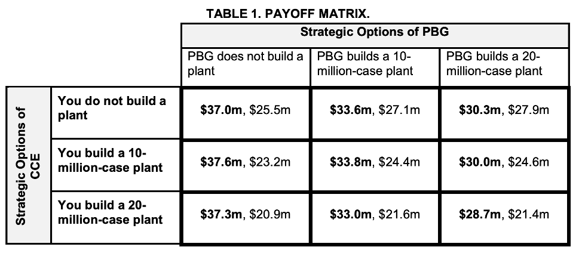
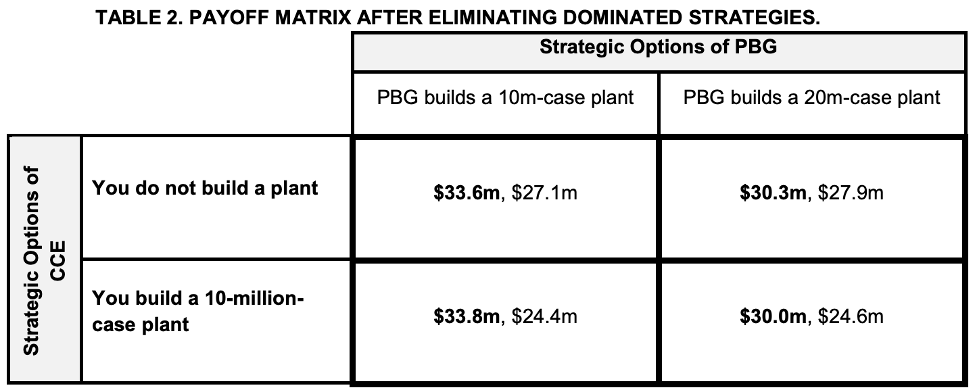
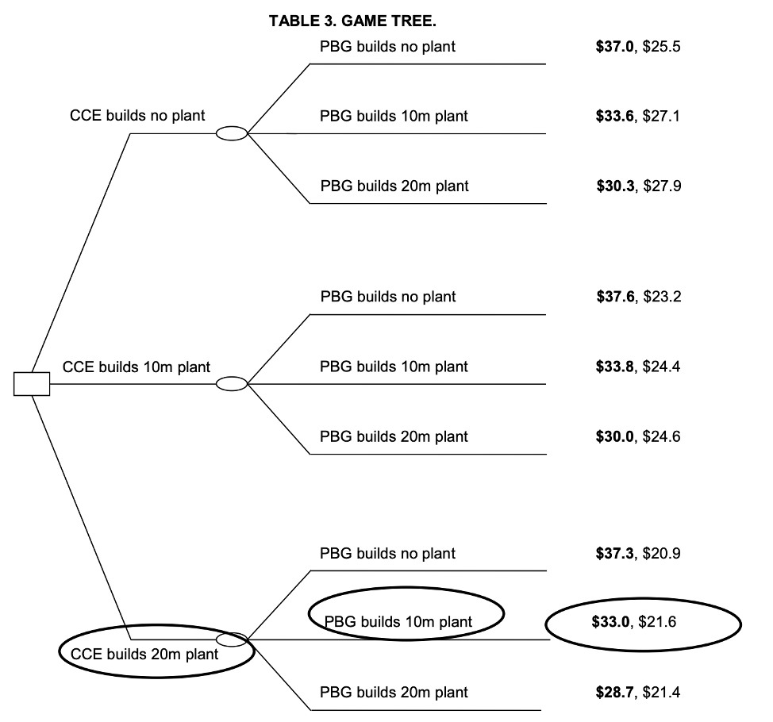

## A Primer on Game Theory

Most strategic decisions are highly interdependent. The formulation of a firm’s strategy almost always depends on the strategic choices of number of key players, including competitors, customers, and complementors. For example, whether lowering the price of a product is a sound strategy not only depends on consumers’ reactions to price changes but also on whether competitors will lower their prices as a reaction.

Those carrying out strategic analysis—whether managers, corporate strategists, analysts, consultants, policy makers, or others—require a systematic approach to model and analyze their decisions. Having a way to understand the dynamics in competitive interaction is crucially important in formulating an optimal strategy for a business unit—one that can lead to a sustainable competitive advantage.

Increasingly, business firms are relying on game theory to help them think about competitive dynamics more systematically. Originally formalized in the 1940s by mathematician John von Neumann and economist Oskar Morgenstern, game theory has been applied in a range of areas, including biology, politics, engineering, economics, health, and others. Its strength lies in helping decision makers manage uncertainty about their counterpart’s actions within strategic interaction.

While not every game is analytically solvable, this does not absolve the strategist from the essential tasks of recognizing the pattern of the underlying game and using game theoretic thinking to develop game shaping and game winning strategies.

## Building a Model

Suppose as a strategist working for Coca-Cola Enterprises (CCE), the primary bottler and distributor for the Coca-Cola Company, you were asked to determine the effect on profitability of the planned construction of a new bottling plant in Wisconsin. Before applying a game theory approach, you need to decide on five key parameters:

1.  Who are the **players** in this environment? This is often much more difficult to determine than it sounds, as one has to think not only about existing players but also potential competitors. In the case of the new plant in Wisconsin, the strategist needs to determine who the key players are. Are other bottlers competing in this state? Does CCE compete with other bottlers in nearby states? Within what radius? Determining the players in the Wisconsin market is a critical step in modeling competitive dynamics.
2.  What are the **actions/strategies** the players can take? In order to model potential outcomes, the strategist must understand the range of actions CCE and its competitors can employ. For instance, suppose CCE is considering the construction of either a small bottling plant with a capacity of 10 million cases or a bigger plant with a capacity of 20 million cases per year. Moreover, the strategist must determine whether competitors also have the capacity to build a new plant, and if so, how large?
3.  What **information** is available to the players? Here the strategist needs to consider precisely what information is available to the various players. Critical information often relating to competitive strategy includes information about consumer demand, cost structure, profit margins, available financing, planned investment, as well as merger and acquisition activity. An understanding of these and other data are useful in anticipating how a rival might respond to a given competitive threat. It is important to remember that in addition to acquiring relevant information, the strategist needs to consider whether the other players possess the same information and, if not, what the differences in the information set are. Does the Pepsi Bottling Group (PBG) have the same estimates of consumer demand? What information does the strategist possess that they do not? And what information are they likely to possess that the strategist does not have?
4.  What is the **timing** of the actions? The timing of competitors’ actions is often related to the type of available information, as well as the nature of the particular industry. Consider the building of bottling plants, which take many months to complete before they actually start to produce drink products. The long lead times in this type of decision naturally affect the timing of strategic actions, with a tendency to produce lagged responses by competitors. Games typically fall into two general categories: sequential-move games and simultaneous-move games.
    1. As the name suggests, in a sequential move game, Firm A is the first to take a strategic action—in this case, the construction of a new bottling plant. After firm A acts—the new plant is completed—Firm B must decide what (if any) strategic action it will take. The defining dynamic here is that Firm B will make its choice only after Firm A has undertaken a strategic decision that Firm A cannot change in the short or medium run.
    1. In a simultaneous move game, however, competing firms are making their respective strategic decisions at the same time—without knowing what the other rival is doing. A common example is a standard bidding process in which all bidders must decide whether to bid, and the amount of their bid, effectively at the same time. Firm B makes its bid without knowing whether (or how much) Firm A is bidding.
5.  What are the **payoffs** of the different scenarios? At its root, game theory provides quantitative measures to compare possible outcomes. In order to accomplish this, strategists must have a concrete understanding of the respective payoffs associated with the various possible outcomes. As payoffs are typically established in economic terms, figures such as expected revenue, costs, and profits are often used to model a firm’s payoffs. As with much of the analysis carried out through game theory, determining payoffs requires the strategist to make good judgments and realistic assumptions about how the given market works and the probability that select outcomes will occur.

## The Payoff Matrix

Answering the five questions above allows the building of a model that quantifies the payoff of the different strategic options dependent on the counterpart’s options. The game theoretical reasoning will then allow predicting competitive dynamics and the outcome of the strategic interaction.

Consider CCE’s decision to build a bottling plant. Suppose that at the moment, the only other important player in the carbonated drinks market in Wisconsin is PBG. CCE is the bigger player, capturing a 59% market share, and PBG supplies the remaining 41%. The current size of the market is 125 million cases per year, which are sold at an average price of $5.51 and generate 50 cents in net profit per case.  Both CCE and the PBG have the option of constructing a 10-million- or a 20-million-case bottling plant at a respective annual cost of $0.6 million and \$1.2 million. Your market research has shown that the Wisconsin market has considerable growth potential but that with the emergence of healthier substitutes for carbonated drinks, consumers have become much more price sensitive, which means an increase in the supply of carbonated drinks will be accompanied by a price decrease. Specifically, your best estimate of the market’s aggregate demand curve is that every 10-million-cas e increase in supply will result in a 50 cent drop in the price per case and 4.54 cent drop in the net profits per case. You now have to think about the payoffs for each of your strategic options and of the options of your competitor. Let’s think about scenario 1:

**Scenario 1:** Both you and PBG build a 20 million case plant. Once the plants are producing drinks, both of you would increase your sales by 20 million cases: your sales go from 74 million to 94 million cases, and PBG’s go from 51 million to 71 million. As a consequence of the 40-million-case increase in the supply of carbonated drinks, the average selling price decreases by $0.50 x 4 = $2.00 (to $3.51), which means both of you earn less per case, namely, 50 - 4.54 x 4 = 3.84 cents per case. Lastly, each of you has to pay the cost of the new plant, which is $1.2 million per year. In summary, your profits would equal $0.3184 x 94 million cases - $1.2 million = $28.7 million, and PBG’s profits would equal $0.3184 x 71 million cases - $1.2 million = \$21.4 million.

Doing the same calculations for the remaining eight possible scenarios leads us to the following representation of the different options, that is, the payoff matrix. Scenario 1 is in the lower right corner and the first number in a cell (in bold) indicates the payoff for CCE and the second for PBG in a given scenario:

What is the most likely outcome in this strategic interaction? First, let’s consider the tradeoff between building a 20-million-case plant and building a 10-million-case plant. As we can see from the payoff matrix, CCE always earns a higher profit if it builds the smaller plant irrespective of what PBG does. That is, you earn more by building the smaller rather than the larger plant if PGB does not build a plant ($37.6 million vs. $37.3 million), if PGB builds a 10-million-case plant ($33.0 million vs. $28.7 million). In Game theory, we would say building a 20-million-case plant is dominated by building a 10-million-case plant. A player will never choose a dominated strategy. Note that PBG also has a dominated strategy, namely, not building a plant.

Once we have eliminated your dominant strategy in Figure 2, we can see that none of your other two strategies dominate one another. If PBG builds a 20-million-case plant, you would rather not build a plant since above all you want to maximize your profits. However, if PBG were to build a 10-million-case plant, you would maximize your profits by building a 10-million-case plant. What should CCE do?

To solve this game and in order for CEE to decide on its strategy, you have to put yourself in the other party’s shoes. If you go for your highest payoff ($33.8mm), that is, building a 10-million-case plant, then PBG maximizes its profits by building the larger plant, prices will drop, and you will end up with your lowest payoff ($30.0mm). In contrast, if you do not build a plant and PBG builds the larger plant, you end up earning more (\$30.3mm). Analyzing PBG’s reaction to both of your actions shows that in the last scenario, neither of you has an incentive to change to another strategy.

In game theoretic terms, the solution concept applied to this kind of game is the **Nash Equilibrium**, named after its author and Nobel Prize winner John Nash. A Nash Equilibrium is a pair of strategies such that each player can do no better by unilaterally shifting strategies. In other words, at Nash Equilibrium, each player plays the best response to the other player’s strategy. In this game, for PBG to build a 20-million-case plant and for you not to build a plant is the Nash Equilibrium. To see why, note that if PBG builds the 20-million-case plant, your profits are highest when you do not build a plant: they equal $30.3 million compared to $30.0 million when you build a 10-million-case plant. Moreover, if you do not build a plant, PBG maximizes their profits by building a 20-million-case plant. They earn $27.9 million instead of $27.1 or \$25.5 when they build a 10-million-case plant or no plant at all. Thus, each player is best-responding to the other player’s action. None of the other cells in the payoff matrix have this property.

## Changing the Game

As we observed in the above game, there are instances in which the competitive dynamics as they stand prove unfavorable to you and your firm. In the game analyzed above, we noted that the outcome would likely yield $30.3 million for your and $27.9 million for your rival—the upper right box of the matrix. Compared to the starting situation, this is a $6.7 million decrease in profits for you and a $2.4 million increase for PBG. In that instance, PBG was able to deduce that a large plant was relatively less profitable for you because a price decrease affects you more due to your bigger market share. But how can we change the dynamic of the game to bring about a more favorable outcome? The outcome discussed above is based on the often true fact that both firms have to decide almost simultaneously which action to take, that is, without any first-mover advantage. But how would the outcome change if one company moves first? Let’s go back to the original payoff matrix where all options are on the table. How would the payoffs differ if CCE could choose first? Is there a way CCE can implement a more profitable strategy? Companies facing this type of situation have often employed ways of demonstrating commitment to a specific course of action, with the idea being if the company can constrain its own potential actions—and the other player or players fully understand this constraint—then a movement from an unfavorable strategic position to a more favorable location can occur.
In our example, CCE could commit to building the larger 20-million-case plant by signing a binding legal contract with a plant manufacturer before PGB has a chance to act. From a game theoretic point of view, such a move changes the game from a simultaneous-move game into a sequential-move game. Sequential-move games are usually represented with a game tree. Now, CCE can decide first. Given CCE’s decision, PGB has to make a decision. Again, the first number at the end of the decision by CCE and PGB refers to the payoff of CCE (in bold) and the second to PGB.

From the game tree it is clear that once CCE commits to building the 20-million-case plant, PBG has no better choice than to build a 10-million-case plant as it would prefer a $21.6 million profit to the $21.4 million profit of building the larger plant. If this happens, your profits would be $33.0 million instead of the \$30.3 million in the case where there was no commitment.

Some other techniques companies might follow to demonstrate commitment to specific course of action include making public announcements or, in some instances, even selling off select manufacturing plants in order to, for example, limit their production capacity, thus signaling an inability to reduce prices.

A well-known industry where strategic commitment is crucial is airplane manufacturing. Airbus and Boeing provide strategists with a ripe set of situations that illustrate how a demonstrated commitment to constrain their own company’s actions may help preserve competitive advantage. The two companies’ domination of the jet airliner market since the 1990s presents a natural oligopoly in which the actions of one firm dramatically impact the business of the other. Given the high cost structure and relatively long development cycle for new aircraft, these two firms have competed fiercely in what has come to be known as the “Airliner Wars.”

The importance of demonstrating commitment is particularly important in this long-term rivalry given the stakes and the repeated strategic interactions between the firms. Consider the case in which one firm, say, Airbus, is developing a new aircraft for release within a few years. Boeing then faces a number of strategic considerations: Should the firm develop a new aircraft to compete with the new Airbus model? If so, at what price should it enter the market? Should it enter at the price set by Airbus, or should it cut the price and risk an all-out price war.
Game theory analysts would likely show that margins on the new jetliner would decrease substantially for both firms in the instance of a price war, and yet the second mover to the market will be hard pressed to gain market share in the absence of a price cut. Herein lies an opportunity for one or the other firm to “change the game” by limiting its own strategic options. Over the years, each firm has pursued long-term contracts, become subject to much federal legislation, and also made public pronouncements, the net effect of which has shifted the competitive dynamics substantially.

## Behavioral Aspects of Game Theory

As we think about the benefits of game theory as a strategic tool, a couple of things become clear. Game theory is a very effective tool for strategists because it reduces the complexity of strategic interdependence to a manageable level, thus allowing the strategist to choose from among strategic options. The ability to depict and compare various strategic options in a quantitative model makes game theory extremely appealing for people facing complex decisions—whether in business or in other fields.

At the same time, however, the assumptions on which many game theory models are built are often fairly rigid and potentially unrealistic in some cases. As such, the skilled strategist is always checking a model’s assumptions, implicit logic, and generated outcomes against one’s intuition. This “reality” or “common sense” check is no different in working with game theory models than it is when working with financial modeling and other modes of quantitative decision making: the model is only as good as the assumptions on which it is built.

A more recent approach to competitive dynamics—articulated and explored in current research on behavioral aspects of game theory—relaxes some of the assumptions strategists typically make in order to make the models more realistic. In particular, although we often assume business people’s behavior is essentially rational, experience and research show that many business people make decisions that do not follow the rules of rational behavior. In fact, we can go as far as to say many business people—be they managers, customers, suppliers, or competitors—exhibit many behaviors that are arguably irrational. That is, their observable behavior departs noticeably from what we would expect from reasonable, well-informed professionals.

For example, many managers and customers care too much for the present relative to the future. This short-sightedness will change the way they discount the future consequences of their strategic actions. For instance, managers may discount cash flows of a future project in a way that underweights long-term consequences relative to short-run impact.

Another bias common to managers and others is the so-called “salience” bias. Managers subject to the salience bias place greater importance on recent or highly memorable events than they do on other data that may prove to have equal or even greater importance. In this context, one can imagine a sales manager using customer feedback received in the past three days as the basis to push for a new product feature—even though the feedback was provided by only a small minority of customers. In this manager’s mind, this feedback stands out simply because it was provided recently, not because it is necessarily representative of the base of target customers.

Having the ability to incorporate such biases into models used in game theory can only improve their predictive power. Fortunately, the irrational behavior exhibited in business is not completely random; rather it’s “predictable irrationality.” That is, there are a predictable number of behavioral biases observable in business actions and decisions, including the two mentioned above: the tendency to overweight the present relative to the future and the tendency to overweight recent or memorable events.

As such, advances in the behavioral aspects of game theory suggest the strategist’s ability to relax standard assumptions of rationality and account for some level of “predictably irrational” behavior will make game theory an increasingly accurate and valuable tool, helping companies create successful strategies and leading toward long-term competitive advantage.

## Conclusion

Most competitive strategies depend crucially on the actions of one or more other players—in particular, on competitors’ strategies. Good strategic choices—those that generate value and competitive advantage—require a deep understanding of competitive dynamics, as well as an ability to accurately predict how given strategies will interact to generate economic value. Game theory is one important tool available to strategists that allow for the systematic analysis of competitive dynamcis. Leading consulting firms and corporate executives are finding that game theory modeling is an excellent way to put oneself in the other parties’ shoes, anticipate competitors’ moves, and tailor one’s own strategy in keeping with current goals and interests.
