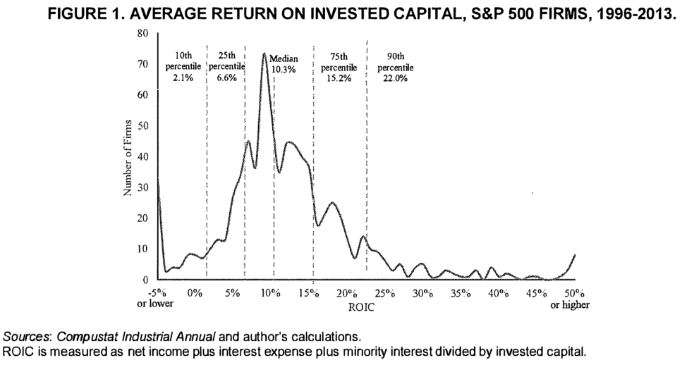
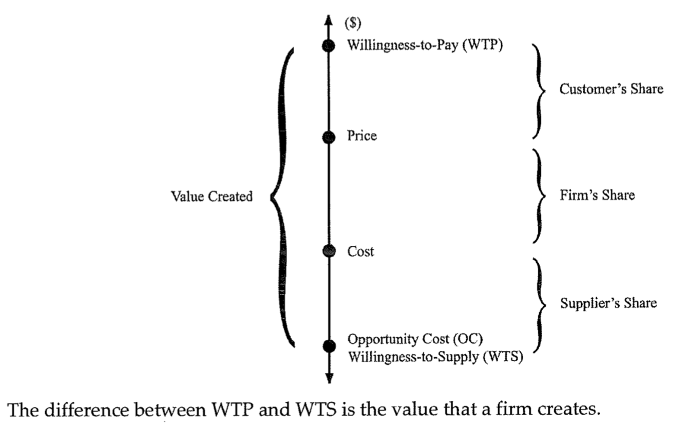
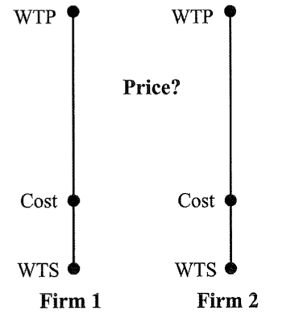
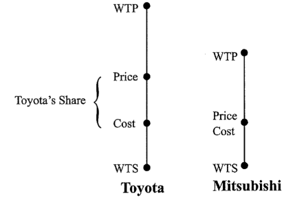
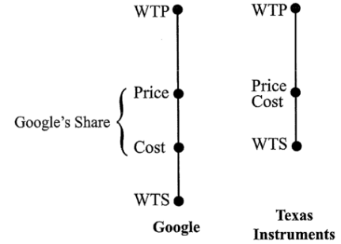
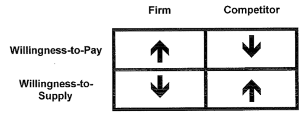

## What is Strategy?

Strategy, in the abstract, is the formulation of a plan and process for the attainment of sustained and superior profits. Firms vary greatly in their abilities and opportunities to achieve this goal. The distribution in the figure below shows that many firms fail altogether to achieve a return on invested capital, while the rightward skew indicates that a few firms are extraordinarily successful.

These differences in financial performance reflect many factors, including differences in national opportunities, industry conditions, and firm capabilities. Information about differences in ROIC among industries suggests that certain industries (i.e. advertising agencies) are more profitable than others (i.e. ice cream and desserts). Often, firms cannot do much about some of the factors that influence their profitability; they cannot easily change countries or industries. However, even within an industry in a single country, firms realize a wide variance in financial performance—airlines are a good example. In fact, most recent estimates show that the influence of industry factors accounts for a minority of inter-firm differences in profitability (les than 20%), indicating that firm-level strategies are decisive.

Clearly, the choice of how to position a firm and the capabilities needed to compete are strategic to the financial success of a firm. Therefore, the two fundamental jobs of strategists are:

1. To understand why financial performance varies across companies and industries;
2. To devise a set of actions (“the strategy”) and processes that allows their company to attain a competitive advantage.

In most companies, the major strategic decisions are the purview of the CEO, top management, and the company’s board. These decisions are often “corporate” in nature; that is, they concern the portfolio choice of industries in which to invest or divest. Strategies for individual businesses are often formulated by managers responsible for their results. In a recent trend, a number of firms have appointed chief strategy officers (CSOs). The role of CSOs is not only to facilitate the formulation of a strategy, but also to ensure that the company’s strategy gets translated into action. Strategists are, of course, not alone in trying to understand why some companies are much more profitable than others. These differences are also of interest to investors, financial analysts, and employees.

The theories and practices that inform good strategies have evolved over the recent decades, with an increasing agreement on the importance of value as the central idea. In the first decades after World War II, strategy was influenced by two very different streams: the sophistication of operation research methods used in military thinking and logistics, and the conceptual understanding of how to identify which businesses to compete in. These two approaches were joined together partly through the work of General Electric, Shell, Boston Consulting Company, Arthur D. Little, and McKinsey. The emphasis was on experience costs and their relation to the portfolio of choices of large companies regarding which businesses to sell, keep, grow, and acquire. A revolution in thinking about strategy was introduced by Michael Porter, who converted the industrial economics popular in the 1970s to a set of tools useful in analyzing why certain industries were more profitable than others. Game theory grew in importance in the 1980s, as well as transaction cost economics, which led to more subtle analyses of the sequential dependence of the future competitive situation on the decisions made today. The 1990s witnessed a relative move away from industry dynamics toward a more thorough analysis of the competitive advantage of the firm in terms of resources, knowledge, and capabilities. In this evolution, there appeared an analytical gap between understanding what firms do well and understanding what leads to financial success.

A new framework bridges this gap and helps in understanding how companies create competitive advantage that leads to financial success. The theory, called Value-Based Strategy, was developed by Adam Brandenburger of the Stern School of Business at NYU and Gus Stuart of the Columbia Business School.

## Value Creation vs. Value Capture

A value-based strategy starts with a fundamental observation that challenges any entrepreneurial effort: a good idea, a novel product, or a breakthrough service does not guarantee strategic success. While each might create significant value, companies can hope to earn superior profits only if they manage to capture at least some of the value that they create. It is easy to find examples of firms that create significant value but manage to capture little of it (i.e. airlines).

## Value Creation

Think of the firm as a conduit: companies acquire resources (capital, labor, raw materials) and transform these resources to sell them to customers. The figure below shows this process. Starting with the top of the graph, willingness-to-pay (WTP), as the term suggests, is the maximum a customer is willing to pay for a product. If the price of the product exceeds the customer’s WTP, he or she is better off not buying it. Similarly, the opportunity cost (OC) for a supplier is the lowest price for which a supplier is willing to sell a resource. In the case of an employee, OC is the lowest wage for which the person is willing to work for the company. To simplify our discussion, we will call opportunity cost by the easier mnemonic the willingness-to-supply (WTS) in order to emphasize that this is the minimum price that a supplier could economically want to charge. We should remember, though, that the WTS is related to the other opportunities that a supplier could choose.

Both WTP and WTS represent the decisions of customers and suppliers in the context of other opportunities and choices. For instance, the advent of skype, a company that provides free telephone calls over the Internet, has reduced customer WTP for landlines. Similarly, government subsidies for corn-based biofuels have increased farmers’ WTS for selling corn to grocers.

## Value Capture

The figure above also illustrates the second insight of value-based strategy: it is rare that a firm captures all the value that it creates. This value may accrue to customers (in the form of what microeconomics calls consumer surplus). A supplier also may be selling a unique component (i.e. a new microchip or software) and will charge a premium relative to suppliers of similar but less valued inputs. Thus, the capture of value always implicitly or explicitly entails a type of bargaining situation, in which two parties (the seller and buyer) have to agree on a price which will be different than the WTP and WTS.

In general, companies would like to charge prices as close as possible to WTP and pay little more than their suppliers’ WTS. However, firms are often constrained in their ability to capture the value that they create. If prices remain below customer WTP and costs above supplier WTS, firms receive only a share of the created value.

## Competitors

Our discussion of value capture serves to remind us that firms have many sources of competition. When asked about their most important competitors, many managers will name rival firms. In this view, for example, Morgan Stanley competes with Goldman Sachs and J.P. Morgan. While rivals are important competitors, the figure above shows that companies also compete with their customers and their suppliers for a share of the created value. Suppose a pharmaceutical company considers hiring a star scientist whose future discoveries are valued at $50 million a year.  The company can capture only a part of the value that the scientist creates by paying her less than $50 million. As the example suggests, strategic success is often the result of paying less than full-market value for resources.

To see why the ability of firms to capture value varies widely, it is useful to start by considering competition among companies (while keeping in mind, however, that suppliers also compete for their share of value). We start with the example in the figure below. To keep things simple, we look at just two companies with identical WTP and identical cost of inputs. As the top manager of Firm 1 responsible for this business, what price would you charge your customers in this situation?

The dilemma is easy to see. If you charge a price that is close to customer WTP, your firm captures value. However, in response to your charging a high price, Firm 2 can undercut you slightly, attracting your customers. You, in turn, will lower your price to win back business. This process stops once the price is equal to the cost of inputs, leaving the two firms with no value. A general insight from this example is that strategic success comes from being different. Me-too firms stand little chance of attaining a competitive advantage.

## Differences in Willingness-to-Pay

According to Interbrand, in 2007 Toyota was one of the world’s top 10 brands, with a value of more than \$30 billion. Consider the competition between the Toyota Corolla and Mitsubishi’s Lancer, two similar cars. The figure below shows that individuals are willing to pay more for a product with a stronger brand. As before, we assume the two companies have a similar cost. What price should Toyota charge?

In this example, Toyota’s advantage in customer WTP allows the company to charge a premium. To understand why, think about price competition in this setting. Suppose Toyota charged a price that equaled customer WTP for its car. How might Mitsubishi win over buyers? The company has to charge a price that is less than the difference in WTP for the two cars. As before, the two firms have an incentive to undercut each other. But once the Lancer is offered at its economic cost, Toyota can charge a premium (slightly less than the difference in WTP) without losing customers to Mitsubishi. Toyota’s ability to capture value reflects customers’ greater WTP for the company’s products.

## Differences in Willingness-to-Supply

A second strategy to create a competitive advantage is to lower suppliers WTS. Some companies are more attractive employers than others. Working for them might increase one’s prestige (think Goldman Sachs), might be more fun (think Google), or might provide exceptional career opportunities (think GE). For example, Google offers its engineers “20 percent time,” a program that allows them to work on innovative projects of their own choosing. As a result, as the figure below shows, Google has lowered its employees’ willingness-to-supply. We compare Google to Texas Instruments. As before, we keep things simple and assume that both companies have the same customer WTP and charge the same price for comparable products. Suppose Google were to offer a wage that equals its suppliers’ WTS. As a result, in order to lure talent, Texas Instruments needs to pay a higher wage, some premium over its potential employees’ WTS. In response, Google will raise its compensation. Competition drives up wages, but Texas Instruments cannot afford to pay more than the price of its products. And even at this level, Google remains competitive, capturing the share that is shown in the figure.

## Added Value

These two examples illustrate an important source of competitive advantage. Companies with a wider wedge between customer WTP and supplier WTS are able to capture value. The following definition is useful in strategic analyses:

**Added Value:** _A firm’s added value is the total value created in a business situation minus the total value that would be created in the situation if the firm did not exist._

A firm’s added value is the amount lost if the firm were not there. Understanding added value is important because the maximum share of value that a firm can capture is its added value. In the example with two identical firms, added value is zero for both companies because total value (WTP minus WTS) does not change if one firm disappears. As a result, neither firm captures any value. To create a competitive advantage, companies have to raise buyer WTP or lower supplier WTS by more than their competitors. In the figures above, Toyota and Google have positive added value. If either company were to disappear, total value created would decline. Companies with a competitive advantage are unique in respect to their abilities to differentiate their products or to lower costs.

The simple way to express this idea is that a competitive advantage exists only if it permits the firm to be “different.” A firm without a competitive advantage can enter an industry and destroy the value capture enjoyed by the incumbents. However, if the new entrant does not offer anything different, then it has not added value—for example, consumers will not be willing to pay more for its products; or its costs will not be lower than its competitors’. It is a common mistake to be drawn to markets where competitors are making a profit. A new entrant must also bring something different to the market; otherwise, the firm will add no value and hence will affect no value capture.

## Margin and Profit

The value of the firm is directly related to its ability to charge customers a price over its costs to suppliers. Clearly, this difference is the margin (price – cost) that a firm enjoys. The calculation of profit relies upon this margin times the quantity sold. For this calculation, price and costs are taken at their average unit values. Profit is then (price – cost) x quantity, where price and costs are average unit values.

Surely, though, prices may vary across customers if firms have the ability to set a different price for distinct consumers or segments. This is called price discrimination. In making a decision, a firm is concerned about the contribution at the margin of serving a new customer and buying from suppliers. In working out a detailed analysis of a strategy, the difference between margin and average and the power to differentiate price can be very important. Nevertheless, considerable insight can be gained by first focusing on the “representative consumer” and comparing the WTP and value capture propositions for competing products.

It is also a reasonable simplification to focus on margin rather than profit, as long as we compare similar businesses. A 20% margin for selling an airplane is not the same as a 20% margin for selling a pen. Conceptual errors can be avoided by recalling that the value-strategy focus is on firm-level strategies. From a corporate perspective, though, margin alone will not provide sufficient information for making comparisons across very different businesses.

## A Taxonomy of Value-Based Strategies

Companies must create added value to gain competitive advantage. The key to adding value is to be different, and thus to create a wider wedge between customer WTP and supplier WTS than competing firms have. The figure below shows four avenues toward achieving this goal.

In the column labeled “Firm,” we find two generic strategies:

1. **Differentiation strategy** (top left box): The firm figures out a way to better meet the needs of its customers (and thus increase their WTP). A branded-goods strategy is one example.
1. **Cost leadership** (bottom left box): Companies in this group enjoy a cost advantage. For example, Southwest Airlines gains a cost advantage over other carriers by relying heavily on secondary airports that charge lower gate fees and allow a faster turnaround of aircraft.

In implementing generic strategies, managers pay close attention to the tension between WTP and WTS. Increasing customer WTP often implies higher costs, and lowering costs is often associated with a decrease in customer WTP. For examples, companies can raise WTP by producing higher-quality products. However, improved quality might necessitate hiring better-educated employees or using more precious raw materials, both of which will increase supplier WTS. To gain competitive advantage, companies have to increase WTP more than cost, or lower cost more than WTP.

Our definition of added value allows us to arrive immediately at a richer understanding of competitive advantage. Because added value compares the firm with its competitors, companies can also gain competitive advantage by influencing their rivals’ customer WTP and supplier WTS:

1. **Decreasing rivals’ customer WTP** (top right box): There are many strategies that lower customer WTP for competing products. For example, frequent-flyer programs create switching costs, reducing what passengers are willing to pay for flights that are not part of their program.
1. **Increasing rivals’ supplier WTS** (lower right box): Patenting innovative products is an important example of strategy that increases rivals’ cost, forcing competitors to license the technology or invent alternatives to the patented innovation.

## Sustaining Competitive Advantage

To attain competitive advantage, companies need to create added value. But how sustainable are these differences? If a company adds value by improving the quality of its products, how long will it typically take the competition to catch up? As it turns out, many types of advantages are fleeting. Management scholars point to two classes of threats to explain why firms’ added value tends to diminish over time: changes in the market environment and changes inside the firm.

## Market Environment and Porter’s Five Forces

Michael Porter’s Competitive Strategy, written in 1980, introduced industry analysis to the study of strategy and the forces that influence the profitability of industries. This book analyzed why some industries are more attractive than others. Porter originally saw forces operating on the industry level that explain why certain industries are more profitable than others. But the mechanisms of the forces also apply to individual firms by affecting the market environment and the possibility of capturing value. In his analysis of industries and competitive advantages, Porter argued that there are five principal forces (subsequently expanded to seven) that can undermine superior performance:

1. **Entry of Competing Firms:** Companies with substantial added value earn high returns on invested capital, and these returns make it attractive for other companies to copy the business model of the leading firms. If the new entrants are successful, the leaders’ added value declines, reducing their returns. However, the existence of barriers to new firms entering the market can lead to sustainable high returns. For example, patent protection in the pharmaceutical industry makes it legally impossible for new entrants to tap into the market for a successful drug.
2. **Emergence of Substitutes:** The availability of substitute products lowers customer WTP for the original product. For example, generic drugs are close substitutes to brand-name medicines. Where generic drugs become available, the price of branded medications declines sharply. Similarly, the Linux operating system reduces customer WTP for Microsoft Windows.
3. **Increasing Bargaining Power of Buyers:** In our analysis, we emphasized that companies need to have positive added value in order to capture value. However, there is no guarantee that a company can appropriate its entire added value. To see why, it is useful to revisit the example of Toyota and Mitsubishi. The availability of the Lancer model clearly restricts Toyota’s pricing power. In negotiation theory, the area between the maximum price and Toyota’s cost is called the Zone of Possible Agreement (ZOPA). Any bargain struck in the zone makes both parties better off relative to no agreement. Where in ZOPA will the two parties end up? The bargaining power of buyers depends on a variety of factors, including their negotiation skills, quantities purchased, and, importantly, the number of buyers. In markets with a single buyer, the buyer is in a particularly strong bargaining position. For example, some governments negotiate drug prices directly with pharmaceutical companies to exploit their bargaining power.
4. **Increasing Bargaining Power of Suppliers:** Analogous to buyer power, the bargaining power of suppliers determines where in the ZOPA a firm and its supplier will end up. A monopolistic supplier is in a great position to extract a high price.
5. **Price Competition:** Finally, competitive advantages are more difficult to sustain if rival firms compete on price. For example, price wars are common among airlines. In contrast, in their long-standing rivalry, Coca-Cola and Pepsi have generally avoided competing on price, thereby preserving substantial margins. A number of factors, such as the number of key competitors (there are only two in the soft drink market), or the cost structure (the very low variable cost of airlines filling their empty seats increases the pressure to lower prices), affect the rivalry between existing competitors.
6. **Emergence of Complements:** A sixth market force—the emergence of complements—was missing from the original list but is now routinely included in strategic analyses. The availability of complements, unlike that of substitutes, raises customer WTP for the original product. Applying this logic, Andre Michelin, founder of the eponymous tire company, decided to publish the famous Michelin Guides to encourage travel and, of course, the use of tires. Games and gaming consoles are another example of products that are complements. The availability of (cheap) games increases the value of gaming consoles.
7. **Government and Nonmarket Strategies:** As the recent financial crisis has made clear, government regulations and policies also constitute an important force that both impedes and creates profit opportunities. The political decision to deregulate commercial banks to permit them to enter new financial markets provided the opportunity to create and trade new financial instruments, such as mortgage-backed securities. The subsequent decision of the government to “bail out” some institutions—including auto companies—but not others poses the interesting question of whether such firms had superior strategies for acquiring government support. While the crisis is a spectacular example of the force of government policies, the more standard examples are the decisions fo governments to issue patents for innovations. Patent protection is a major reason why pharmaceutical companies that successfully innovate realize high returns; these companies also lobby the government in order to maintain patent protection. We call such strategies nonmarket strategies, because they concern the political efforts of firms to influence the regulatory environments in which they compete.

These seven forces can each have a substantial impact on the sustainability. Of competitive advantage. Paying close attention to these forces allows strategists to understand both why their organization may be more or less successful than rival firms and what levers they can use to improve performance. The seven forces point to the importance of the company’s market environment for continued strategic success. A second group of factors that helps determine long-run performance is internal to the firm.

## Resources, Knowledge, and Capabilities

So far, we have talked about strategies as if we were looking through a window onto a field filled with consumers, suppliers, and competitors. Another part of strategy is looking in the mirror and understanding what a firm does well and what it can do better. One way to think about these questions is to ask whether a firm can imitate the strategies of competitors.

An important reason why it can be difficult to imitate companies that create positive added value is that they control resources that are not freely available to other firms. These resources lead to particular capabilities that drive the differentiation and cost advantages of a company. We thus have a relationship between resources, capabilities, and market value. For example, Samsung Electronics successfully created a corporate culture that enhances a capability of high productivity, which supports competitive pricing valued by the customer. Copying this culture is a difficult—perhaps impossible—task, creating a sustainable competitive advantage for Samsung. The resource-based view of firms is that the basis for competitive advantage lies primarily in the bundles of valuable resources at the disposal of companies. These resources include assets, organizational processes, and knowledge. To be valuable in a strategic sense, resources need to be scarce and difficult to imitate, and to correspond to market demand.

Since resources is a very abstract term, it is simpler to think about capabilities. A capability bridges the resources of a firm and market opportunities. For example, Southwest Airlines has a capability in its human resource organization to motivate its employees to provide satisfactory service to many passengers at low cost. Many competitors have tried to imitate Southwest Airlines; almost all have failed.

It is useful to consider two separate reasons why capabilities may be hard to imitate. To return to the Toyota Mitsubishi example, if Mitsubishi could simply buy production technology and marketing experts to match Toyota’s competitive position, Toyota’s advantage would be eroded very quickly. However, added value is typically the result of a complex combination of resources, making it difficult to know which aspects of a business model need to be copied to match a rival’s success.

The second reason illustrates nicely the problem of strategic trade-offs. In the 1990s, Dell advanced quickly to become the top manufacturer or personal computers by selling directly to the customer and eliminating the distribution channel. This strategy was implemented through many components, consisting of aggressive outsourcing, logistics, Web-based sales, and design. Competitors, who had already built long-standing commitments to their distributors, were caught between the low-cost distribution strategy of Dell and their traditional strength in dominating the sales channel. Eventually, competitors worked out responses to Dell’s capability to deliver at lower cost and thus lower price to the consumer, but this response took years. Meanwhile, Dell substantially increased its relative economic value and its return to investors.

## Game Theory

Ultimately, what firms care about is value capture. A very useful way to analyze value capture is game theory. Game theory establishes the actions that firm can take and the payoffs of these actions. These payoffs are the profits to the firm—that is, the value that is captured. In trying to figure out whether cutting price will lead to more value capture, the strategist has to think about competitors’ responses. More complex considerations concern games played over time, in which building a plant today can influence the firm’s subsequent capability of increasing production. The simple intuition is that such flexibility must be a good thing. The fascination of game theory is that it can generate counterintuitive results. For example, game theory reverses the common thinking about flexibility—in some cases, flexibility (i.e. the capability to produce more) can destroy value capture. If consumers know that you cannot produc e more, then they may be more willing to conced on price. Or if competitors know that a firm cannot increase production even if demand increases through price cuts, it may be easier for a group of firms to agree implicitly to keep prices high. Thus, any discussion regarding value capture requires a consideration of the strategic interaction among competitors in order to test simple intuitions.

## Behavioral Strategy and Organizational Sociology

In the past decade, economists have come to admit the limitations of perfect rational decision making and decision biases. For example, prospect theory has gained considerable empirical support for tis claim that people tend to avoid risk when in a situation of gain and to choose risk when in a situation of loss. There is a fundamental asymmetry. Efforts to increase the willingness of top managers to take risks by tying pay to performance can thus have perverse effects. Managers will be risk averse when things are going well and may take unreasonable risks when things are going badly.

Firms are also not distinct from the societies in which they exist. In many countries, family firms dominate business. Their decisions may be influenced not only by concern over their private maximization of wealth, but also by their religious and cultural values. In many cases, firms may hold to a set of social values that may even be the source of their competitive advantage insofar as it generates high levels of commitment and trust. These values are frequently embedded in social networks that exist within the firm and among firms, associations, and government agencies.

Our approach to strategy has emphasized value and its creation and capture. Ultimately, behavioral biases and sociological forces will end up influencing value creation and value capture and thus the framework proposed above will be robust ot these larger issues. However, it should not be forgotten that strategic change is often very difficult because people are cognitively limited and their choices are influenced by decision biases and deeply held social values. The frontier challenge to strategists is to understand these influences not only as constraints but also as sources of value and opportunity.

## Conclusion

Strategists seek to create and sustain a competitive advantage for their organization. The goal is to achieve returns that exceed those of other companies competing in the same market. In this note, we used the framework of Value-based Strategy to describe how companies can achieve superior returns. Four ideas are particularly important:

1.  **Value creation versus value capture:** Most companies create value, but some value—and sometimes all value—is captured by other parties.
1.  **Added value:** to capture value, companies need to be different. Specifically, companies that create a wider wedge than their competitors do between customer WTP and supplier WTS add value, a necessary condition for competitive advantage.
1.  **Sustainability:** Companies’ ability to create added value and maintain their advantage depends on two sets of factors—favorable competitive conditions in the market (as determined by the seven forces discussed previously) and control over resources and the related capabilities that are scarce and difficult to imitate and yet drive customer demand.
1.  **Competition:** A firm can increase its value by directly improving its value offering relative to competitors, or by hurting the relative value of its rivals.

These four ideas are fundamental to the analysis of strategy. Of course, the devil is in the details. A good strategy will always be sensitive to the specific conditions of its industry and market. A firm may find that it has to face important trade-offs between cost and quality; or it can fear that competing in one market may negatively influence its position in a second market. These trade-offs are often difficult to evaluate and lie at the heart of strategy. Therefore, it helps to have a few basic ideas to place the analysis in a coherent conceptual frame provided by a value-based approach to strategy formulation.
