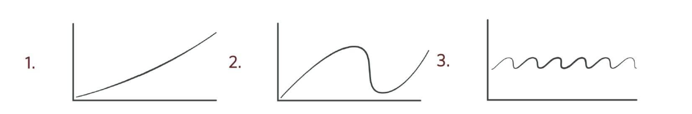
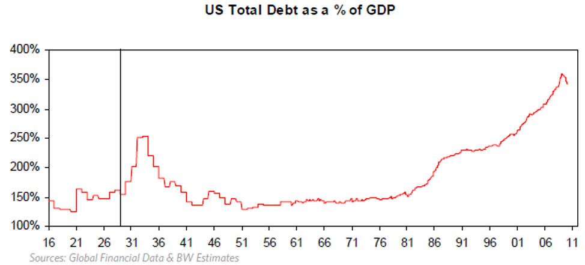
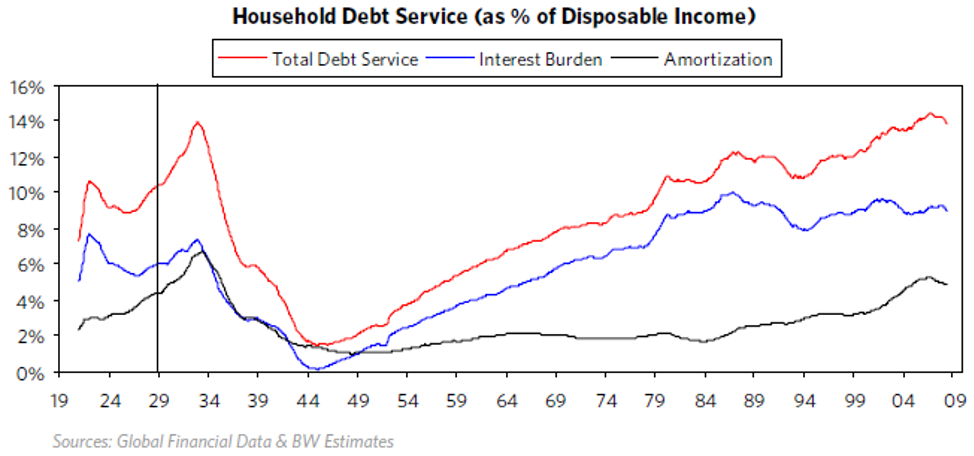
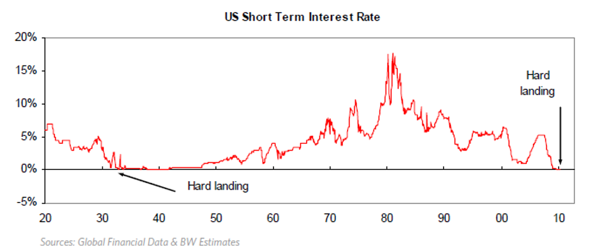
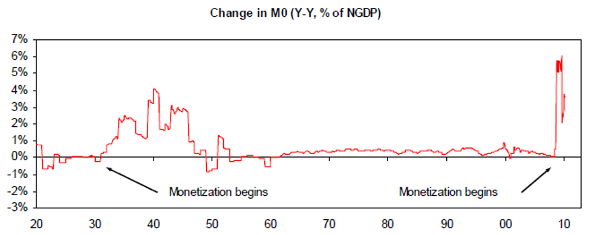
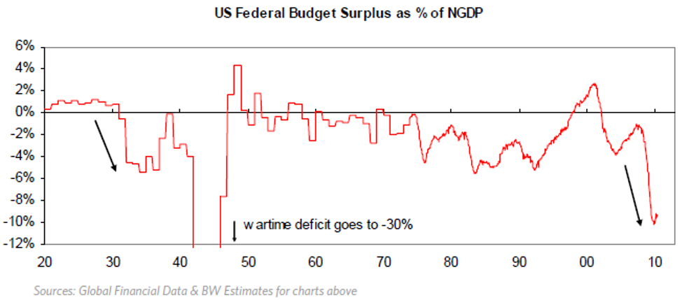
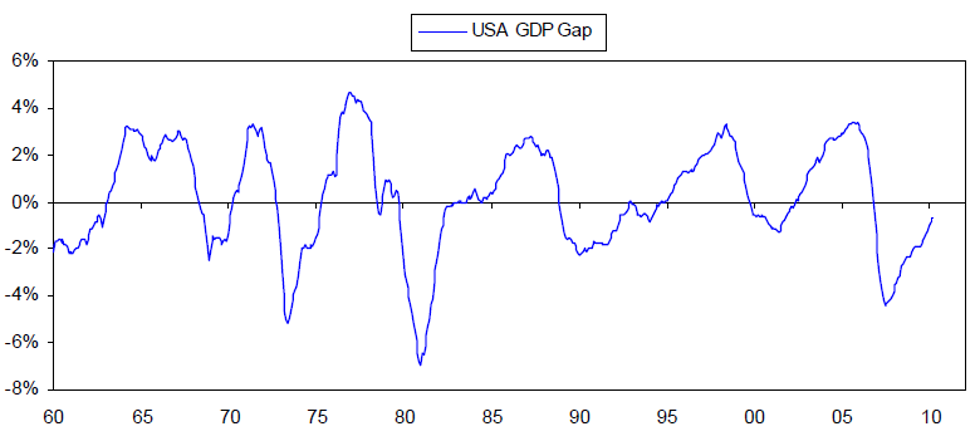

## How the Economic Machine Works: A Transactions-Based Approach

An economy is simply the sum of the transactions that make it up. Because there are a lot of transactions, the economy looks more complex than it really is. A transaction consists of a buyer giving money (or credit) to a seller in exchange for a good, a service, or a financial asset. A market consists of all the buyers and sellers making exchanges for the same things, and an economy consists of all of the transactions in all of its markets.

For any market (or any economy), if you know the total amount of money (or credit) spent and the total quantity sold, you know everything you need to know to understand it. For example, since the price of any good, service or financial asset equals the total amount spent by buyers (total $) divided by the total quantity sold by sellers (total Q), to understand or forecast the price of anything you just need to forecast total $ and total Q. While in any market there are lots of buyers and sellers, and these buyers and sellers have different motivations, the motivations of the most important buyers are usually pretty understandable and adding them up to understand the economy isn’t all that tough if one builds from the transactions up.
The only other important thing to know at this point is that spending (\$) can come in two forms—money and credit. For example, when you go to a store to buy something, you can pay with a credit card or cash. If you pay with a credit card, you have created credit—which is a promise to deliver money at a later date—whereas, if you pay with money, you have no such liability.

All changes in economic activity and all changes in a financial market’s prices are due to changes in the amounts of 1) money or 2) credit that are spent on them, and the amounts of these items sold. Changes in the amount of buying typically have a much bigger impact on changes in economic activity and price changes than do changes in the total amount of selling. That is because there is nothing that’s easier to change than the supply of money and credit.

For simplicity, let’s cluster the buyers in a few big categories. Buyers can come from either 1) the private sector, or 2) the government sector. The private sector consists of “households” and businesses that can be either domestic or foreign. The government sector most importantly consists of a) the Federal Government (which spends its money on goods and services), and b) the central bank (which is the only entity that can create money and, by and large, mostly spends its money on financial assets).

Because money and credit—and through them demand—are easier to create (or stop creating) than the production of goods and services and investment assets, we have economic and price cycles. Most of what economists call the velocity of money is not the velocity of money at all—it is credit creation. Velocity is a misleading term created to explain how the amount of spending in a year (GDP) could be paid for by a smaller amount of money. To explain this relationship, people divided the amount of GDP by the amount of money to convey the picture that money is going around at a speed of so many times per year, which is then called the velocity. The economy doesn’t work that way. Instead, much of spending comes from credit creation, and credit creation doesn’t need money to go around in order to occur. Understanding this has big implications for understanding how the economy and markets will work. For example, whereas one who has the traditional perspective might think that a large increase in the amount of money will be inflationary, one using a transactions based approach will understand that it is the amount of spending that changes prices, so that if the increase in the amount of money is offsetting a decrease in the amount of credit, it won’t make a difference; in fact, if the amount of credit is contracting and the amount of money is not increased, the amount of spending will decline and prices will fall.

## How the Market-Based System Works

As mentioned, the previously outlined economic players buy and sell both 1) goods and services and 2) financial assets, and they can pay for them with either 1) money or 2) credit. In a market-based system, this exchange takes place through free choice (i.e. there are “free markets” in which buyers and sellers of goods, services and financial assets make their transactions in pursuit of their own interests). The production and purchases of financial assets (i.e. lending and investing) is called “capital formation.” It occurs because both the buyer and seller of these financial assets believe that the transaction is good for them. Those with money and credit provide it to recipients in exchange for the recipients’ “promises” to pay them more. So, for this process to work well, there must be large numbers of capable providers of capital (i.e. investors/lenders) who choose to give money and credit to large numbers of capable recipients of capital (borrowers and sellers of equity) in exchange for the recipients’ believable claims that they will return amounts of money and credit that are worth more than they were given. While the amount of money in existence is controlled by central banks, the amount of credit in existence can be created out of thin air (i.e. any two willing parties can agree to do a transaction on credit) though this is influenced by central bank policies. In bubbles more credit is created than can be later paid back, which creates busts.

When capital contractions occur, economic contractions also occur (i.e. there is not enough money and/or credit spent on goods, services and financial assets). These contractions typically occur for two reasons, 1) contractions within a short-term debt cycle (recessions) and 2) contractions within deleveragings (depressions).

A short-term debt cycle (commonly called the business cycle) arises from a) the rate of growth in spending (i.e. total \$ funded by the rates of growth in money and credit) being faster than the rate of growth in the capacity to produce leading to price increases until b) the rate of growth in spending is curtailed by tight money and credit, at which time a recession occurs. In other words, a recession is an economic contraction that is due to a contraction in private sector debt growth arising from tight central bank policy (usually to fight inflation), which ends when the central bank eases. Recessions end when central banks lower interest rates to stimulate demand for goods and services and the credit growth that finances these purchases, because lower interest rates 1) reduce debt service costs; 2) lower monthly payments (de-facto, the costs) of items bought on credit, which stimulates the demand for them; and 3) raise the prices of income-producing assets like stocks, bonds and real estate through the present value effect of discounting their expected cash flows at the lower interest rates, producing a “wealth effect” on spending.

In contrast, a long-term debt cycle arises from debts rising faster than both incomes and money until this can’t continue because debt service costs become excessive, typically because interest rates can’t be reduced any more. A deleveraging is the process of reducing debt burdens (i.e. debt and debt service relative to incomes). Deleveragings typically end via a mix of 1) debt reduction; 2) austerity; 3) redistributions of wealth; and 4) debt monetization. A depression is the economic contraction phase of a deleveraging. It occurs because the contraction in private sector debt cannot be rectified by the central bank lowering the cost of money. In depressions, a) a large number of debtors have obligations to deliver more money than they have to meet their obligations; and b) monetary policy is ineffective in reducing debt service costs and stimulating credit growth.
Typically, monetary policy is ineffective in stimulating credit growth either because interest rates can’t be lowered (because interest rates are near 0%) to the point of favorably influencing the economics of spending and capital formation (this produces deflationary deleveragings), or because money growth goes into the purchase of inflation-hedge assets rather than into credit growth, which produces inflationary deleveragings. Depressions are typically ended by central banks printing money to monetize debt in amounts that offset the deflationary depression effects of debt reductions and austerity.

Differences in how governments behave in recessions and deleveragings are good clues that signal which one is happening. For example, in deleveragings, central banks typically “print” money that they use to buy large quantities of financial assets in order to compensate for the decline in private sector credit, while these actions are unheard of in recessions. Also, in deleveragings, central governments typically spend much, much more to make up for the fall in private sector spending.

## The Three Big Forces

Three main forces drive most economic activity: 1) trend line productivity growth, 2) the long-term debt cycle, and 3) the short-term debt cycle.

By overlaying the archetypical short-term debt cycle on top of the archetypical long-term debt cycle and overlaying them both on top of the productivity trend line, one can derive a good template for tracking most economic/market movements.

### 1.) Productivity Growth

Real per capita GDP has increased at an average rate of ~2% over the last 100 years and hasn’t varied a lot from that. This is because, over time, knowledge increases, which in turn raises productivity and living standards. Over the very long run, there is relatively little variation from the 2% trend line. Even the Great Depression looks rather small. As a result, we can be relatively confident that, with time, the economy will get back on track. However, up close, these variations from trend can be enormous. For example, typically in depressions the peak-to-trough declines in real economic activity are around 20%, the destruction of financial wealth is typically more than 50%, and equity prices typically decline by roughly 80%.

Swings around this trend are not primarily due to expansions and contractions in knowledge. For example, the Great Depression didn’t occur because people forgot how to efficiently produce, and it wasn’t set off by war or drought. All the elements that make the economy buzz were there, yet it stagnated. So why didn’t the idle factories simply hire the unemployed to utilize the abundant resources in order to produce prosperity? These cycles are not due to events beyond our control (i.e. natural disasters). They are due to human nature and the way the credit system works.

Most importantly, major swings around the trend are due to the expansions and contractions in credit (i.e. credit cycles). A cycle is nothing more than a logical sequence of events leading to a repetitious pattern. In a market-based economy, cycles of expansions and contractions in credit drive economic cycles, and they occur for perfectly logical reasons.

Prosperity exists when the economy is operating at a high level of capacity: in other words, when demand is pressing up against a pre-existing level of capacity. At such times, business profits are good, and unemployment is low. The longer these conditions persist, the more capacity will be increased, typically financed by credit growth. Declining demand creates a condition of low capacity utilization; as a result, business profits are bad, and unemployment is high. The longer these conditions exist, the more cost-cutting (i.e. restructuring) will occur, typically including debt and equity write-downs. Therefore, prosperity equals high demand, and in our credit-based economy, strong demand equals strong real credit growth; conversely, deleveraging equals low demand, and hence lower and falling real credit growth. Contrary to now-popular thinking, recessions and depressions do not develop because of productivity (i.e. inabilities to produce efficiently); they develop from declines in demand, typically due to a fall-off in credit creation.

#### Money

Money is what you settle your payments with. Some people mistakenly believe that money is whatever will buy you goods and services, whether that’s dollar bills or simply a promise to pay (i.e. whether it’s a credit card or an account at the local grocery). When a department store gives you merchandise in return for your signature on a credit card form, is that signature money? No, because you did not settle the transaction. Rather, you promised to pay money. So you created credit, which is a promise to pay money.

The Federal Reserve has chosen to define “money” in terms of aggregates (i.e. currency plus various forms of credit – M1, M2, etc.), but this is misleading. Virtually all of what they call money is credit (i.e. promises to deliver money) rather than money itself. The total amount of debt in the U.S. is about $50 trillion and the total amount of money (i.e. currency and reserves) in existence is about $3 trillion. So, if we were to use these numbers as a guide, the amount of promises to deliver money (i.e. debt) is roughly 15 times the amount of money there is to deliver. The main point is that most people buy things with credit and don’t pay much attention to what they are promising to deliver and where they are going to get it from, so there is much less money than obligations to deliver it.

#### Credit

As mentioned, credit is the promise to deliver money, and credit spends just like money. While credit and money spend just as easily, when you pay with money the transaction is settled; but if you pay with credit, the payment has yet to be made.

There are two ways demand can increase: with credit or without it. Of course, it’s far easier to stimulate demand with credit than without it. For example, in an economy in which there is no credit, if I want to buy a good or service I would have to exchange it for a comparably valued good or service of my own. Therefore, the only way I can increase what I own and the economy as a whole can grow is through increased production. As a result, in an economy without credit, the growth in demand is constrained by the growth in production. This tends to reduce the occurrence of boom-bust cycles, but it also reduces both the efficiency that leads to high prosperity and severe deleveraging (i.e. it tends to produce lower swings around the productivity growth trend line of about 2%).

By contrast, in an economy in which credit is readily available, I can acquire goods and services without giving up any of my own. A bank will lend the money on my pledge to repay, secured by my existing assets and future earnings. For these reasons credit and spending can grow faster than money and income.

For example, if I ask you to paint my office with an agreement that I will give you the money in a few months, your painting my office will add to your income (because you were paid with credit), so it will add to GDP, and it will add to your net worth (because of my promise to pay is considered as much of an asset as the cash that I still owe you). Our transaction will also add an asset (i.e. the capital improvement in my office) and a liability (the debt I still owe you) to my balance sheet. Now let’s say that buoyed by this increased amount of business that I gave you and your improved financial condition that you want to expand. So you go to your banker who sees your increased income and net worth, so he is delighted to lend you some “money” (increasing his sales and his balance sheet) that you decide to buy a financial asset with (let’s say stocks) until you want to spend it. As you can see, debt, spending and investment would have increased relative to money and income.

This process can be, and generally is, self-reinforcing because rising spending generates rising incomes and rising net worths, which raise borrowers’ capacity to borrow, which allows ore buying and spending, etc. Typically, monetary expansions are used to support credit expansions because more money in the system makes it easier for debtors to pay off their loans (with money of less value), and it makes the assets I acquired worth more because there is more money around to bid them. As a result, monetary expansions improve credit ratings and increase collateral values, making it that much easier to borrow and buy more.

In such an economy, demand is constrained only by the willingness of creditors and debtors to extend and receive credit. When credit is easy and cheap, borrowing and spending will occur; and when it is scarce and expensive, borrowing and spending will be less. In the short-term debt cycle, the central bank will control the supply of money and influence the amount of credit that the private sector creates by influencing the cost of credit (i.e. interest rates). Changes in private sector credit drive the cycle. Over the long term, typically decades, debt burdens rise. This obviously cannot continue forever. When it can’t continue, a deleveraging occurs.

As previously mentioned, the most fundamental requirement for private sector credit creation to occur in a market-based system is that both borrowers and lenders believe that the deal is good for them. Since one man’s debts are another man’s assets, lenders have to believe that they will get paid back an amount of money that is greater than inflation (i.e. more than they could get by storing their wealth in inflation-hedge assets), net of taxes. And, because debtors have to pledge their assets (i.e. equity) as collateral in order to motivate the lenders, they have to be at least as confident in their ability to pay their debts as they value the assets (i.e. equity) that they pledged as collateral.

Also, an important consideration of investors is liquidity (i.e. the ability to sell their investments for money and use that money to buy goods and services). For example, if I own a $100,000 Treasury bond, I probably presume I’ll be able to exchange it for $100,000 in cash and in turn exchange the cash for \$100,000 worth of goods and services. However, since the ratio of financial assets to money is so high, obviously if a large number of people tried to convert their financial assets into money and buy goods and services at the same time, the central bank would have to either produce a lot more money (risking a monetary inflation) and/or allow a lot of defaults (causing a deflationary deleveraging).

#### Monetary Systems

One of the greatest powers governments have is the creation of money and credit, which they exert by determining their countries’ monetary systems and by controlling the levers that increase and decrease the supply of money and credit. The monetary systems chosen have varied over time and between countries. In the old days there was barter (i.e. the exchange of items of equal intrinsic value). That was the basis of money. When you paid with gold coins, the exchange was for items of equal intrinsic value. Then credit developed (i.e. promises to deliver “money” of intrinsic value). Then there were promises to deliver money that didn’t have intrinsic value.

Those who lend expect that they will get back an amount of money that can be converted into goods or services of a somewhat greater purchasing power than the money they originally lent (i.e. they use credit to exchange goods and services today for comparably valuable goods and services in the future). Since credit began, creditors essentially asked those who controlled the monetary systems: “How do we know you won’t just print a lot of money that won’t buy me much when I go to exchange it for goods and services in the future?” At different times, this question was answered differently.

Basically, there are two types of monetary systems: 1) commodity-based systems – those systems consisting of some commodity (usually gold), currency (which can be converted into the commodity and a fixed price) and credit (a claim on the currency); and 2) fiat systems – those systems consisting of just currency and credit. In the first system, it’s more difficult to create credit expansions. That is because the public will offset the government’s attempts to increase currency and credit by giving both back to the government in return for the commodity they are exchangeable for. As the supply of money increases, its value falls; or looked at the other way, the value of the commodity it is convertible into rises. When it rises above the fixed price, it is profitable for those holding credit (i.e. claims on the currency) to sell their debt for currency in order to buy the tangible asset from the government at below the market price. The selling of the credit and the taking of currency out of circulation causes credit to tighten and the value of the money to rise; on the other hand, the general price level of goods and services will fall. Its effect will be lower inflation and lower economic activity.

Since the value of money has fallen over time relative to the value of just about everything else, we could tie the currency to just about anything in order to show how this monetary system would have worked.

For example, since a one-pound loaf of white bread in 1946 cost 10 cents, let’s imagine we tied to the dollar to bread. In other words, let’s imagine a monetary system in which the government in 1946 committed to buy bread at 10 cents a pound and stuck to that until now. Today a pound loaf of white bread costs $2.75. Of course, if they had used this monetary system, the price couldn’t have risen to $2.75 because we all would have bought our bread from the government at 10 cents instead of from the free market until the government ran out of bread.

But, for example, let’s say that the price of bread is $2.75. I’d certainly be willing to take all of my money, buy bread from the government at 10 cents and sell it in the market at $2.75, and others would do the same. This process would reduce the amount of money in circulation, which would then reduce the prices of all goods and services, and it would increase the amount of bread in circulation (thus lowering its price more rapidly than other prices). In fact, if the supply and demand for bread were not greatly influenced by its convertibility to currency, this tie would have dramatically slowed the last 50 years’ rapid growth in currency and credit.

Obviously, what the currency is convertible into has an enormous impact on this process. For example, if instead of tying the dollar to bread, we chose to tie it to eggs, since the price of a dozen eggs in 1947 was 70 cents and today it is about \$2.00, currency and credit growth would have been less restricted.

Ideally, if one has a commodity-based currency system, one wants to tie the currency to something that is not subject to great swings in supply or demand. For example, if the currency were tied to bread, bakeries would in effect have the power to produce money, leading to increased inflation. Gold and, to a much lesser extent, silver, have historically proven more stable than most other currency backings, although they are by no means perfect.

In the second type of monetary system (i.e. in a fiat system in which the amount of money is not constrained by the ability to exchange it for a commodity), the growth of money and credit is very much subject to the influence of the central bank and the willingness of borrowers and lenders to create credit.

Governments typically prefer fiat systems because they offer more power to print money, expand credit and redistribute wealth by changing the value of money. Human nature being what it is, those in government (and those not) tend to value immediate gratification over longer-term benefits, so government policies tend to increase demand by allowing liberal credit creation, which leads to debt crises. Governments typically choose commodity-based systems only when they are forced to in reaction to the value of money having been severely depreciated due to the government’s “printing” of a lot of it to relieve the excessive debt burdens that their unconstrained monetary systems allowed. They abandon commodity-based monetary systems when the constraints to money creation become too onerous in debt crises. So, throughout history, governments have gone back and forth between commodity-based and fiat monetary systems in reaction to the painful consequences of each. However, they don’t make these changes often, as monetary systems typically work well for many years, often decades, with central banks varying interest rates and money supplies to control credit growth well enough so that these inflection points are infrequently reached.

### 2.) The Long-Term Debt Cycle

As previously mentioned, when debts and spending rise faster than money and incomes, the process is self-reinforcing on the upside because rising spending generates rising incomes and rising net worths, which raise borrowers’ capacity to borrow, which allows more buying and spending, etc. However, since debts can’t rise faster than money and income forever there are limits to debt growth. When debts can no longer be raised relative to incomes and the time of paying back comes, the process works in reverse. It is that dynamic that creates long-term debt cycles. These long-term debt cycles have existed for as long as there has been credit. Even the Old Testament described the need to wipe out debt once every 50 years, which was called the year of Jubilee.

The chart below show US debt/GDP going back to 1916 and conveys the long-term debt cycle:

Upswings in the cycle occur and are self-reinforcing in a process by which money growth creates greater debt growth, which finances spending growth and asset purchases. Spending growth and higher asset prices allow even more debt growth. This is because lenders determine how much they can lend on the basis of the borrowers’ 1) income/cash flows to service the debt and 2) net worth/collateral, as well as their own capacities to lend, and these rise in a self-reinforcing manner.

Suppose you earn $100,000, have a net worth of $100,000 and have no debt. You have the capacity to borrow $10,000/year, so you could spend $110,000 per year for an umber of years, even though you only earn \$100,000. For an economy as a whole, this increased spending leads to higher earnings, which supports stock valuations and other asset values, giving people higher incomes and more collateral to borrow more against, and so on. In the up-wave part of the cycle, promises to deliver money (i.e. debt burdens) rise relative to both a) the supply of money and b) the amount of money and credit debtors have coming in (via incomes, borrowings and sales of assets). This up-wave in the cycle typically goes on for decades, with variations in it primarily due to central banks tightening and easing credit (which makes short-term debt cycles). But it can’t go on forever.

Eventually the debt service payments become equal to or larger than the amount we can borrow, and the spending must decline. When promises to deliver money (debt) can’t rise any more relative to the money and credit coming in, the process works in reverse and we have deleveragings. Since borrowing is simply a way of pulling spending forward, the person spending $110,000 per year and earning $100,000 per year has to cut his spending to $90,000 for as many years as he spent $110,000, all else being equal.

While the last chart showed the amount of debt relative to GDP (the debt ratio), it is more precise to say that high debt service payments (i.e. principal and interest combined), rather than high debt levels, cause debt squeezes because cash flows rather than levels of debt create the squeezes that slow the economy. For example, if interest rates fall enough, debts can increase without debt service payments rising enough to cause a squeeze. This dynamic is best conveyed in the chart below. It shows interest payments, principal payments and total debt service payments of American households as a percentage of their disposable incomes going back to 1920. While the household sector is the most important part of the economy, the concept applies equally well to all sectors and all individuals. As shown ,the debt service burden of households has increased to the highest level since the Great Depression.

The long-term debt cycle top occurs when 1) debt burdens are high and/or 2) monetary policy doesn’t produce credit growth. From that point on, debt can’t rise relative to incomes, net worth and money supply. That is when deleveraging—bringing down these debt ratios—begins. All deleveragings start because there is a shortage of money relative to debtors’ needs for it. This leads to large numbers of businesses, households and financial institutions defaulting on their debts and cutting costs, which leads to higher unemployment and other problems. While these debt problems can occur for many reasons, most classically they occur because investment assets are bought at high prices and with leverage—because debt levels are set on the basis of overly optimistic assumptions about future cash flows. As a result of this, actual cash flows fall short of what’s required for debtors to service their debts. Ironically, quite often in the early stages the cash flows fall short because of tight monetary policies that are overdue attempts to curtail these bubble activities (buying overpriced assets with excessive leverage), so that the tight money triggers them (i.e. in 1928/29 in much of the world, in 1989/91 in Japan and in 2006/07 in much of the world). Also, ironically, inflation in financial assets is more dangerous than inflation in goods and services because this financial asset inflation appears like a good thing and isn’t prevented even though it is as dangerous as any other form of over-indebtedness. In fact, while debt-financed financial booms that are accompanied by low inflation are typically precursors of busts, at the time they typically appear to be investment-generated productivity booms (i.e. much of the world in the late 1920s, Japan in the late 1980s and much of the world in the mid 2000s).

Typically, though not always, interest rates decline in reaction to the economic and market declines and central banks easing, but they can’t decline enough because they hit 0%. As a result, the ability of central banks to alleviate these burdens, to stimulate private credit growth and to cause asset prices to rise via lower interest rates is lost. These conditions cause buyers of financial assets to doubt that the value of money they will get from owning this asset will be more than the value of the money they pay for it. Then monetary policy is ineffective in rectifying the imbalance.

In deleveragings, rather than indebtedness increasing (i.e. debt and debt service rising relative to income and money), it decreases. This can happen in one of four ways: 1) debt reduction, 2) austerity, 3) transferring wealth from the haves to the have-nots and 4) debt monetization. Each one of these four paths reduces debt/income ratios, but they have different effects on inflation and growth. Debt reduction (i.e. defaults and restructurings) and austerity are both deflationary and depressing while debt monetization is inflationary and stimulative.

Transfers of wealth typically occur in many forms, but rarely in amounts that contribute meaningfully to the deleveraging. The differences between how deleveragings play out depends on the amounts and paces of these four measures.

Depressions are the contraction phase of the deleveraging process. Typically, the “depression” phase of the deleveraging process comes at the first part of the deleveraging process, when defaults and austerity (i.e. the forces of deflation and depression) dominate. Initially, in the depression phase of the deleveraging process, the money coming in to debtors via incomes and borrowings is not enough to meet debtors’ obligations; assets need to be sold and spending needs to be cut in order to raise cash. This leads asset values to fall, which reduces the value of collateral and in turn reduces incomes. Because of both lower collateral values and lower incomes, borrowers’ creditworthiness is reduced, so they justifiably get less credit, and so it continues in a self-reinforcing manner. Since the creditworthiness of borrowers is judged by both a) the values of their assets/collaterals (i.e. their net worths) in relation to their debts; and b) the sizes of their incomes relative to the size of their debt service payments, and since both net worth and incomes fall faster than debts, borrowers become less creditworthy and lenders become more reluctant to lend. In this phase of the cycle, the contraction is self-reinforcing at the same time as debt/income and debt/net-worth ratios rise. That occurs for two reasons. First, when debts cannot be serviced, both debtors and creditors are hurt; since one man’s debts are another man’s assets, debt problems reduce net worths and borrowing abilities, thus causing a self-reinforcing contraction cycle. Second, when spending is curtailed, incomes are also reduced, thus reducing the ability to spend, also causing a self-reinforcing contraction.

As mentioned earlier, in a credit-based economy, the ability to spend is an extension of the ability to borrow. For lending/borrowing to occur, lenders have to believe that a) they will get paid back an amount of money that is greater than inflation; and b) they will be able to convert their debt into money. In deleveragings, lenders justifiably worry that these things will not happen.

Unlike in recession, when cutting interest rates and creating more money can rectify this imbalance, in deleveragings, monetary policy is ineffective in creating credit. In other words, in recessions (when monetary policy is effective) the imbalance between the amount of money and the need for it to service debt can be rectified by cutting interest rates enough to 1) ease debt service burdens; 2) stimulate economic activity because monthly debt service payments are high relative to incomes; and 3) produce a positive wealth effect. However, in deleveragings, this can’t happen. In deflationary depressions/deleveragings, monetary policy is typically ineffective in creating credit because interest rates hit 0% and can’t be lowered further, so other, less effective ways of increasing money are followed. Credit growth is difficult to stimulate because borrowers remain over-indebted, making sensible lending impossible. In inflationary deleveragings, monetary policy is ineffective in creating credit because increased money growth goes into other currencies and inflation-hedge assets because investors fear that their lending will be paid back with money of depreciated value.

In order to alleviate this fundamental imbalance, governments inevitably a) create initiatives to encourage credit creation; b) ease the rules that require debtors to come up with money to service their debts (i.e. create forbearance); and, most importantly, c) print and spend money to buy goods, services and financial assets. The printing of and buying financial assets by central banks shows up in central banks’ balance sheets expanding and the increased spending by central governments shows up in budget deficits exploding. This is shown in the following three charts.

As shown below, in 1930/32 and in 2007/08 short-term government interest rates hit 0%...

… the Fed’s production and spending of money grew…

… and budget deficits exploded…

You can tell deleveragings by these three things occurring together, which does not happen at other times.

Typically, though not necessarily, these moves come in progressively larger dosages as initial dosages of these sorts fail to rectify the imbalance and reverse the deleveraging process. However, these dosages do typically cause temporary periods of relief that are manifest in bear market rallies in financial assets and increased economic activity. For example, in the Great Depression there were six big rallies in the stock market (of between 21% and 48%) in a bear market that totaled 89%, with all of these rallies triggered by these sorts of increasingly strong dosages of government actions that were intended to reduce the fundamental imbalance.

That is because a return to an environment of normal capital formation and normal economic activity can occur only by eliminating this fundamental imbalance so that capable providers of capital (i.e. investors/lenders) willingly choose to give money to capable recipients of capital (borrowers and sellers of equity) in exchange for believable claims that they will get back an amount of money that is worth more than they gave. Eventually there is enough “printing of money” or debt monetization to negate the deflationary forces of both debt reduction and austerity. When a good balance of debt reduction, austerity, and “printing/monetizing” occurs, debt burdens can fall relative to incomes with positive economic growth. In the U.S. deleveraging of the 1930s, this occurred from 1933 to 1937.

Some people mistakenly think that the depression problem is just psychological: that scared investors move their money from riskier investments to safer ones (i.e. from stocks and high-yield lending to government cash), and that problems can be rectified by coaxing them to move their money back into riskier investments. This is wrong for two reasons. First, contrary to popular thinking, the deleveraging dynamic is not primarily psychologically driven. It is primarily driven by the supply and demand of and relationships between credit, money and goods and services. If everyone went to sleep and woke up with no memories of what had happened, we would all soon find ourselves in the same position. That is, because debtors still couldn’t service their debts, because their obligations to deliver money would still be too large relative to the money they are taking in, the government would still be faced with the same choices that would still have the same consequences, etc. Related to this, if the central bank produces more money to alleviate the shortage, it will cheapen the value of money, thus not rectifying creditors’ worries about being paid back an amount of money that is worth more than they gave. Second, it is not correct that the amount of money in existence remains the same and has simply moved from riskier assets to less risky ones. Most of what people think is money is really credit, and it does disappear.

A big part of the deleveraging process is people discovering that much of what they thought was their wealth isn’t really there. When investors try to convert their investments into money in order to raise needed cash, the liquidity of their investments is tested and, in cases in which the investments prove illiquid, panic-induced “runs” and sell-offs of their securities occur. Naturally those who experience runs, especially banks (though this is true of most entities that rely on short-term funding), have problems raising money and credit to meet their needs, so they often fail. At such times, governments are forced to decide which ones to save by providing them with money and whether to get this money through the central government (i.e. through the budget process) or through the central bank “printing” more money. Governments inevitably do both, though in varying degrees. What determines whether deleveragings are deflationary or inflationary is the extent to which central banks create money to negate the effects of contracting credit.

Governments with commodity-based monetary systems or pegged currencies are more limited in their abilities to “print” and provide money, while those with independent fiat monetary systems are less constrained. However, in both cases, the central bank is eager to provide money and credit, so it always lowers the quality of the collateral it accepts and, in addition to providing money to some essential banks, it also typically provides money to some non-bank entities it considers essential.

The central bank’s easing of monetary policy and the movement of investor money to safer investments initially drives down short-term government interest rates, steepens the yield curve and widens credit and liquidity premiums. Those who do not receive money and/or credit that is needed to meet their debt service obligations and maintain their operations, which is typically a large segment of debtors, default and fail.

In depressions, as credit collapses, workers lose jobs and many of them, having inadequate savings, need financial support. So in addition to needing money to provide financial support to the system, governments need money to help those in greatest financial need. Additionally, to the extent that they want to increase spending to make up for decreased private sector spending, they need more money. At the same time, their tax revenue falls because incomes fall. For these reasons, governments’ budget deficits increase. Inevitably, the amount of money lent to governments at these times increases less than their needs (i.e. they have problems funding their deficits), despite the increased desire of lenders to buy government securities to seek safety at these times. As a result, central banks are again forced to choose between “printing” more money to buy their governments’ debts or allowing their governments and their private sector to compete for the limited supply of money, thus allowing extremely tight money conditions.

Governments with commodity-based money systems are forced to have smaller budget deficits and tighter monetary policies than governments with fiat monetary systems, though they all eventually relent and print more money (i.e. those on commodity-based monetary systems either abandon these systems or change the amount/pricing of the commodity that they will exchange for a unit of money so that they print more, and those on fiat systems will just print more). This “printing” of money takes the form of central bank purchases of government securities and non-government assets such as corporate securities, equities and other assets. In other words, the government “prints” money and uses it to negate some of the effects of contracting credit. This is reflected in money growing at an extremely fast rate at the same time as credit and real economic activity contract. Traditional economists see that as the velocity of money declining, but it’s nothing of the sort. If the money creation is large enough, it devalues the currency, lowers real interest rates and drives investors from financial assets to inflation-hedge assets. This typically happens when investors want to move money outside the currency, and short-term government debt is no longer considered a safe investment.

Because governments need more money, and since wealth and incomes are typically heavily concentrated in the hands of a small percentage of the population, governments raise taxes on the wealthy. Also, in deleveragings, those who earned their money in the booms, especially the capitalists who made a lot of money working in the financial sector helping to create the debt (and especially the short sellers who some believe profited at others’ expense), are resented. Tensions between the “haves” and the “have-nots” typically increase and, quite often, there is a move from the right to the left. In fact, there is a saying that essentially says, “in booms everyone is a capitalist and in busts everyone is a socialist.” For these various reasons, taxes on the wealthy are typically significantly raised. These increased taxes typically take the form of greater income and consumption taxes because these forms of taxation are the most effective in raising revenues. While sometimes wealth and inheritance taxes are also increased, these typically raise very little money because much wealth is illiquid, and even for liquid assets, forcing the taxpayer to sell financial assets to make their tax payments undermines capital formation. Despite these greater taxes on the wealthy, increases in tax revenue are inadequate because incomes—both earned incomes and incomes from capital—are so depressed, and expenditures on consumption are reduced.

The wealthy experience a tremendous loss of “real” wealth in all forms (i.e. from their portfolios declining in value, from their earned incomes declining and from higher rates of taxation) in inflation-adjusted terms. As a result, they become extremely defensive. Quite often, they are motivated to move their money out of the country (which contributes to currency weakness), illegally dodge taxes and seek safety in liquid, non-credit-dependent investments.

Workers losing jobs and governments wanting to protect them become more protectionist and favor weaker currency policies. Protectionism slows economic activity, and currency weakness fosters capital flight. Debtor countries typically suffer most from capital flight.

When money leaves the country, central banks are once again put in the position of having to choose between “printing” more money, which lessens its value, and not printing money in order to maintain its value but allowing money to tighten. They inevitably choose to “print” more money. This is additionally bearish for the currency. As mentioned, currency declines are typically acceptable to governments because a weaker currency is stimulative for growth and helps to negate deflationary pressures. Additionally, when deflation is a problem, currency devaluations are desirable because they help to negate it.

Debtor, current account deficit countries are especially vulnerable to capital withdrawals and currency weakness as foreign investors also tend to flee due to both currency weakness and an environment inhospitable to good returns on capital. However, this is less true for countries that have a great amount of debt denominated in their own currencies (like the United States in the recent period and in the Great Depression) as these debts create a demand for these currencies. Since debt is a promise to deliver money that one doesn’t have, this is essentially a short squeeze that ends when a) the shorts are fully squeezed (i.e. the debts are defaulted on) and/or b) enough money is created to alleviate the squeeze, and/or c) the debt service requirements are reduced in some other way (i.e. forbearance).

The risk at this stage of the process is that the currency weakness and the increased supply of money will lead to short-term credit (even government short-term credit) becoming undesirable, causing the buying of inflation-hedge assets and capital flight rather than credit creation. For foreign investors, receiving an interest rate that is near 0% and having the foreign currency that their deposits are denominated in decline produces a negative return; so this set of circumstances makes holding credit, even government short-term credit, undesirable.

Similarly, for domestic investors, this set of circumstances makes foreign currency deposits more desirable. If and when this happens, investors accelerate their selling of financial assets, especially debt assets to get cash in order to use this cash to buy other currencies or inflation-hedge assets such as gold. They also seek to borrow cash in that local currency. Once again, that puts the central bank in the position of having to choose between increasing the supply of money to accommodate this demand for it or allowing money and credit to tighten and real interest rates to rise. At such times, sometimes governments seek to curtail this movement by establishing foreign exchange controls and/or prohibiting gold ownership. Also, sometimes price and wage controls are put into place. Such moves typically create economic distortions rather than alleviate problems.

Though the deleveraging process, especially the depression phase of it, seems horrible and certainly produces great hardships—in some cases, even wars—it is the free market’s way of repairing itself. In other words, it gets the capital markets and the economy into a much healthier condition by rectifying the fundamental imbalance.

Debts are reduced (through bankruptcies and other forms of debt restructuring), businesses’ break-even levels are reduced through cost-cutting, the pricing of financial assets becomes cheap, and the supply of money to buy the assets and to service debts is increased by the central banks—so capital formation becomes viable again.

Deleveragings typically end via a mix of 1) debt reduction, 2) austerity, 3) redistributions of wealth, and 4) debt monetization. Additionally, through this process, businesses lowering their break-even levels through cost-cutting, substantial increases in risk and liquidity premiums that restore the economics of capital formation (i.e. lending and equity investing), and nominal interest rates being held under nominal growth rates typically occur.

The decline in economic and credit creation activity (the depression phase) is typically fast, lasting two to three years. However, the subsequent recovery in economic activity and capital formation tends to be slow, so it takes roughly a decade (hence the term “lost decade”) for real economic activity to reach its former peak level. Though it takes about a decade to return the economy to its former peak levels, it typically takes longer for real stock prices to reach former highs, because equity risk premiums take a very long time to reach pre-deleveraging lows. During this time nominal interest rates must be kept below nominal growth rates to reduce the debt burdens. If interest rates are at 0% and there is deflation, central banks must “print” enough money to raise nominal growth. As mentioned, these cycles are due to human nature and the way the system works. Throughout this process, most everyone behaves pretty much as you’d expect in pursuing their self-interest, thus reacting to and causing developments in logical ways, given how the economic machine works.

### 3.) The Short-Term Debt Cycle

The short-term debt cycle, also known as the business cycle, is primarily controlled by central banks’ policies that a) tighten when inflation is too high and/or rising uncomfortably because there isn’t much slack in the economy (as reflected in the GDP gap, capacity utilization and the unemployment rate) and credit growth is strong; and b) ease when the reverse conditions exist. The cycles in the U.S. since 1960 are shown below.

These cycles can be described a bit differently by different people but they’re all about the same. They typically occur in six phases – four in the expansion and two in the recession.

The **expansion phase** of the cycle:

1. The “early-cycle” (which typically lasts about five or six quarters), typically begins with the demand for interest rate sensitive items (i.e. housing and cars) and retail sales picking up because of low interest rates and lots of available credit. It is also supported by prior inventory liquidations stopping and inventory rebuilding starting. This increased demand and rising production pulls the average workweek and then employment up. Credit growth is typically fast, economic growth is strong (i.e. in excess of 4%), inflation is low, growth in consumption is strong, the rate of inventory accumulation is increasing, the U.S. stock market is typically the best investment (because there is fast growth and interest rates aren’t rising because inflation isn’t rising) and inflation-hedge assets and commodities are the worst-performing assets.
2. This is typically followed by the “mid-cycle” (which lasts an average of three or four quarters) when economic growth slows substantially (i.e. to around 2%), inflation remains low, growth in consumption slows, the rate of inventory accumulation declines, interest rates dip, the stock market rate of increase tapers off, and the rate of decline in inflation-hedge assets slows.
3. This in turn is followed by the “late-cycle” (which typically begins about two and a half years into expansion, depending on how much slack existed in the economy at the last recession’s trough). At this point, economic growth picks up to a moderate pace (i.e. around 3.5-4%), capacity constraints emerge, but credit and demand growth are still strong. So, inflation begins to trend higher, growth in consumption rises, inventories typically pick up, interest rates rise, the stock market stages its last advance and inflation-hedge assets become the best-performing investments.
4. This is typically followed by the tightening phase of the expansion. In this phase, actual or anticipated acceleration of inflation prompts the Fed to turn restrictive, which shows up in reduced liquidity, interest rates rising and the yield curve flattening or inverting. This, in turn, causes money supply and credit growth to fall and the stock market to decline before the economy turns down.

The **recession phase** of the cycle follows and occurs in two parts.

1. In the early part of the recession, the economy contracts, slack returns (as measured by the GDP gap, capacity utilization and the unemployment rate), stocks, commodities and inflation-hedge assets fall and inflation declines because the Fed remains tight.
2. In the late part of the recession, the central bank eases monetary policy as inflation concerns subside and recession concerns grow. So, interest rates decline and the lower interest rates cause stock prices to rise (even though the economy hasn’t yet turned up) while commodity prices and inflation-hedge assets continue to be weak. The lower interest rates and higher stock prices set the stage for the expansion part of the cycle to begin.

It is the sequence of events, not the specific timeline, which is important to keep an eye on. For example, given the previously described linkages, inflation doesn’t normally heat up until the slack in the economy is largely eliminated, and the Fed doesn’t normally turn restrictive until inflation rises. An expansion that starts off after a deep recession (i.e. one that produces lots of slack) is bound to last longer than an expansion that begins with less excess capacity. Similarly, as the cycle progresses through its various stages as a function of the sequences just described, the rate at which it progresses will be a function of the forcefulness of the influences that drive its progression. For example, an expansion that is accompanied by an aggressively stimulative central bank is likely to be stronger and evolve more quickly than one that is accompanied by a less stimulative monetary policy. Also, exogenous influences such as China’s entry into the world economy, wars, and natural disasters can alter the progression of these cycles. This is just a description of the classic template: not all cycles manifest precisely as described.

While the economy is more complicated than this template suggests, laying the short-term debt cycle on top of the long-term debt cycle and then laying them both on top of the productivity line gives a good conceptual roadmap for understanding the market-based system and seeing both where the economy is now and where it is probably headed.
