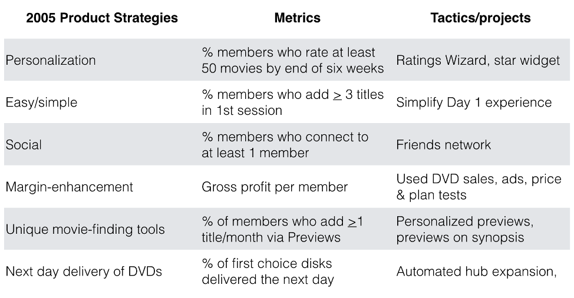
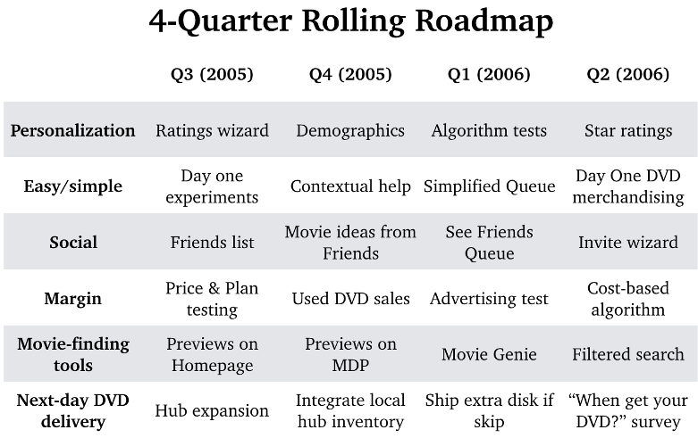

## The DHM Model

Product strategy answers the question, “How will your product delight customers, in hard to copy, margin-enhancing ways?” The answers to the following questions provide high-level hypotheses for your product strategy:

1. How will the product delight customers?
2. What will make the product hard to copy?
3. What are the business model experiments required to build a profitable business?

#### Delight Customers

Think about how your product delights customers, both now and in the future. As an example, think about how Netflix delights you today. How could it deliver even more in the future. Here is a list of ideas Netflix explored in the past, along with potential future experiments:

1. Next day delivery of DVDs
2. Instant delivery via streaming
3. A large selection of movies & TV shows
4. Easy to find & watch videos
5. An entertaining website experience
6. Unique movie-finding tools
7. Movie suggestions from friends
8. Original content
9. Episodic TV binge-watching
10. Available on all devices, “anytime, anywhere”
11. Personalized choices for each family member
12. Download videos for playback later
13. Live sports
14. News and current events
15. 3D/VR immersive stories

Netflix has explored most of these ideas. Some delighted customers, others didn’t. What’s the list of “delighters” for your product?

#### Creating a Hard to Copy Advantage

What makes it hard for companies to compete with Netflix? Hamilton Helmer’s book, “7 Powers,” outlines seven hard-to-copy advantages. Below are each of these seven powers and how they apply to Netflix:

1. **Brand**. Building trust with customers takes years of delivering value with a minimum of “trustbusters.” Today, more than 140 million members trust Netflix with their credit cards. The Netflix brand provides a significant hard to copy advantage.
2. **Network Effects**. Today, nearly all TVs, DVD/Blu-Ray players, game systems, set-top boxes, and mobile devices are pre-wired to stream Netflix.
3. **Economies of Scale**. Netflix members enjoy original content, enabled by the company’s economies of scale. Because Netflix can amortize content cost across 140 million members, it can invest significantly more than its smaller rivals.
4. **Counter-positioning**. This “power”—an offer to customers that is impossible for competitors to match—is rare. In 2004, however, Netflix advertised “No Late Fees.” Blockbuster could not respond as late fees generated nearly all of their profits. Blockbuster could not afford to make the same offer.
5. **Unique technology**. Helmer’s “7 Powers” book does not list this attribute, but it’s essential. An example: Netflix’s personalization technology.
6. **Switching costs**. This hard-to-copy advantage exists when a customer invests so much in one product that it’s hard to switch to another. To a small degree, Netflix customers don’t turn to Amazon or Hulu because it’s too much work to recreate profiles for each family member.
7. **Process power**. Netflix has many unique, hard-to-copy processes. One example: they encrypt tens of thousands of titles each year at multiple bandwidths for thousands of different hardware devices.
8. **Captured resource**. The clearest example of this power is a patent. Another example is a close-knit team not available to other companies. The Netflix startup trio of Reed Hastings, Neil Hunt, and Patty McCord—who all worked together at a previous startup—is an example of a captured resource.
   How will your product build a hard to copy advantage?

#### Margin-Enhancing

How will your product generate margin? You’ll need profits to invest in innovation to build an even better product in the future. You’ll need to experiment to evaluate different prices and business models over the life of your product. You’ll never be “done.” For example, Netflix continues to experiment with both price and plans. Today, prices range from $8.99 to $15.99. Higher-priced plans have higher quality video and the ability to watch more streams simultaneously. Today, Netflix is testing lower-priced mobile-only plans in international markets.

#### Product Strategy Exercises

1. Take a moment to jot down how your product delights customers today, then add a few ideas about how you might delight them even more in the future.
2. Using the eight hard to copy powers above as a springboard, list ways your product might create a hard-to-copy advantage in the future.
3. For your product, list a few price and business model experiments you might explore over the next 1-3 years.

At this point, you should have a list of hypotheses to delight your customers, create hard to copy advantage, and experiment with price/plan combinations and business models. We’ll bring these three components together to articulate a product strategy in the next essay.

## From DHM to Product Strategy

The next. Step is to tease out high-level hypotheses that combine delight, hard to copy advantage, and margin. Achieving two or three of these objectives with a single strategy is at the heart of a good product strategy.

Below are a dozen of the high-level theories. That Netflix explored over fifteen years, along with. A brief description of each. Half of these strategies failed. But many of the winners combined delight, hard to copy advantage and margin-enhancement.

1. **Personalization**. Today, Netflix’s personalization delights customers in hard to copy, margin-enhancing ways. Over two decades, the percentage of recommendations that customers choose increased from 2% to 80%, making it easy for customers to find movies they’ll love. Personalization also supports the business by enabling Netflix to predict the number of members who will watch original content, allowing Netflix to right-size their original content investment.
1. **Easy**. Netflix wasn’t simple at launch but became simpler over time. Netflix learned to add features that customers valued and remove those they did not. A surprising example in 2018: the decision to remove movie reviews. Now that members can quickly hit “play” or “quit” at any time, they no longer need reviews.
1. **Social**. Netflix experimented with “Friends” for six years. The hypothesis was the friends would suggest great long-tail movies (creating both delight and margin) but also create a hard to copy, network effect. The effort engaged only 6% of members, however, so Netflix cut it in 2010.
1. **Unique movie-finding tools**. In 2005, the vision was that personalized previews would begin to play on each member’s homepage, delivering both delight and margin. (the personalized choices would be lower-cost, long-tail titles.). The effort failed, however, Customers found the previews annoying, and the experiment did not move any of its proxy metrics.
1. **Price and Plans**. Given the need for ongoing business model experiments, there was constant price and plan testing.
1. **Ads & Used DVD Sales**. In 2006, Netflix explored two alternate business models—advertising and used DVD sales. Both businesses generated profit but were killed in 2008 when Netflix began to deliver higher-margin through its core DVD rental business.
1. **Next-day DVD delivery**. A source of delight for members: DVDs arrived the next day in the mail. Netflix achieved this through a network of automated shipping hubs. It took Blockbuster years to replicate this capability.
1. **Streaming**. It’s an obvious win today, but it was unclear when Netflix should launch its streaming service and how to acquire content. Today, there’s hard to copy advantage in the technology that Netflix employs to encrypt and deliver video. And customers love watching movies instantly—anytime, anywhere.
1. **Open APIs**. In 2006, when Facebook, LinkedIn, and others opened their Application Programming Interfaces to enable partners to innovate on their platforms, Netflix followed suit. The intent was to let a “thousand flowers bloom,” but none did. Later, however, the APIs became the foundation for Netflix’s device ecosystem.
1. **Device ecosystem**. Netflix launched streaming in January of 2007 on PC-based computers. The Mac followed shortly but members wanted to stream movies to their TVs, which required partnerships with hardware manufacturers. In late 2008 Netflix launched on Xbox. Later, Playstation, Wii, Roku, Samsung, and nearly all DVD and Blu-ray manufacturers followed. By 2012, Netflix had critical mass with hardware partners; they created a hard to copy network effect that also delights customers who enjoy watching “anytime, anywhere.”
1. **Exclusive DVD content**. During the DVD era, Netflix tested exclusive content via “Red Envelope Studios,” but without the economies of scale Netflix has today, the effort failed.
1. **Original content**. Netflix launched its first episodic TV series, “Lilyhammer” in 2012. By 2013, it’s \$100mm investment in “House of Card” delivered a hit.
1. **High-quality video & sound**. One of the early lessons at Netflix was the importance of staying focused on making the core product better. Netflix’s continued effort to improve both video and sound quality is a good example, and the technology required to do this is quite hard to copy. And, today, Netflix generates higher margin through its higher-priced, Ultra HD plan.

All of the efforts above are motivated by the desire to improve customers’ experience in ways that build a hard to copy, margin-enhancing experience. Netflix did not test all of the ideas above in parallel. Each year Netflix took on about 4-6 product strategies. Here were the significant efforts in 2005:

1.  Personalization
1.  Easy/simple
1.  Social
1.  Margin-enhancement
1.  Unique movie-finding tools
1.  Next-day DVD delivery

Each of these efforts had a dedicated “pod” made up of engineers, designers, product, and data leaders.

#### Product Strategy Exercise

Given your product’s potential “delighters,” hard to copy advantages, and business model explorations, what are four to six hypotheses you’d like to test in the next year or two.

## How to Assign Metrics and Tactics to Each Product Strategy

In 2005, Netflix explored six key product strategies. For each strategy, there was a team focused on experiments to prove or disprove each theory. Here’s the 2005 high-level product strategy for Netflix, coupled with metrics and projects:

Each of these strategies had a clear proxy metric to determine if the high-level product strategy delivered, or not. And there were typically two to three projects—think of these as tactics—that worked to deliver against the strategy.

In retrospect, we know that four of the high-level product strategies worked, and two failed (social, movie-finding tools). Over the years, Netflix learned to double down in areas where they moved their proxy metrics and demonstrated retention improvements. They also learned to cut their losses when projects didn’t deliver.

#### Product Strategy Exercise

Using the Netflix Product Strategy as a guide, articulate each of your high-level strategies, the proxy metric for that strategy, along with projects against each strategy.

## Proxy Metrics

At Netflix, the metric they used to evaluate overall product quality was monthly retention. This “North Star” product metric improved significantly over twenty years. In the early days, about 10% of members canceled each month. In 2005 the monthly cancel rate was around 4.5%. Today, it is close to 2%.

Using retention as a metric for all projects isn’t feasible, however. It’s a hard metric to move, and proving a retention improvement requires large-scale A/B tests. Lower-level metrics—proxy metrics—are easier and faster to move than a high-level North Star metric. Ideally, moving a proxy will improve the high-level metric (i.e. retention for Netflix)—there is a correlation between the two. Later, you can prove causation via an A/B test.

#### How do you measure “simple?”

One of the hypotheses at Netflix was that a simpler member experience would improve retention. But how do you measure “simple?” And how do you demonstrate that it improves retention?

Netflix began by exploring customer service data. Why do members call or email Netflix with questions or complaints? What links do they click on when they visit the help pages? Where do customers get confused? Over time, Netflix focused their efforts on new members as a large number of potential customers at the top of the sign-up funnel provided a substantial business opportunity.

Netflix talked to new members in one-on-one sessions and focus groups. They asked a small group of customers to write a journal describing their weekly activity with Netflix. Last, they looked at existing data for the new member sign-up flow, as well as their first few weeks with the service.

One point of confusion among new members: Netflix’s early DVD-by-mail service required customers to create an ordered list of movies that Netflix would send to them. But some new members failed to add any videos to their Netflix Queue. Some new members chose a plan, entered their credit card information, then asked, “Now what?” The notion of adding at least three titles to their Queue confused many new members.

It was clear Netflix needed to simplify the sign-up process and make it easier for customers to create a list of movies. Eventually, Netflix executed a series of “day one” projects focused on eliminating steps, reducing cognitive overhead, and providing clarity about how the service worked.

The proxy metric they devised was “the percentage of new members who add at least three titles to their Queue during their first session.” When Netflix first looked at the data, 70% of new members added at least three titles to their queue during their first session. By the end of the year, after a series of fast-paced experiments, they increased this percentage to 90%.

Over the same period, Netflix drove one-month retention from 88% to 90%--both retention and their “simple” metric moved together. They chose not to take the time, however, to execute a large-scale A/B test because they were confident that the more straightforward experience improved retention.

#### The Right Proxy Metric

Proxy metrics are a stand-in for your North Star product metric. First, you seek a correlation between your high-level metric and the proxy metric. Later you work to prove causation.

Here’s a simple model to define proxy metrics:

_Percentage of (member/new customers/returning customers) who do at least (the minimum threshold for user action) by (X period in time)._

As you evaluate potential metrics, make sure the proxy:

1. **Is measurable**. You can find, collect, and measure the data. Ideally, you assess the metric in an A/B test, and the metric helps answer the question, “should we launch this feature, or not?” In evaluating a new product strategy, ask yourself, “In an A/B test, what metric would we use to make a go/no-go decision?”
2. **Is moveable**. You can affect the metric through changes to the product experience.
3. **Is not an average**. The danger of averages is you may move the metric by inspiring a small subset of customers to do a lot more of something. But this may not affect enough members to improve the overall product experience.
4. **Correlates to your topline “North Star” metric**. For Netflix, successful proxy metrics and retention moved together. Longer-term, you hope to prove causation via a large-scale A/B test.
5. **Specifies new vs. existing customers**. As Netflix grew, they learned to focus their effort on new members. They believed that to become a sizeable worldwide service, they needed to optimize for new members. They would test features with new members, then roll out to all members based on positive results. Existing members sometimes noticed the change, complained about it, but rarely canceled. (Occasionally, if they believed there was a real risk of hurting retention, they ran an A/B test with existing members, too.).
6. **Is not a gamble**. One product manager focused on customer service. His job was to make it easy for members to help themselves and not call the customer service team via their 800 number. The metric that defined his role was “contacts per 1,000 customers,” and the goal was to lower this metric below 20 contacts per 1,000 customers. But he quickly discovered he could game the metric by hiding the 800 number. Consequently, Netflix revised the proxy: “Contacts/1,000 members with the 800 number available within two clicks.”

Eventually each product manager should be able to measure their performance through one or two proxy metrics that contribute to the North Star metric.

#### Product Strategy Exercise

Identify your “North Star” metric—the equivalent of Netflix’s monthly retention. Now re-look at your work from the last section (How to assign Metrics and Tactics) and re-evaluate your proxy metric for each high-level strategy against “The Right Proxy Metric” outlined above.

## Working Bottom-Up

The key to the Strategy/Metric/Tactic lockup is to identify a high-level product strategy, assign a proxy metric to measure the strategy’s effectiveness, then brainstorm a set of projects that. Will move the metric. If you get “stuck” in this process, however, it sometimes help to turn this process on its head.

Ask your team to list all the projects they believe are important, then sort the projects into “buckets” of ideas. The label for each of these buckets often indicates the implied strategy. For instance, in the case of the “simple” product strategy, there were a set of projects that the team believed were important:

1. Reduce text and explanations
1. Provide step-by-step guides for new members
1. Use customer support dispositioning data to isolate mistakes
1. Eliminate unused features or functions
1. Provide context-sensitive information (progressive disclosure)
1. Provide easy access to self-help systems

Looking at this list of ideas, the team discussed common themes and isolated the “simple” hypothesis.

In contrast, personalization efforts at Netflix are an example of a top-down approach. They decided that the high-level hypothesis—creating a personalized experience will improve retention—then identified a proxy metric and brainstormed projects to move the metric.

#### Product Strategy Exercise

Look at the list of projects you believe are essential, then sort them to identify high-level themes. These themes are potential product strategies. Now re-evaluate your “Product Strategy/Metric/Tactic Lockup” to see if it warrants changes or edits.

## A Strategy for Each Swimlane

So far, we have focused on defining the overall product strategy for a company. It’s essential that each product leader within an organization also articulate their pod’s strategy. Each product leader should work with a dedicated team of engineers, designers and data analysts, and articulate their own “North Star” metric, along with the key strategies, proxy metrics, and projects for their area.

#### Product Strategy Exercise

For each swimlane in your product organization, identify the proxy metric each product leader will move—their North Star metric for their pod—along with strategies, proxy metrics, and projects. Ideally, this work is done by the product leader for each swimlane.

## The Product Roadmap

A roadmap is an expression of your strategy. It shows how projects fit together, along with a rough time estimate.

Roadmaps are a richly debated topic. On the one hand, they help teams to see how all the projects fit together. And with technology teams, who have long lead-time plans, it’s good to have advance notice of upcoming projects. On the other hand, a four-quarter roadmap provides false confidence, given uncertainty about what will work, or not. It’s especially hard to guess the timing of projects, given this uncertainty.

When sharing a roadmap, express confidence about the next quarter’s projects but highlight that the content and timing of the subsequent quarters are highly speculative. There’s lots of near-term learning that will cause plans to change.

Here’s a stylized version of the Netflix roadmap, halfway through 2005:

The roadmap articulates the focus and organization of the product team. Once the teams define the strategies, proxy metrics, and projects for their swimlanes, it’s straightforward to complete the exercise. The roadmap is an artifact—an expression—of your product strategy.

The roadmap does not have to show all the work, however. It is a high-level view that outlines the key projects in each swimlane, along with the best guess of timing. The roadmap tells a story about how the overall strategy for the product team might play out over time. When putting together the roadmap, think of the company’s board as the primary audience—they don’t need all the details.

One note on organizing product teams: it’s generally better to have structures where each product leader has a clear proxy metric that communicates what success looks like in their area. Proxy metrics provide radical role clarity.

#### Product Strategy Exercise

For each of your product swimlanes (pods), outline the projects against each strategy over four quarters. Put all of the projects into a roadmap like the one above.

## The GLEe Model (Get Big On, Lead, Expand)

As companies grow, there are a few common criticisms about the product strategy:

1. Teams see and understand the projects, but now how they fit together.
1. Investors complain that there’s not a big enough product vision.
1. The product team feels too focused on the short term.

The GLEe model helps product leaders to form a product vision to address these criticisms. The model encourages teams to think big, to think long-term, and describes a phased, step-by-step approach to build a product that “dents the universe.”

The exercise also help s product leaders avoid the “one and done” phenomenon articulated by Jeff Kagan, a financial analyst who reflects on Yahoo!’s demise: “Every successful company rides the growth wave until it crests and falls. The secret is to create the next growth wave before the first one collapses.”

The GLEe model encourages teams to ask, “What’s next?” and forces long-term thinking. To invent the future, you have to be optimistic, and long-term thinking enables an “anything is possible” attitude. By long-term, we mean 3-5 years, and in this timeframe, most things are possible. But the GLEe model goes far beyond this to encourage product leaders to think 10-15 years ahead. Below is an articulation of the Netflix product vision, as described in 2005:

1. Get big on DVDs
1. Lead downloading
1. Expand worldwide

Like product strategies, these three phases are high-level hypotheses; they help tell a story of how a startup might develop over 10-15 years. You’ll occasionally get the stages wrong, but putting a stake in the ground enables teams to see how things fit together and to imagine how big the product might get.

The GLEe model also reinforces that you don’t have to do everything at once. Netflix focused on its DVD-by-mail service for eight years before it launched streaming. And they needed to transition to streaming before they could expand globally. Last, Netflix needed the economies of scale that international expansion enabled to make significant investments in original content.

When you look at the three phases from the GLEe model together with your product strategies, things get interesting. Note the importance of Netflix’s personalization strategy over the four stages of Netflix’s growth:

1. As Netflix got big on DVDs, personalization powered the merchandising of high-quality, high-margin titles.
1. In the early days of streaming, when Netflix had limited content, personalization helped members zero in on the small number of titles that were “just right” for them.
1. As Netflix expanded globally, personalization helped connect members with movies they loved, regardless of nationality.
1. Today, with original content, personalization helps Netflix right-size its investments. Based on the knowledge of its 150M members’ tastes, Netflix could reasonably forecast that 10M members would watch “Bojack Horseman” while 100M members would stream “Stranger Things.” Well-informed forecasts let Netflix invest intelligently. The ability to forecast streaming hours based on member tastes enables Netflix to build lots of great niche content, as well as an occasional worldwide hit.

Finding a high-level product strategy that supports multiple phases of a company’s growth is rare. But if you accomplish this, it builds a huge, hard to copy advantage.

#### Product Strategy Exercise

To outline the GLEe model for your product and company, ask yourself three questions:

1. What is the initial product that enables to company and product to “Get Big” over the first 3-5 years of its life? Are there trends that the product can “surf,” much like Netflix rode the wave of DVD players and e-commerce? What are these trends for your company and product?
2. What will you “Lead?” Three to five years in the future, what is the next wave your product or company will ride—the equivalent of internet video for Netflix?
3. Once your product establishes a leadership position, how might it “expand” even further? Given the brand, network effects, economies of scale, and unique technology your product will have at this point, what is the next wave of activity?

Reflecting on your answers to the questions above, complete the GLEe Model for your product and company:

1. Get Big On:
1. Lead:
1. Expand:

## The GEM Model (Growth, Engagement, and Monetization)

As companies grow, product strategy helps teams maintain focus. But misalignment, especially across product, marketing, sales, and finance organizations, happens often. One of the biggest causes is differing opinions on how to prioritize growth, engagement, and monetization. The GEM model forces cross-functional teams to prioritize these factors and helps build a metrics-focused organization.
In 2005, Netflix had nearly two million members, was growing 30% year-over-year, and monthly cancellation, the proxy for product quality and engagement, was about 4.5%. The key challenge at the time was how to build a profitable business. So a force-rank of growth, engagement, and monetization, along with the metrics they used to measure each, looked like this:

1. Monetization: As measured by Lifetime Value (LTV) and gross margin.
1. Engagement: As measured by monthly retention. (Think of this as a proxy for product quality.)
1. Growth: As measured by year-over-year member growth rate. (30% in 2005.)

Based on the forced-rank prioritization above, Netflix put some new projects at the top of their prioritized list. In 2005, they started testing advertising, experimented with selling previously viewed DVDs to members, and initiated lots of price and plan testing. Their priority was monetization to answer the question, “How can Netflix deliver a high-margin business?”

Eventually, they figured out how to deliver a more profitable DVD rental service through the introduction of lower-priced plans. They maintained their $22/month, three disks at a time, but added $15 and \$9 monthly plans for two and one DVDs at a time. Both of these lower-priced plans generated a higher lifetime value.

By 2008, Netflix was confident they could deliver a profitable business and flipped the priority as they set a goal to achieve 20 million subscribers by 2010. They wanted to convince investors they would have a big, profitable business in the long-term. Here was the forced rank in 2008:

1. Growth
1. Engagement
1. Monetization

By this point, Netflix had reasonable confidence that they could deliver higher margins, and the priority shifted to growth. At different times in a company’s life, the priorities change. It’s an excellent habit to reassess the priority of these three factors every six months, or so.

#### Product Strategy Exercise

Thinking about the overall needs of your company, how do you prioritize growth, engagement, and monetization? Which metric will you use to measure each? Now compare notes with your CEO and leaders in other parts of the company to see how they prioritize the three factors. If the answer is different, find ways to debate the prioritization and reach an agreement. Doing this every six months will dramatically improve cross-functional alignment.

## How to Run a Quarterly Product Strategy Meeting

An essential part of the Netflix culture is to enable teams to become highly aligned and loosely coupled. “Highly aligned” means each group understands the overall product strategy and how they contribute to the company’s success. “Loosely coupled” means teams occasionally check in with each but avoid the trap of “tight coupling”—consulting multiple teams for every decision they make.

Another Netflix principle is “context, not control.” The intent is to provide context through strategy so that focused teams make decisions without consulting anyone.

To provide both context and high-level alignment, the head of product should bring the leaders of each swimlane together for quarterly product strategy meetings. The goals of this meeting are to:

1. Provide context through product strategy, metrics, and tactics
2. Ensure alignment across the entire product organization
3. Share results and learnings
4. Articulate theories and hypotheses for the future, and
5. Determine the level of investment in each swimlane

At Netflix, there was also a set of guiding principles, consistent with the Netflix culture:

1. Use CEO level communication—don’t “dumb it down” for newbies.
1. Engage in lively debate.
1. Use slides, but don’t polish them. Slides are a good conversation starter, but you don’t want “death by PowerPoint.” The goal is to deliver crisp articulation of strategy, hypotheses, and results to inspire discussion and debate.
1. Limit attendance. Once you have more than fifteen people in the room, the meeting becomes less effective. The session can include a few key “C” and VP-level leaders, product managers, plus critical consumer insight, data, design, and technology partners. To discourage tight coupling, minimize the number of participants outside the product and tech organization.
1. It’s NOT a decision-making meeting. If product leaders have successful A/B test results, encourage them to launch the new experience before the meeting. The goal is to enable fast-paced decision-making, not slow it down.

At Netflix, there were three indirect results of the quarterly product strategy meeting:

1. The meeting became a mechanism for the company’s culture. By participating in the meeting, leaders learned the skills, behaviors, and values that embodied Netflix’s culture.
1. The meeting created a results-focused organization. If your product area moved its proxy metrics, it got more resources. The opposite was true, too.
1. You began to learn which product leaders were effective, and over time, which leaders’ skills were not scaling as the company grew.

All three of these outcomes meant the quarterly meetings had a direct effect on the overall culture of the company.

The head of product owns the meeting, determines its attendees, and manages the schedule. The day before the meeting, the head of product shares the following materials, using Google Slides or Docs:

1. A re-articulation of the overall product strategy, including the product vision (GLEe), product strategy lock-up (Strategy/metrics/tactics), high-level priorities (GEM), and the rolling four-quarter roadmap.
1. Key projects for the upcoming quarter—those projects that require cross-functional coordination.
1. Any insights relevant to the entire product team—usually shared by the leader of the customer research, design, or data teams.

In turn, the product leaders for each swimlane share these materials in advance:

1. The product strategy for their swimlane, including their strategy lockup and rolling four-quarter roadmap.
1. Results and learnings from the past quarter. These materials are both design and data rich. For instance, you can see A/B test designs through the eyes of customers, along with detailed data to describe results.
1. Key hypotheses for the next quarter and how the product leader will evaluate success/failure—often through a progression from existing data, to qualitative, and A/B test results. As before, the work is both design and data rich.

Sharing the materials the day before enables broad participation. The expectation is that everyone will read the documents, then ask questions and make comments within the shared docs.

Here is a rough outline for your first quarterly product strategy meeting:

1. Articulation of the high-level strategy by the head of the product team. Key team members can also share insights relevant to everyone in the room. (30 – 60 minutes)
1. The strategy for each swimlane, presented by each product leader. Rather than share all materials from the day before, each leader presents a subset of materials. What each product leader discusses is informed by the questions and comments from the shared docs. The goal is a 50/50 balance of presentation and discussion. (30 to 60 minutes per swimlane, depending on the number of lanes.)
1. A wrap-up at the end of the session. This time provides an opportunity for general discussion, to debate unresolved issues, and to frame which information should be shared broadly outside the room. (60 minutes)
1. Include meaningful breaks throughout the day. (4 x 15-minute breaks, plus a 30 to 60 minute lunch break).

Post meeting:

1. Have participants complete a Net Promoter Score survey to understand what went well and what could be better. The intent is to make each meeting better than the one before.
1. It’s good to have all the participants share a meal afterward. You need time to rebuild relationships after heated debate.
1. Sometimes it’s hard to sort out all the issues in real-time. There’s often a short-list of topics that require discussion with a smaller team.
1. It’s an excellent habit to summarize the events of the day—especially results and learning, changes in direction, or other decisions that will impact the rest of the company. You can share this list at an upcoming company, board, or executive meeting. It’s also good to reference this list at the next quarterly product strategy meeting to reinforce progress.

A good meeting is like a movie. There’s a script, good & bad surprises, drama. And a denouement (that old-fashioned movie moment when a couple smokes a cigarette in bed—much like dinner and beers after the meeting).

At Netflix, the Quarterly Product Strategy meeting became a cultural mechanism. It:

1. Reinforced the company’s values of intellectual curiosity, courage, and candor,
1. Provided a means to enhance context through strategy,
1. Enabled fast-paced decision-making by individuals expert in their areas
